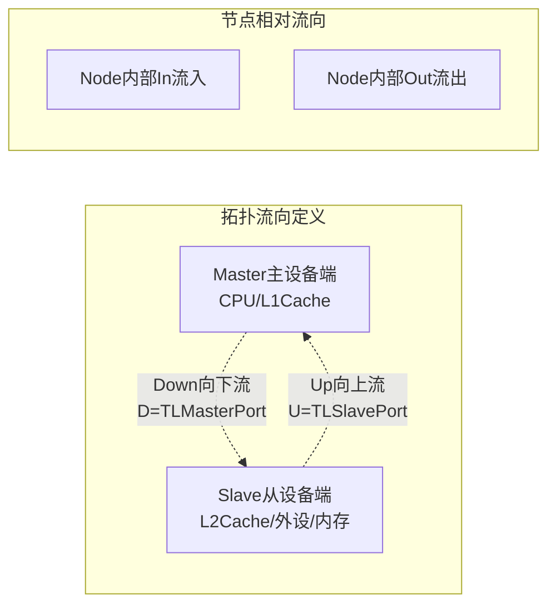

## 前言
在RISC-V开源处理器（香山、BOOM等）的总线架构设计中，Diplomacy与TileLink是核心互联组合。多数开发者难以理清二者关系，核心误区为混淆框架与协议的层级定位。

二者核心定位区分：

+ **Diplomacy**：通用懒加载DAG拓扑参数协商框架，属于底层通用骨架。仅定义模块连线规则、双向参数传递机制、自动参数协商逻辑，不绑定任何具体总线协议，独立于TileLink、AXI等总线标准。
+ **TileLink**：基于Diplomacy框架实现的片上总线协议，属于上层业务实现。依托Diplomacy的拓扑与协商能力，定义专属总线参数、节点规则、传输通道与硬件信号，最终生成可综合的总线电路。

该架构的核心价值：摒弃传统手动配置总线位宽、端口参数、互联规则的开发方式，通过拓扑自动协商机制，实现模块互联后参数自动对齐、总线电路自动生成，大幅降低总线适配与接线错误风险。

## 整体分层架构
### 1.1 架构总览
整套Diplomacy+TileLink架构分为五层，从全局参数配置到底层RTL硬件生成逐层依赖、逐层落地，完整架构流程如下：

### 1.2 各层级核心职责
1. **CDE全局参数层**：芯片全局配置中心，通过Config、Field、Parameters机制统一定义缓存容量、总线位宽、最大传输长度、设备ID范围等基础硬件参数，为全芯片模块提供统一参数基准。
2. **LazyModule分层载体**：架构分层核心载体，严格拆分两大执行阶段。预协商阶段完成拓扑搭建与参数运算，RTL阶段待参数完全稳定后再实例化硬件电路，规避参数未初始化导致的电路错误。
3. **Diplomacy通用框架**：总线互联基础骨架，定义标准化拓扑节点、双向参数流动模型、自定义参数协商接口，提供无协议依赖的通用互联能力。
4. **TileLink协议扩展层**：协议落地核心层，为Diplomacy通用骨架填充TileLink专属规则，包含总线参数体系、拓扑节点、协商逻辑、硬件通道定义。
5. **RTL生成层**：硬件落地层，将协商完成的标准化总线参数，转换为可综合的总线时序逻辑、IO端口电路，最终输出Verilog代码。

<!-- 这是一个文本绘图，源码为：flowchart TD
    A[CDE全局参数层] --> B[LazyModule分层载体]
    B --> C[Diplomacy通用DAG协商框架]
    C --> D[TileLink协议定制扩展层]
    D --> E[最终Chisel RTL硬件生成]
    
    subgraph A[CDE全局参数层]
        A1[Config配置文件]
        A2[Field键值参数]
        A3[Parameters上下文传递]
    end
    
    subgraph B[LazyModule分层载体]
        B1[预协商阶段<br/>定义节点/拓扑/规则]
        B2[懒加载RTL阶段<br/>参数敲定后实例化电路]
    end
    
    subgraph C[Diplomacy通用DAG协商框架]
        C1[Node拓扑节点<br/>Source/Sink/Adapter/Nexus]
        C2[Edge拓扑边<br/>上下/内外双向参数流]
        C3[核心协商函数<br/>mapParamsD/U + dFn/uFn]
        C4[通用NodeImp泛型模板]
    end
    
    subgraph D[TileLink协议定制扩展层]
        D1[TLImp协议实现<br/>绑定TL专属参数类型]
        D2[TL端口参数体系<br/>MasterPort/SlavePort]
        D3[TLEdge协商结果<br/>TLEdgeIn/TLEdgeOut]
        D4[TLBundle硬件通道<br/>A/B/C/D/E总线信号]
    end
    
    subgraph E[最终Chisel RTL硬件生成]
        E1[总线时序逻辑]
        E2[模块互联IO端口]
        E3[可综合Verilog输出]
    end -->


## TileLink对Diplomacy的核心扩展机制
Diplomacy为无协议空框架，仅提供互联与协商模板；TileLink基于该模板完成四项核心扩展，实现总线协议的完整落地，具体包含参数体系、拓扑节点、协议适配、硬件总线四大模块。

1. 构建完整的TileLink总线参数层级体系，定义设备、端口、协商、硬件四级参数
2. 派生TileLink专属拓扑节点，适配主从设备、适配、多路互联等总线场景
3. 实现TLImp协议适配层，完成TileLink协议与Diplomacy框架的类型绑定
4. 定义TileLink五通道硬件总线结构，实现协议参数到硬件信号的映射

### 2.1 TileLink四级参数体系
TileLink采用分层参数设计，从单体设备属性逐步迭代为最终硬件参数，层级递进、逐层约束，完整覆盖总线协商全流程。

#### 2.1.1 单体设备参数
用于描述单个总线设备的固有属性，是总线参数的最小单元。

+ **TLMasterParameters**：定义CPU、L1缓存等主设备的请求能力、Source ID范围、可访问地址空间、传输规格等属性。
+ **TLSlaveParameters**：定义内存、外设、L2缓存等从设备的响应能力、地址映射、缓存属性、访问权限等属性。

#### 2.1.2 端口集合参数
对多个同类型单体设备参数进行聚合，形成模块对外的标准化端口参数，是拓扑互联的基础入参。

```scala
// 主设备端口参数：所有发起请求的设备集合
class TLMasterPortParameters private(
  val masters:       Seq[TLMasterParameters], // 多个主设备集合
  val channelBytes:  TLChannelBeatBytes,      // 总线单拍传输字节数
  val minLatency:    Int,                     // 总线最小传输延迟
  val echoFields:    Seq[BundleFieldBase],
  val requestFields: Seq[BundleFieldBase],
  val responseKeys:  Seq[BundleKeyBase]) extends SimpleProduct

// 从设备端口参数：所有接收请求的设备集合
class TLSlavePortParameters private(
  val slaves:         Seq[TLSlaveParameters], // 多个从设备集合
  val channelBytes:   TLChannelBeatBytes,
  val endSinkId:      Int,                    // 从设备最大Sink ID
  val minLatency:     Int,
  val responseFields: Seq[BundleFieldBase],
  val requestKeys:    Seq[BundleKeyBase]) extends SimpleProduct
```

#### 2.1.3 协商边参数（核心）
主从设备完成拓扑互联后，框架自动融合两端端口参数，生成唯一的边参数，存储本次互联的所有协商规则与对齐结果，是总线参数收敛的核心载体。

```scala
case class TLEdgeParameters(
  master: TLMasterPortParameters,
  slave:  TLSlavePortParameters,
  params:  Parameters,
  sourceInfo: SourceInfo) extends FormatEdge
{
  // 自动对齐主从设备最大传输规格
  val maxTransfer = max(master.maxTransfer, slave.maxTransfer)
  // 基于主从参数，协商生成最终硬件总线参数
  val bundle = TLBundleParameters(master, slave) 
}
```

核心特性：总线位宽、传输规格、通道功能等核心硬件参数，均由框架自动协商生成，无需人工硬编码。

#### 2.1.4 硬件总线参数
由协商边参数推导生成，是最终硬件总线信号的配置基准，直接决定总线的物理形态。

```scala
case class TLBundleParameters(
  addressBits: Int,  // 地址线位宽（由从设备最大地址推导）
  dataBits:    Int,  // 数据线位宽
  sourceBits:  Int,  // 主设备Source ID位宽
  sinkBits:    Int,  // 从设备Sink ID位宽
  sizeBits:    Int,  // 传输大小配置位宽
  echoFields:     Seq[BundleFieldBase],
  requestFields:  Seq[BundleFieldBase],
  responseFields: Seq[BundleFieldBase],
  hasBCE: Boolean)   // 缓存一致性通道使能标志

// 主从参数自动对齐协商核心逻辑
def apply(master: TLMasterPortParameters, slave: TLSlavePortParameters) =
    new TLBundleParameters(
      addressBits = log2Up(slave.maxAddress + 1),
      dataBits    = slave.beatBytes * 8,
      sourceBits  = log2Up(master.endSourceId),
      sinkBits    = log2Up(slave.endSinkId),
      hasBCE = master.anySupportProbe && slave.anySupportAcquireB)
```

#### 2.1.5 参数层级依赖关系
四级参数逐层依赖、逐级收敛，完整串联从设备属性到硬件电路的转化流程：

层级逻辑：**单体设备属性 → 端口聚合参数 → 互联协商收敛 → 硬件配置参数 → 物理总线电路**

<!-- 这是一个文本绘图，源码为：flowchart TD
    Z1[TLMasterParameters<br/>单个主设备属性] --> Z2[TLMasterPortParameters<br/>一组主设备集合]
    Z3[TLSlaveParameters<br/>单个从设备属性] --> Z4[TLSlavePortParameters<br/>一组从设备集合]
    
    Z2 & Z4 --> Z5[TLEdgeParameters<br/>主从参数融合协商]
    Z5 --> Z6[TLBundleParameters<br/>硬件端口最终参数]
    Z6 --> Z7[TLBundle<br/>A/B/C/D/E物理总线信号] -->


### 2.2 TLImp协议适配核心
TLImp是TileLink适配Diplomacy框架的核心适配器，用于绑定Diplomacy的泛型模板与TileLink专属协议类型，解决通用框架无协议定义的问题。

核心类型绑定关系：

+ D（向下传输参数）= TLMasterPortParameters
+ U（向上传输参数）= TLSlavePortParameters
+ EO/EI（内外双向边参数）= TLEdgeOut / TLEdgeIn
+ B（硬件总线）= TLBundle

```scala
object TLImp extends NodeImp[TLMasterPortParameters, TLSlavePortParameters, TLEdgeOut, TLEdgeIn, TLBundle]
{
  // 生成向外、向内双向协商边参数
  def edgeO(pd: TLMasterPortParameters, pu: TLSlavePortParameters, p: Parameters, sourceInfo: SourceInfo) = new TLEdgeOut(pd, pu, sourceInfo)
  def edgeI(pd: TLMasterPortParameters, pu: TLSlavePortParameters, p: Parameters, sourceInfo: SourceInfo) = new TLEdgeIn (pd, pu, sourceInfo)
  // 基于协商边参数生成标准化硬件总线
  def bundleO(eo: TLEdgeOut) = TLBundle(eo.bundle)
  def bundleI(ei: TLEdgeIn)  = TLBundle(ei.bundle)
}
```

### 2.3 TileLink拓扑节点体系
TileLink继承Diplomacy四大基础节点，绑定TLImp协议规则，衍生出适配总线场景的专属节点，覆盖所有总线互联拓扑。

```scala
// 主设备节点：主动发起总线请求（CPU/L1Cache）
case class TLClientNode(portParams: Seq[TLMasterPortParameters])(implicit valName: ValName) extends SourceNode(TLImp)(portParams) with TLFormatNode

// 从设备节点：被动响应总线请求（内存/外设/L2）
case class TLManagerNode(portParams: Seq[TLSlavePortParameters])(implicit valName: ValName) extends SinkNode(TLImp)(portParams) with TLFormatNode

// 适配器节点：一对一互联，仅修改参数、不改变拓扑（缓存核心节点）
case class TLAdapterNode(
  clientFn:  TLMasterPortParameters => TLMasterPortParameters = { s => s },
  managerFn: TLSlavePortParameters  => TLSlavePortParameters  = { s => s })(
  implicit valName: ValName)
  extends AdapterNode(TLImp)(clientFn, managerFn) with TLFormatNode

// 交叉开关节点：多对多互联，实现总线仲裁与多路分发
case class TLNexusNode(
  clientFn:        Seq[TLMasterPortParameters] => TLMasterPortParameters,
  managerFn:       Seq[TLSlavePortParameters]  => TLSlavePortParameters)(
  implicit valName: ValName)
  extends NexusNode(TLImp)(clientFn, managerFn) with TLFormatNode
```

#### 2.3.1 节点继承关系
<!-- 这是一个文本绘图，源码为：classDiagram
    class BaseNode
    class MixedNode
    class SourceNode
    class SinkNode
    class AdapterNode
    class NexusNode
    
    class TLImp
    class TLClientNode
    class TLManagerNode
    class TLAdapterNode
    class TLNexusNode
    
    BaseNode <|-- MixedNode
    MixedNode <|-- SourceNode
    MixedNode <|-- SinkNode
    MixedNode <|-- AdapterNode
    MixedNode <|-- NexusNode
    
    SourceNode <|-- TLClientNode : 绑定TLImp
    SinkNode <|-- TLManagerNode : 绑定TLImp
    AdapterNode <|-- TLAdapterNode : 绑定TLImp
    NexusNode <|-- TLNexusNode : 绑定TLImp
    
    TLImp --o TLClientNode : 定义D/U/E/B泛型 -->


### 2.4 TLBundle硬件总线结构
TLBundle是TileLink协议的最终硬件载体，框架根据协商参数`hasBCE`自动裁剪总线通道，兼顾基础传输与缓存一致性场景。

+ 完整一致性场景（hasBCE=true）：包含A、B、C、D、E五组通道
+ 基础传输场景（hasBCE=false）：仅保留A、D两组基础传输通道

各通道核心功能：

+ A通道：主设备发起读写、预取等总线请求
+ D通道：从设备返回数据、传输响应与状态信息
+ B/C/E通道：专属缓存一致性通道，完成缓存查询、数据失效、一致性应答等操作

## 参数双向流向与自动协商机制
双向参数流动与自定义协商是Diplomacy+TileLink架构的核心能力，通过Up/Down双向参数传输、clientFn/managerFn自定义修改，实现总线参数的精准适配与自动对齐。

<!-- 这是一个文本绘图，源码为：flowchart LR
    F1["CDE静态配置参数<br/>beatBytes/sourceId/缓存配置"] --> F2["构造TL端口参数"]
    F2 --> F21["TLMasterPortParameters<br/>客户端主设备参数"]
    F2 --> F22["TLSlavePortParameters<br/>从设备管理端参数"]
    
    F21 --> F3["注入TL各类Node"]
    F22 --> F3
    F3 --> F31["TLClientNode"]
    F3 --> F32["TLManagerNode"]
    F3 --> F33["TLAdapterNode<br/>挂载clientFn/managerFn"]
    
    F3 --> F4["节点:=拓扑连接<br/>仅记录iPorts/oPorts，无硬件"]
    F4 --> F5["Diplomacy自动收集上下游参数"]
    F5 --> F51["diParams 下游向下参数"]
    F5 --> F52["uoParams 上游向上参数"]
    
    F51 --> F6["执行参数协商逻辑"]
    F52 --> F6
    F6 --> F61["clientFn=dFn 改写向下Master参数"]
    F6 --> F62["managerFn=uFn 改写向上Slave参数"]
    
    F61 --> F7["生成TLEdge边参数"]
    F62 --> F7
    F7 --> F71["TLEdgeOut向外边参数"]
    F7 --> F72["TLEdgeIn向内边参数"]
    
    F7 --> F8["整合生成TLBundleParameters<br/>位宽/通道/协议属性协商定稿"]
    F8 --> F9["实例化TLBundle硬件总线"]
    F9 --> F10["LazyModuleImp内部调用<br/>val (tl,edge)=node.in/out"] -->


### 3.1 双向参数流向定义
核心规则：

+ **Down向下流**：参数由主设备向从设备传输，对应Master端口参数，通过`clientFn(dFn)`自定义修改
+ **Up向上流**：参数由从设备向主设备传输，对应Slave端口参数，通过`managerFn(uFn)`自定义修改




### 3.2 完整参数协商全流程
从全局参数加载到最终硬件生成，整套协商流程全自动执行，无需人工干预参数对齐，完整流程如下：

#### 流程分步解析
1. **参数初始化**：加载CDE全局配置，构造主、从设备标准化端口参数，定义设备固有能力；
2. **节点参数挂载**：将端口参数注入对应拓扑节点，适配器节点绑定自定义参数修改函数；
3. **拓扑搭建**：通过`:=`运算符完成模块互联，仅记录拓扑关系，不执行参数计算与硬件生成；
4. **参数自动采集**：Diplomacy遍历DAG拓扑，自动收集上下游双向流动参数；
5. **自定义参数协商**：通过clientFn、managerFn修改流经的双向参数，实现缓存属性、传输规格的定制适配；
6. **协商边生成**：每一条拓扑连线生成唯一Edge参数，固化本次互联的所有协商规则；
7. **硬件参数收敛**：基于Edge参数推导总线位宽、通道配置，生成最终硬件参数；
8. **硬件实例化**：根据收敛后的参数生成TLBundle总线信号，开发者基于总线信号编写业务逻辑。

### 3.3 各类节点协商规则
+ **TLAdapterNode适配器节点**：一对一透传拓扑，不改变连线数量，核心用于参数修正与属性适配，是缓存模块的核心节点；
+ **TLNexusNode交叉开关节点**：支持多对多拓扑，可聚合多路输入参数、统一收敛后分发至各路输出，用于总线仲裁、多路互联场景；
+ **TLClientNode/TLManagerNode端点节点**：作为总线拓扑端点，无协商修改能力，仅提供自身固有端口参数。

## 拓展：BundleBridge通用无协议互联
TileLink为带严格协议的总线互联架构，适用于片上数据传输场景；而BundleBridge为Diplomacy提供的无协议通用互联框架，适用于处理器流水线、执行单元、发射队列等纯数据传输、无协议约束的场景。

核心特性：无需总线参数协商，仅校验两端Bundle信号类型一致性，即可完成自动连线，实现极简模块互联。

```scala
// 自定义流水线输入、输出信号
class ExuInput extends Bundle
class ExuOutput extends Bundle

// 发射队列信号分发节点实现
class ReservationStation(implicit p: Parameters) extends SimpleLazyModule {
  val issue_node = BundleBridgeNexusNode(Some(() => Decoupled(new ExuInput)))
  val wakeup_node = BundleBridgeNexusNode[DecoupledIO[ExuOutput]]()
}
```

## 核心问题解析
### 问题1：协商参数的定义与传入机制
#### 1. 参数定义方式
+ 全局静态参数：基于CDE Config+Field机制统一配置，包含总线位宽、最大传输长度、MHSR数量等全局固定参数；
+ 设备业务参数：通过代码手动构造TLMasterPortParameters、TLSlavePortParameters，定义单设备与端口的业务能力。

#### 2. 参数传入协商流程
+ 端点节点：创建节点时直接传入固化的端口参数，作为拓扑初始参数；
+ 适配器节点：无固定入参，通过clientFn、managerFn动态修改拓扑中流经的参数；
+ 全流程自动采集：拓扑搭建完成后，Diplomacy自动遍历所有节点与连线，收集双向参数并纳入mapParams协商流程。

### 问题2：Diplomacy整体架构解析
Diplomacy是一套基于懒加载机制、支持双向参数协商的DAG模块互联框架，整体分层架构如下：

1. **底层基类层**：BaseNode定义所有拓扑节点的通用基础属性与端口管理能力；
2. **核心能力层**：MixedNode实现双向参数流动能力，衍生出Source、Sink、Adapter、Nexus四大核心节点；
3. **协商核心层**：内置参数缓存与mapParamsD/U协商接口，支持自定义函数完成参数对齐与修正；
4. **协议适配层**：通过NodeImp通用泛型接口，支持TileLink、AXI等各类总线协议适配接入；
5. **双阶段执行层**：区分拓扑预协商与RTL实例化阶段，保障参数完全收敛后再生成硬件电路。

## 六、全文总结
1. **架构层级关系**：Diplomacy是通用模块互联与参数协商骨架，TileLink是基于该骨架实现的标准化片上总线协议，二者分层协作、解耦设计。
2. **核心运行链路**：CDE全局配置 → 设备端口参数构造 → 拓扑互联搭建 → 双向参数协商修正 → 边参数收敛固化 → 硬件总线自动生成。
3. **核心定制能力**：clientFn管控主设备向下传输参数，managerFn管控从设备向上传输参数，是总线属性定制、参数适配的核心入口。
4. **架构核心优势**：摆脱人工硬编码总线参数与接线的模式，通过自动化协商机制实现参数精准对齐，大幅提升总线开发效率与电路可靠性，广泛应用于RISC-V高端处理器总线架构设计。

