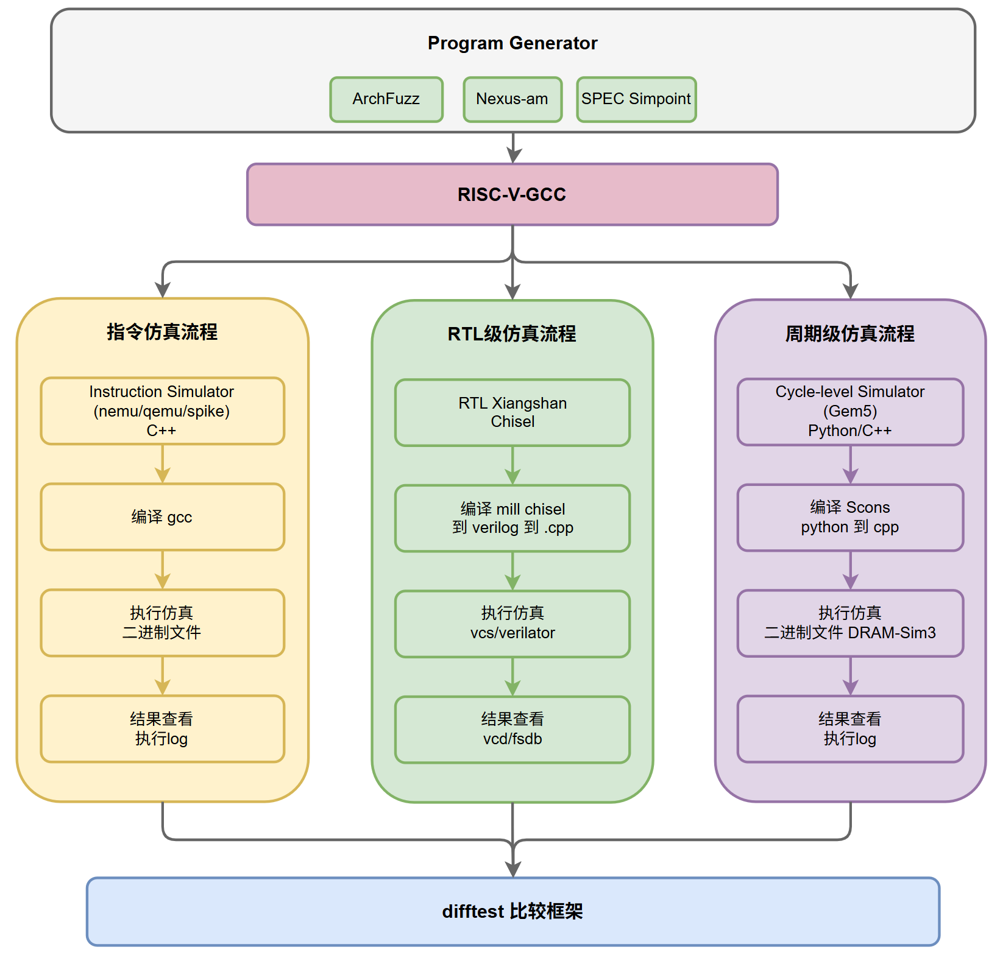
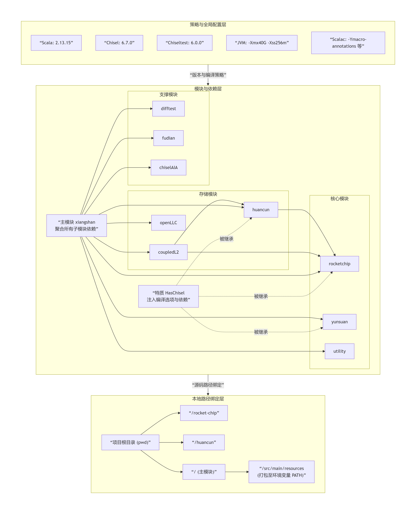
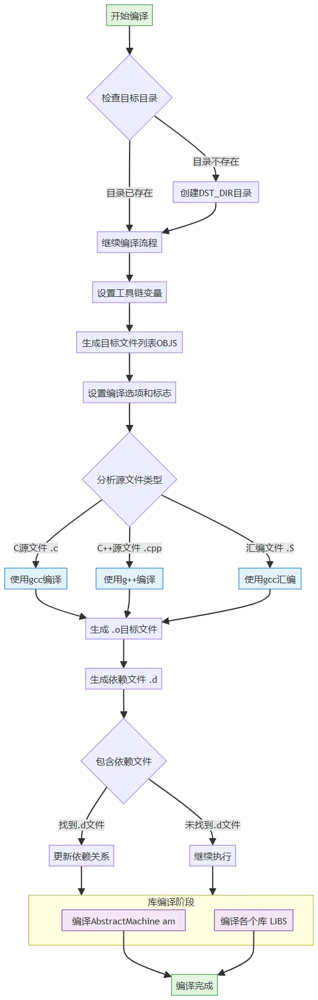
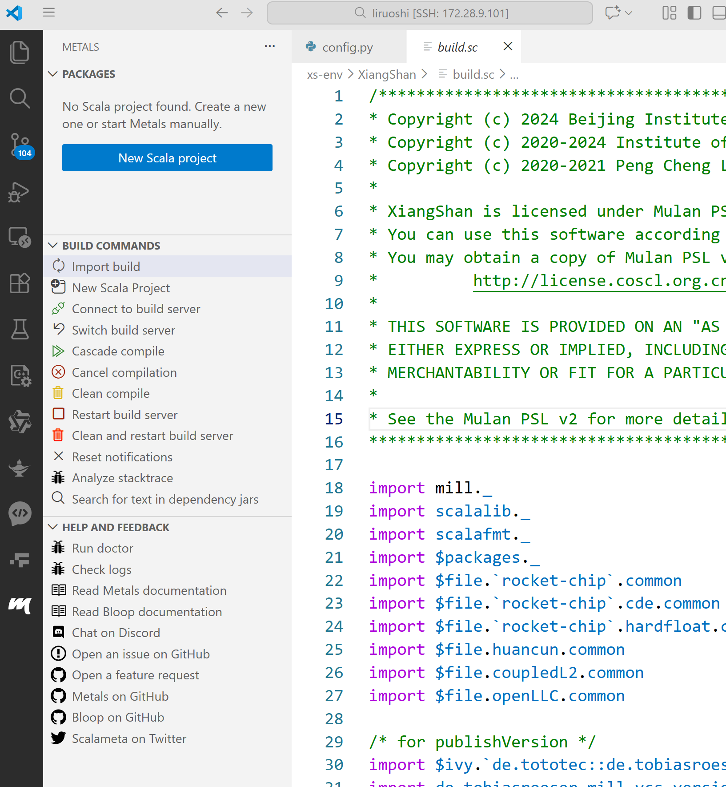

# 第二章 使用工具准备与理解

1 使用工具准备

:::color1
旁白：

如果你是第一次接触处理器开发，请先记住一件事：本章不是让你掌握所有工具而是让你知道它们各自负责什么

:::

:::info

### 🎯 本章完成后你应该能做到

✔ 说出香山开发需要哪些工具\
✔ 理解工具之间的调用关系\
✔ 判断环境是否安装成功\
✔ 解释 Chisel → Verilog → 仿真 的流程

如果做不到，不是你能力问题，而是你跳过了步骤。

:::

## 1.1 香山开发流程与对应工具



图1：

本章我们将介绍绿色路径上涉及的香山开发所需的所有基本使用工具。

绿色部分流程：

```plain
程序生成
   ↓
RISC-V GCC 编译
   ↓
RTL (Chisel)
   ↓
生成 Verilog
   ↓
仿真器运行
   ↓
查看结果
```

香山开发不是单一工具，而是一整套工具链。

| 类型 | 工具 | 作用 |
| --- | --- | --- |
| 设计工具 | Chisel | 写硬件 |
| 构建工具 | Mill | 编译项目 |
| 编译器 | RISC-V GCC | 生成程序 |
| 仿真器 | Verilator / VCS | 运行硬件 |
| IDE | VSCode / IDEA | 写代码 |

:::danger
记忆口诀：写 → 编 → 译 → 跑 → 看

:::

:::info
旁白：在处理器设计的每一个环节，都需要对应的各种专业工具：

* **设计工具**（如Chisel）→ 建筑师的图纸，例如<font style="color:rgb(15, 17, 21);">一</font>张“全玻璃幕墙”的图纸
* **构建工具**（如 Mill）→ 工地指挥塔吊，例如原来设计的是红砖墙，现在改成玻璃幕墙了。于是它下令：“之前切好的红砖别运了，赶紧调一批钢化玻璃过来！”同时通知地基组：“幕墙重了，地基需要额外加固，补一车水泥。”
* **编译工具**（如RISC-V GCC）→ 施工队的工具包，工人们根据图纸，把玻璃切割成标准尺寸。
* **仿真工具**（如Verilator）→ 建筑模型测试台，在电脑里模拟风洞实验，看这玻璃幕墙抗不抗风。
* **开发环境**（如VS Code）→ 建筑师的工作室

:::

## 1.2 主要用到的工具和版本

### 1.2.1 工具链安装脚本

这是香山环境的"一键安装包"，包含了所有必需的工具：

:::danger
**新手提示：** 这个脚本通常在Ubuntu系统上运行，如果你使用其他系统，可能需要手动安装部分工具。

:::

```bash
# This script will setup tools used by XiangShan
# tested on ubuntu 20.04 Docker image

# make apt non-interactive to avoid tzdata prompt
export DEBIAN_FRONTEND=noninteractive

apt update
apt install -y \
    proxychains4 \
    vim \
    wget \
    git \
    tmux \
    make \
    g++ \
    clang \
    llvm \
    time \
    curl \
    libreadline6-dev \
    libsdl2-dev \
    g++-riscv64-linux-gnu \
    openjdk-11-jre \
    zlib1g-dev \
    device-tree-compiler \
    flex \
    autoconf \
    bison \
    sqlite3 \
    libsqlite3-dev \
    zstd \
    libzstd-dev \
    python-is-python3 \
    python3-protobuf \
    python3-grpc-tools \
    rsync

# Install llvm-bolt if available
apt install -y llvm-bolt || echo "Skipping llvm-bolt installation, not available in apt repos"

sh -c "curl -L https://repo1.maven.org/maven2/com/lihaoyi/mill-dist/1.0.4/mill-dist-1.0.4-mill.sh > /usr/local/bin/mill && chmod +x /usr/local/bin/mill"

# We need to use Verilator 4.204+, so we install Verilator manually
source ./install-verilator.sh
```

## ✔ 安装成功判断标准（新增）

执行以下命令：

```plain
mill -v
verilator --version
riscv64-unknown-elf-gcc --version
```

成功表现：

* 都能输出版本号

失败表现：

* command not found
* version not supported

只要三条命令通过，就可以继续。

# 2 各类工具介绍

## 2.1Chisel 工具链

:::info
旁白：

Chisel 作用：写硬件

特点：

* 基于 Scala
* 抽象层高
* 最终不会直接运行

只需记住一句：Chisel = 写CPU的语言

:::

### 2.1.1 Chisel 基础概念

**Q\&A：新手常见问题解答**

#### 1. Chisel 和 Scala 的区别？

**Chisel** 是一种基于 **Scala** 的硬件描述语言（HDL），用于构建硬件设计。它利用了 Scala 的强大功能和面向对象特性，简化了硬件设计过程。

**Scala** 是一种通用的编程语言，支持函数式和面向对象编程，而 Chisel 主要专注于硬件描述和电路设计。

#### 2. Scala 和 Java 的联系？

* **兼容性**：Scala 与 Java 兼容，可以在同一个项目中使用两者。
* **运行环境**：两者都运行在 Java 虚拟机（JVM）上。
* **语法相似性**：Scala 的语法受到 Java 的影响，但增加了更多高级特性。
* **互操作性**：Scala 可以直接调用 Java 库，反之亦然。

#### 3. 为什么 Chisel 代码需要转换为 Verilog/SystemVerilog？

:::info
因为：行业工具只认 Verilog/SystemVerilog

:::

Verilog 和 SystemVerilog 是行业标准的硬件描述语言，广泛用于芯片设计和验证。Chisel 作为高级抽象，通过转换为这些标准语言，可以与现有的工具链、仿真器和综合工具兼容，便于生成实际的硬件电路。

转换流程

```plain
Chisel
 ↓
FIRRTL
 ↓
CIRCT优化
 ↓
SystemVerilog
```

:::info
📌 新手理解到这里就够了\
FIRRTL / CIRCT 细节属于进阶内容。

:::

#### 4. Chisel 如何转换为 Verilog/SystemVerilog？

Chisel 使用其编译器工具将代码转换为 Verilog 或 SystemVerilog。编译过程通常在构建阶段完成，生成的 Verilog 代码可以用于后续的硬件实现。

#### 5. Chisel 哪些版本支持转换为 Verilog？

Chisel 从 3.6.0 版本开始，通过集成 **CIRCT** 项目中的 `firtool` 工具，正式支持将设计编译为 **SystemVerilog（.sv）**

#### 6. Chisel 的最新版本是否默认支持 SystemVerilog？

是的，Chisel 的最新版本默认支持 SystemVerilog，提供了更灵活的硬件描述能力。

### 2.1.2 Chisel 编译流程


图2：Chisel编译处理流程

**图表解读：**

这张图展示了Chisel代码从高级硬件描述到最终硬件实现的完整编译流程：

1. **Chisel源代码**（左侧）
   * 开发者使用Chisel语言编写硬件设计
   * 这是最高层次的抽象，类似于高级编程语言
2. **FIRRTL中间表示**（中部上方）
   * Chisel编译器将代码转换为FIRRTL格式
   * FIRRTL（Flexible Intermediate Representation for RTL）是一种硬件中间表示
   * 这一层去除了Scala语法糖，保留硬件结构
3. **CIRCT优化**（中部）
   * CIRCT（Circuit IR Compiler and Tools）对FIRRTL进行优化
   * 包括逻辑优化、内存访问优化等
   * 使用`firtool`工具进行处理
4. **SystemVerilog输出**（右侧）
   * 最终生成标准的SystemVerilog代码
   * 这是行业标准的硬件描述语言
   * 可以被商业工具（如VCS）和开源工具（如Verilator）接受

:::info
**学习建议：** 初学者不需要深入理解每个步骤，但要知道Chisel代码最终会变成标准的硬件描述语言。

:::

### 2.1.3 Chisel 相关资源

1. **API 介绍**\
   <https://www.chisel-lang.org/>
2. **Chisel Tutorial**\
   <https://github.com/ucb-bar/chisel-tutorial>
3. **在线网站**\
   <https://scastie.scala-lang.org/XWLf0m6vRS2gfXi7pcnaeQ>
4. **香山使用的版本**\
   [Installation | Chisel](https://www.chisel-lang.org/docs/installation)

**工具的版本查看路径：**\
Chisel comes with a firtool-resolver ([chipsalliance/chisel#3458](https://github.com/chipsalliance/chisel/pull/3458)) to automatically download and use the correct CIRCT for building the design.

The Chisel version we are using is listed in `build.sc`. For the corresponding FIRTOOL version, please refer to the Chisel upstream (<https://github.com/chipsalliance/chisel>).

### 2.1.4 CIRCT（电路IR编译器和工具）

<https://circt.llvm.org/>

**"CIRCT"代表"电路 IR 编译器和工具"**

**CIRCT处理FIRRTL**：生成的FIRRTL代码会被送入CIRCT项目中的核心工具 `firtool` 。`firtool`会对设计进行编译、优化（如进行内存访问优化），并最终转换为低层次的目标输出，如优化的SystemVerilog代码。

### 2.1.5 FIRRTL

<https://github.com/chipsalliance/firrtl>

请参阅 [CIRCT](https://github.com/llvm/circt) ，了解下一代 FIRRTL 编译器。另请参阅 [FIRRTL 规范](https://github.com/chipsalliance/firrtl-spec)和 [Chisel](https://github.com/chipsalliance/chisel) 。

**Chisel生成FIRRTL**：当你编译Chisel代码时，它首先会生成一份FIRRTL格式的中间表示。这份描述是"高层次"的，它抽象了寄存器和组合逻辑。

## 2.2 Mill构建工具

:::info
作用：管理项目编译流程

它负责：

* 编译
* 依赖
* 生成文件
* 运行任务

:::

### 2.2.1 Mill简介

#### Mill：一款更优秀的 Java、Scala 和 Kotlin 构建工具

官方文档：[Mill: A Better Build Tool for Java, Scala, & Kotlin :: The Mill Build Tool](https://mill-build.org/mill/index.html)

Mill 构建的项目强依赖于文件结构，所以项目文件夹有相应的格式要求。

[So, What's So Special About The Mill Scala Build Tool?](https://www.lihaoyi.com/post/SoWhatsSoSpecialAboutTheMillScalaBuildTool.html)

:::info

### 新手第一次看 build.sc 只看这三点（新增重点）

打开 build.sc 不要慌，只看以下三点忽略其余内容。

:::

```plain
1️⃣ 模块定义
2️⃣ 依赖关系
3️⃣ 生成任务
```

### 2.2.2 build.sc 文件

**基于 scala 语法的显示**

mill 工具在项目目录中的配置文件。在该文件中主要是添加一些**构建选项和依赖**，在构建时，mill 会联网下载指定的依赖，存放于 out 文件夹。

### 2.2.3 build.sc 代码结构分析



图2：build.sc代码主要结构分析

**图表解读：**

这张图展示了香山项目`build.sc`文件的主要结构，这是一个典型的Mill构建配置文件：

1. **导入和基础配置**（顶部）
   * 导入必要的Mill模块
   * 定义Scala版本和项目根目录
   * 设置默认依赖版本
2. **HasChisel特质**（中部左侧）
   * 为所有需要Chisel的模块提供基础配置
   * 包含Scala编译选项、Chisel依赖、编译器插件
   * 解析firtool工具路径
3. **项目模块定义**（中部）
   * 定义各个子模块：rocketchip、utility、yunsuan等
   * 每个模块对应一个硬件组件
   * 模块之间有依赖关系
4. **主项目配置**（底部）
   * XiangShan主模块组合所有子模块
   * 设置环境变量和JVM参数
   * 版本发布信息生成
   * 资源文件处理
   * 测试配置

**关键文件：** `build.sc`是Mill构建系统的核心配置文件，它定义了项目的结构、依赖、任务和设置。

## 2.3 Verilog 仿真器

:::info
作用：让硬件代码运行起来

:::

输出：

```plain
波形文件
```

你可以看到：

* 信号变化
* 执行过程

### 2.3.1 Verilator

[Verilator User's Guide — Verilator Devel 5.045 documentation](https://verilator.org/guide/latest/)

verilator 仿真会生成 VCD 格式的波形，可以选择通过 gtkwave 等开源软件或 DVE 等商业软件打开。

可以在 open 服务器上通过 gtwave 查看波形，在 mobaxterm 的终端中输入 `gtkwave xxx.vcd` 就可以直接打开 VCD 格式的波形。可以通过 `vcd2fst`命令将 vcd 格式转换成占用空间更小的 FST 格式波形，目前香山的 master 分支也支持直接生成 FST 格式波形。gtkwave 已经是开源范畴中最稳定、功能最强的看波形软件，但依然可能频繁因内存泄漏等原因卡死。

### 2.3.2 VCS

VCS（Verilog Compile Simulator）是一款强大的逻辑仿真工具，广泛用于数字IC设计的验证。

和前面的软件是一样的功能，可以在后面香山的部分查看波形。

## 2.4 RISC-V 编译器（gcc）

:::info
核心认知：普通 gcc 不能编译 RISC-V 程序

原因：不同架构必须用不同编译器。

:::

必须使用：

```plain
riscv64-unknown-elf-gcc
```

### 2.4.1 使用流程

下载 gcc，参考教程

[安装 RISC-V 交叉编译工具链 - USTC CECS 2023](https://soc.ustc.edu.cn/CECS/lab0/riscv/)

#### <font style="color:rgba(0, 0, 0, 0.87);">手动编译安装</font>

<font style="color:rgba(0, 0, 0, 0.87);">在这部分教程中，你将从工程源码开始一步步编译出所需的交叉编译工具链。</font>

#### **<font style="color:rgba(0, 0, 0, 0.87);">安装依赖</font>**

<font style="color:rgba(0, 0, 0, 0.87);">在安装交叉编译工具链之前，我们需要安装一些依赖：</font>

**<font style="color:rgba(0, 0, 0, 0.87);background-color:rgb(245, 245, 245);">shell</font>**

```plain
$ sudo apt install autoconf automake autotools-dev curl python3 python3-pip 
$ sudo apt install libmpc-dev libmpfr-dev libgmp-dev gawk 
$ sudo apt install build-essential bison flex texinfo gperf libtool patchutils 
$ sudo apt install bc zlib1g-dev libexpat-dev ninja-build git cmake libglib2.0-dev
```

#### **<font style="color:rgba(0, 0, 0, 0.87);">下载源码</font>**

<font style="color:rgba(0, 0, 0, 0.87);">我们可以通过以下命令来下载 RISC-V 交叉编译工具链的源码：</font>

**<font style="color:rgba(0, 0, 0, 0.87);background-color:rgb(245, 245, 245);">shell</font>**

```plain
$ git clone --recursive https://github.com/riscv/riscv-gnu-toolchain
```

<font style="color:rgba(0, 0, 0, 0.87);">同样地，你也可以</font>[<font style="color:rgb(121, 86, 73);">点击此处</font>](https://soc.ustc.edu.cn/CECS/appendix/riscv-gnu-toolchain.zip)<font style="color:rgba(0, 0, 0, 0.87);">获取源码压缩包（大小约为 6.8 GB）。</font>

#### **<font style="color:rgba(0, 0, 0, 0.87);">编译安装</font>**

<font style="color:rgba(0, 0, 0, 0.87);">进入源码目录，创建 build 文件夹并进入：</font>

**<font style="color:rgba(0, 0, 0, 0.87);background-color:rgb(245, 245, 245);">shell</font>**

```plain
$ cd riscv-gnu-toolchain
$ mkdir build
$ cd build
```

<font style="color:rgba(0, 0, 0, 0.87);">我们需要编译的是支持乘除法扩展的</font><font style="color:rgba(0, 0, 0, 0.87);"> </font>**<font style="color:rgba(0, 0, 0, 0.87);">riscv64-unknown-linux-gnu</font>**<font style="color:rgba(0, 0, 0, 0.87);"> </font><font style="color:rgba(0, 0, 0, 0.87);">工具链，因此需要执行以下命令进行配置：</font>

**<font style="color:rgba(0, 0, 0, 0.87);background-color:rgb(245, 245, 245);">shell</font>**

```plain
$ ../configure --prefix=/opt/riscv64 --enable-multilib --target=riscv64-linux-multilib
```

<font style="color:rgba(0, 0, 0, 0.87);">之后执行编译。这个过程会非常漫长，强烈建议使用多线程加速编译：</font>

**<font style="color:rgba(0, 0, 0, 0.87);background-color:rgb(245, 245, 245);">shell</font>**

```plain
$ sudo make linux -j <nproc>
```

<font style="color:rgba(0, 0, 0, 0.87);">编译完成后，就可以在 /opt/riscv64/bin 目录下找到交叉编译工具链了。</font>

#### **<font style="color:rgba(0, 0, 0, 0.87);">添加环境变量并测试</font>**

<font style="color:rgba(0, 0, 0, 0.87);">我们可以通过以下命令将交叉编译工具链添加到环境变量中：</font>

**<font style="color:rgba(0, 0, 0, 0.87);background-color:rgb(245, 245, 245);">shell</font>**

```plain
$ echo 'export PATH=/opt/riscv64/bin:$PATH' >> ~/.bashrc
$ source ~/.bashrc
```

<font style="color:rgba(0, 0, 0, 0.87);">之后，我们就可以通过以下命令来查看交叉编译工具链的版本：</font>

**<font style="color:rgba(0, 0, 0, 0.87);background-color:rgb(245, 245, 245);">shell</font>**

```plain
$ riscv64-unknown-linux-gnu-gcc --version
```

<font style="color:rgba(0, 0, 0, 0.87);">若输出了编译器的版本信息，则说明已经安装成功。</font>

<font style="color:rgba(0, 0, 0, 0.87);"></font>

riscv交叉编译链工具（需要自己设置这个环境变量，不然编译workload报错）：/nfs/home/share/riscv/bin

参考示例：

```shell
export PATH=$PATH:/nfs/home/wangran/toolchain/gcc-ubuntu241108/bin
cd apps/
cd hello/
make ARCH=riscv64-xs
```

### 2.4.2 gcc 编译的原理

可选择的编译工具：

```c
riscv64-unknown-elf-addr2line      riscv64-unknown-elf-objcopy           riscv64-unknown-linux-gnu-gcov-tool
riscv64-unknown-elf-ar             riscv64-unknown-elf-objdump           riscv64-unknown-linux-gnu-gdb
riscv64-unknown-elf-as             riscv64-unknown-elf-ranlib            riscv64-unknown-linux-gnu-gdb-add-index
riscv64-unknown-elf-c++            riscv64-unknown-elf-readelf           riscv64-unknown-linux-gnu-gfortran
riscv64-unknown-elf-c++filt        riscv64-unknown-elf-run               riscv64-unknown-linux-gnu-gp-archive
riscv64-unknown-elf-cpp            riscv64-unknown-elf-size              riscv64-unknown-linux-gnu-gp-collect-app
riscv64-unknown-elf-elfedit        riscv64-unknown-elf-strings           riscv64-unknown-linux-gnu-gp-display-html
riscv64-unknown-elf-g++            riscv64-unknown-elf-strip             riscv64-unknown-linux-gnu-gp-display-src
riscv64-unknown-elf-gcc            riscv64-unknown-linux-gnu-addr2line   riscv64-unknown-linux-gnu-gp-display-text
riscv64-unknown-elf-gcc-15.0.0     riscv64-unknown-linux-gnu-ar          riscv64-unknown-linux-gnu-gprof
riscv64-unknown-elf-gcc-ar         riscv64-unknown-linux-gnu-as          riscv64-unknown-linux-gnu-gprofng
riscv64-unknown-elf-gcc-nm         riscv64-unknown-linux-gnu-c++         riscv64-unknown-linux-gnu-ld
riscv64-unknown-elf-gcc-ranlib     riscv64-unknown-linux-gnu-c++filt     riscv64-unknown-linux-gnu-ld.bfd
riscv64-unknown-elf-gcov           riscv64-unknown-linux-gnu-cpp         riscv64-unknown-linux-gnu-lto-dump
riscv64-unknown-elf-gcov-dump      riscv64-unknown-linux-gnu-elfedit     riscv64-unknown-linux-gnu-nm
riscv64-unknown-elf-gcov-tool      riscv64-unknown-linux-gnu-g++         riscv64-unknown-linux-gnu-objcopy
riscv64-unknown-elf-gdb            riscv64-unknown-linux-gnu-gcc         riscv64-unknown-linux-gnu-objdump
riscv64-unknown-elf-gdb-add-index  riscv64-unknown-linux-gnu-gcc-15.0.0  riscv64-unknown-linux-gnu-ranlib
riscv64-unknown-elf-gprof          riscv64-unknown-linux-gnu-gcc-ar      riscv64-unknown-linux-gnu-readelf
riscv64-unknown-elf-ld             riscv64-unknown-linux-gnu-gcc-nm      riscv64-unknown-linux-gnu-run
riscv64-unknown-elf-ld.bfd         riscv64-unknown-linux-gnu-gcc-ranlib  riscv64-unknown-linux-gnu-size
riscv64-unknown-elf-lto-dump       riscv64-unknown-linux-gnu-gcov        riscv64-unknown-linux-gnu-strings
riscv64-unknown-elf-nm             riscv64-unknown-linux-gnu-gcov-dump   riscv64-unknown-linux-gnu-strip
```

makefile.compile 中根据不同的体系架构更换编译工具的前缀：

由此可以看出主要用的编译命令

```bash
OBJS      = $(addprefix $(DST_DIR)/, $(addsuffix .o, $(basename $(SRCS))))
AS        = $(CROSS_COMPILE)gcc
CC        = $(CROSS_COMPILE)gcc
CXX       = $(CROSS_COMPILE)g++
LD        = $(CROSS_COMPILE)ld
AR        = $(CROSS_COMPILE)ar
OBJDUMP   = $(CROSS_COMPILE)objdump
OBJCOPY   = $(CROSS_COMPILE)objcopy
READELF   = $(CROSS_COMPILE)readelf
```

**注意:**

这里的 是 riscv 下的编译，所以 `gcc`命令前面是带有前缀的，单独的 `gcc`编译出来的指令集默认是 x86。

### 2.4.3 makefile 文件的命令是如何把 C 语言编译成 RISC-V 的可执行代码的？

这里使用 makefile.compiler 的编译流程介绍如下：\


:::info
make 编译流程理解

:::

```plain
C代码
 ↓
RISC-V GCC
 ↓
RISC-V 二进制
```

不是：

```plain
C → x86程序
```

***

### 2.4.4 使用 make 指令进行的流程：

1. **环境配置**：`export PATH` 让系统找到 RISC-V 工具链
2. **架构选择**：`ARCH=riscv64-xs` 触发对应的编译配置
3. **构建系统**：Makefile 自动选择合适的编译器和选项
4. **库依赖**：链接了架构特定的 AM 库
5. **最终生成**：针对 RISC-V 64位架构（香山处理器）的可执行文件

### 2.4.5 链接脚本（Linker Script）

:::info
作用：决定程序在内存里的位置

控制内容：

* 代码地址
* 数据地址
* 栈位置

不需要深入理解语法。

:::

#### 简介

链接脚本是指导链接器如何将输入的目标文件（.o文件）合并成输出文件（如可执行文件或库）的脚本。

* 指导链接器如何组织内存布局的**配置文件**
* 定义代码段、数据段、堆栈等的内存地址
* 控制不同段在最终二进制文件中的位置

#### 保存位置

链接脚本通常由开发者编写，一般以`.ld`、`.lds`为扩展名，保存在项目的目录中。在编译时通过`-T`选项指定给链接器。

对应不同的文件要求有不同的链接脚本，可以使用命令查找相应的文件

```bash
yourhome@open01:~/xs-env$ find . -name "*.ld" -o -name "*.lds"
./NutShell/fpga/resource/fsbl-loader/lscript.ld
./nexus-am/am/src/nutshell/ldscript/section.ld
./nexus-am/am/src/nutshell/isa/riscv/boot/loader64.ld
./nexus-am/am/src/southlake/ldscript/loaderflash.ld
./nexus-am/am/src/southlake/ldscript/loadermem.ld
./nexus-am/am/src/xs/ldscript/section.ld
./nexus-am/am/src/nemu/ldscript/section.ld
./nexus-am/am/src/nemu/isa/x86/boot/loader.ld
./nexus-am/am/src/nemu/isa/mips/boot/loader.ld
./nexus-am/am/src/nemu/isa/riscv/boot/loaderflash.ld
./nexus-am/am/src/nemu/isa/riscv/boot/loader64.ld
./nexus-am/am/src/nemu/isa/riscv/boot/loader.ld
./nexus-am/am/src/noop/isa/riscv/boot/loader.ld
./nexus-am/am/src/sdi/ldscript/loader.ld
./NEMU/resource/bbl/bbl.lds
./NEMU/resource/gcpt_restore/restore.lds
./NEMU/resource/nanopb/tests/site_scons/platforms/stm32/stm32_ram.ld
./NEMU/resource/LibCheckpoint/resource/nanopb/tests/site_scons/platforms/stm32/stm32_ram.ld
./NEMU/resource/LibCheckpoint/restore.lds
./XiangShan/rocket-chip/bootrom/linker.ld
./XiangShan/rocket-chip/scripts/debug_rom/link.ld
./XiangShan/rocket-chip/scripts/arch-test/spike/env/link.ld
./XiangShan/rocket-chip/scripts/arch-test/emulator/env/link.ld
```

### 2.4.6 （其他）LLVM

[入门/教程 — LLVM 21.0.0git 文档 - LLVM 项目](https://llvm.net.cn/docs/GettingStartedTutorials.html)

## 2.5 集成开发环境（IDE）

:::info
作用：提供代码提示和跳转

:::

### 2.3.1 Metals + VS Code

1. **下载安装插件**



图3：Metals插件安装界面

**图表解读：**

这张图展示了在VS Code中安装Metals插件的界面：

1. **扩展市场**（左侧）
   * 在VS Code的扩展面板中搜索"Metals"
   * Metals是Scala语言服务器，提供代码补全、跳转等功能
2. **插件信息**（中部）
   * 显示插件名称、版本、开发者信息
   * 描述插件功能：Scala语言服务器
3. **安装按钮**（右侧）
   * 点击"Install"按钮安装插件
   * 安装后需要重新加载VS Code

**安装步骤：**

1. 打开VS Code扩展市场
2. 搜索"Metals"
3. 点击安装
4. 重启VS Code

### 2.3.2 IntelliJ IDEA

**使用流程：**

1. **下载 gateway 或 IDEA**\
   根据不同的开发需求，可以下载 gateway 或 IDEA 进行开发。可以通过学生认证，或自己探索其他方法进行激活。
2. **新建 SSH 连接**\
   点击右上角的 New Connection ，新建一个 SSH 连接。输入用户名和 Host，可以采用 private key 或密码的方式连接到服务器中。
3. **选择 XiangShan 文件夹**\
   选择 XiangShan 文件夹（含有build.sc的 XiangShan 文件夹是一个scala工程），进行项目开发。注意：如果使用IDEA打开一个scala项目，即可进行项目开发；打开非scala的项目IDEA只是当做文件管理器使用。例如，使用IDEA打开 /nfs/home/fenghaoyuan/master/xs-env 目录，将无法进行scala项目正常开发。
4. **启动服务器中的远程 IDE 后端**\
   等待一段时间（如果是第一次启动需要时间较长）\
   在 Settings 中的 Plugins 安装 Scala 插件 (注意下面的截图里有2个Plugins栏, 在On Host, 即主机上才能搜索到并安装scala插件)\
   最后在 Terminal 中 make idea

### 2.3.3 Vim 工具

Vim 是从 vi 发展出来的一个文本编辑器。代码补全、编译及错误跳转等方便编程的功能特别丰富，在程序员中被广泛使用。

参考：vim 的官方网站 (<https://www.vim.org/>)

## 2.6 香山集成开发环境

### 2.6.1 Docker

### 2.6.2 xs-pdb

## 2.7 常见新手错误

| 错误 | 原因 | 解决 |
| --- | --- | --- |
| 找不到 gcc | PATH没设 | export PATH |
| verilator报错 | 版本低 | 更新版本 |
| build失败 | 依赖缺失 | 重新安装 |

# 3 学习路径规划

| 阶段 | 时间 | <font style="color:#DF2A3F;">目标</font> |
| --- | --- | --- |
| 工具熟悉 | 1周 | 知道工具用途 |
| Chisel入门 | 1周 | 会写模块 |
| 构建系统 | 1周 | 看懂 build.sc |
| 完整流程 | 2周 | 能仿真运行 |

### 1.9.1 第一阶段：工具熟悉（1周）

**目标：** 了解各种工具的基本用途\
**任务：**

1. 阅读本章，理解各个工具的作用
2. 尝试运行工具链安装脚本（在虚拟机或容器中）
3. 安装VS Code和Metals插件

### 1.9.2 第二阶段：Chisel入门（1周）

**目标：** 掌握Chisel基本语法\
**任务：**

1. 完成Chisel Tutorial中的基础练习
2. 理解Chisel编译流程
3. 尝试编写简单的Chisel模块

### 1.9.3 第三阶段：构建系统（1周）

**目标：** 理解Mill构建系统\
**任务：**

1. 学习Mill基本命令
2. 理解build.sc文件结构
3. 尝试添加简单的依赖

### 1.9.4 第四阶段：完整流程（2周）

**目标：** 掌握从代码到仿真的完整流程\
**任务：**

1. 配置完整的开发环境
2. 编译简单的Chisel项目
3. 使用Verilator进行仿真
4. 查看波形文件

# 4 总结与建议

## 4.1 本章完成标志

如果你能回答以下问题，说明本章掌握：

```plain
□ Chisel 的作用是什么？
□ 为什么要用 riscv gcc？
□ 仿真器输出什么？
□ Mill 的职责是什么？
```

如果答不出，只需回看对应小节。

### 4.2 本章核心总结：工具链概览

通过本章的学习，你应该已经了解了香山开发环境所需的主要工具：

1. **设计工具**：Chisel（基于Scala的硬件描述语言）
2. **构建工具**：Mill（Scala项目构建工具）
3. **编译工具**：RISC-V GCC交叉编译工具链
4. **仿真工具**：Verilator/VCS（硬件仿真）
5. **开发环境**：VS Code + Metals / IntelliJ IDEA

:::info
记住这五句话：

CPU开发 = 工具链工程\
Chisel 写设计\
GCC 编程序\
仿真器跑硬件\
build.sc 控制构建

:::

>

### ~~1.10.2 给新手的建议~~

1. \~~**从简单开始**~~~~：先理解每个工具的基本用途，不要一开始就深入细节~~
2. \~~**动手实践**~~~~：在虚拟机或容器中尝试安装和运行这些工具~~
3. \~~**循序渐进**~~~~：按照学习路径规划，一步步掌握~~
4. \~~**善用资源**~~~~：官方文档、教程和社区讨论都是宝贵的学习资源~~
5. \~~**保持耐心**~~~~：工具链配置可能会遇到各种问题，这是学习的一部分~~

### ~~1.10.3 下一步行动~~

1. \~~如果你已经理解了各个工具的作用，可以开始配置开发环境~~
2. \~~如果遇到问题，查阅官方文档或搜索社区讨论~~
3. \~~考虑加入香山开源社区，与其他开发者交流学习~~

\~~工具链是处理器开发的基础，掌握好这些工具将为后续的硬件设计打下坚实的基础。祝你在处理器设计的道路上越走越远！~~


> 更新: 2026-04-24 01:44:55  
> 原文: <https://bosc.yuque.com/staff-xmw8rg/fb7qy3/mars7y2vte40egua>