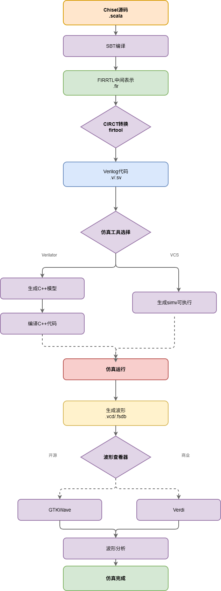

# Chapter 2: Preparing and Understanding the Tools

# 1 Prepare the tools

:::color1
Narrator:

If this is your first time working with processor development, keep one thing in mind: this chapter isn’t meant to teach you how to use every tool, but rather to help you understand what each one does.

:::

:::info

### 🎯 By the end of this chapter, you should be able to

✔ Identify the tools required for XiangShan development

✔ Understand the interdependencies between these tools

✔ Verify whether the environment has been successfully installed

✔ Explain the workflow: Chisel → Verilog → Simulation

If you can’t do this, it’s not a matter of your ability - it’s because you skipped a step.

:::

## 1.1 XiangShan Development Process and Corresponding Tools


图1：

In this chapter, we will introduce all the basic tools required for the development of XiangShan along the green path.

Green process:

```plain
Program Generation
   ↓
RISC-V GCC Compile
   ↓
RTL (Chisel)
   ↓
Generate Verilog
   ↓
Simulator Execution
   ↓
View Results
```

XiangShan Development is not a single tool, but a complete toolchain.

| Type | Tool | Usage |
| --- | --- | --- |
| Design Tools | Chisel | Write Hardware |
| Build tools | Mill | Compile Project |
| Compiler | RISC-V GCC | Generate Program |
| Simulator | Verilator / VCS | Run Hardware |
| IDE | VSCode / IDEA | Write Code |

:::danger
Mnemonic: Write → Compile → Translate → Run → View

:::

:::info
Narrator: Every stage of processor design requires a variety of specialized tools:

* **Design tools** (such as Chisel) → An architect’s blueprints, such as a blueprint for an “all-glass curtain wall”
* **Build tools** (e.g., Mill) → The crane operator on the construction site. For example, the original design called for a red brick wall, but it has now been changed to a glass curtain wall. So the crane operator orders: “Don’t deliver the pre-cut red bricks; get a batch of tempered glass over here right away!” At the same time, they notify the foundation team: “The curtain wall is heavier, so the foundation needs extra reinforcement—send over a truckload of cement.”
* **Compilation tools** (e.g., RISC-V GCC) → The construction crew’s toolkit; workers use the blueprints to cut the glass into standard sizes.
* **Simulation tools** (e.g., Verilator) → The architectural model test bench; it simulates wind tunnel tests on a computer to see if the glass curtain wall can withstand the wind.
* **Development environments** (e.g., VS Code) → The architect’s studio

:::

## 1.2 Main tools and their versions

### 1.2.1 Toolchain Installation Script

This is the “one-click installer” for XiangShan Environment, which includes all the necessary tools:

:::danger
**Tip for beginners:** This script typically runs on Ubuntu. If you're using a different operating system, you may need to install some tools manually.

:::

```bash
# This script will setup tools used by XiangShan
# tested on ubuntu 20.04 Docker image

# make apt non-interactive to avoid tzdata prompt
export DEBIAN_FRONTEND=noninteractive

apt update
apt install -y \
    proxychains4 \
    vim \
    wget \
    git \
    tmux \
    make \
    g++ \
    clang \
    llvm \
    time \
    curl \
    libreadline6-dev \
    libsdl2-dev \
    g++-riscv64-linux-gnu \
    openjdk-11-jre \
    zlib1g-dev \
    device-tree-compiler \
    flex \
    autoconf \
    bison \
    sqlite3 \
    libsqlite3-dev \
    zstd \
    libzstd-dev \
    python-is-python3 \
    python3-protobuf \
    python3-grpc-tools \
    rsync

# Install llvm-bolt if available
apt install -y llvm-bolt || echo "Skipping llvm-bolt installation, not available in apt repos"

sh -c "curl -L https://repo1.maven.org/maven2/com/lihaoyi/mill-dist/1.0.4/mill-dist-1.0.4-mill.sh > /usr/local/bin/mill && chmod +x /usr/local/bin/mill"

# We need to use Verilator 4.204+, so we install Verilator manually
source ./install-verilator.sh
```

## ✔ Criteria for Determining Successful Installation (New)

Run the following command:

```plain
mill -v
verilator --version
riscv64-unknown-elf-gcc --version
```

Signs of success:

* Can all display the build number

Signs of failure:

* command not found
* version not supported

Once these three commands are approved, we can proceed.

# 2 Introduction to Various Tools

## 2.1 Chisel Toolchain

:::info
Narration:

Chisel Purpose: Writing hardware

Features:

* Based on Scala
* High level of abstraction
* Does not ultimately run directly

Just remember this: Chisel = A language for writing CPUs

:::

### 2.1.1 Chisel Basics

**Q\&A：FAQ for Beginners**

#### 1. What is the difference between Chisel and Scala?

**Chisel** is a Scala-based hardware description language (HDL) used to build hardware designs. It leverages Scala’s powerful features and object-oriented capabilities to simplify the hardware design process.

**Scala** is a general-purpose programming language that supports both functional and object-oriented programming, while Chisel focuses primarily on hardware description and circuit design.

#### 2. What is the connection between Scala and Java?

* **Compatibility:** Scala is compatible with Java, and both can be used within the same project.
* **Runtime Environment:** Both run on the Java Virtual Machine (JVM).
* **Syntax Similarity:** Scala’s syntax is influenced by Java but includes additional high-level features.
* **Interoperability:** Scala can directly call Java libraries, and vice versa.

#### 3. Why does Chisel code need to be converted to Verilog/SystemVerilog?

:::info
Answer: Industry tools only support Verilog/SystemVerilog

:::

Verilog and SystemVerilog are industry-standard hardware description languages widely used in chip design and verification. As a high-level abstraction, Chisel is compatible with existing toolchains, simulators, and synthesis tools by converting to these standard languages, facilitating the generation of actual hardware circuits.

Conversion Process

```plain
Chisel
 ↓
FIRRTL
 ↓
CIRCT Optimization
 ↓
SystemVerilog
```

:::info
📌 That's all beginners need to know for now.\
The details of FIRRTL and CIRCT are covered in the advanced section.

:::

#### 4. How do I convert Chisel to Verilog/SystemVerilog?

Chisel uses its compiler tools to convert code into Verilog or SystemVerilog. The compilation process is typically completed during the build phase, and the generated Verilog code can be used for subsequent hardware implementation.

#### 5. Which versions of Chisel support conversion to Verilog?

Starting with version 3.6.0, Chisel officially supports compiling designs into **SystemVerilog** (.sv) by integrating the `firtool`tool from the **CIRCT** project.

#### 6. Does the latest version of Chisel support SystemVerilog by default?

Yes, the latest version of Chisel supports SystemVerilog by default, offering more flexible hardware description capabilities.

### 2.1.2 Chisel Compilation Process



Figure 2: Chisel Compilation Process

**Figure Description:**

This diagram illustrates the complete compilation process for Chisel code, from high-level hardware description to the final hardware implementation:

1. **Chisel source** code (left)
   * Developers use the Chisel language to write hardware designs
   * This is the highest level of abstraction, similar to a high-level programming language
2. **FIRRTL Central Region** (Upper Central)
   * The Chisel compiler converts the code into FIRRTL format
   * FIRRTL (Flexible Intermediate Representation for RTL) is a hardware intermediate representation
   * This layer strips away Scala's syntactic sugar and retains the hardware structure.
3. \*\*CIRCT Optimization \*\*(Central Region)
   * CIRCT (Circuit IR Compiler and Tools) optimizes FIRRTL
   * Including logic optimization, memory access optimization, and more
   * Process using the `firtool`tool
4. **SystemVerilog output** (right)
   * Generates standard SystemVerilog code
   * This is an industry-standard hardware description language
   * It is supported by commercial tools (such as VCS) and open-source tools (such as Verilator)

:::info
**Learning tip:** Beginners don’t need to fully understand every step, but they should know that Chisel code ultimately translates into a standard hardware description language.

:::

### 2.1.3 Chisel Resources

1. **API Overview**\
   <https://www.chisel-lang.org/>
2. **Chisel Tutorial**\
   <https://github.com/ucb-bar/chisel-tutorial>
3. **Online website**\
   <https://scastie.scala-lang.org/XWLf0m6vRS2gfXi7pcnaeQ>
4. **The version used by XiangShan**\
   [Installation | Chisel](https://www.chisel-lang.org/docs/installation)

**Path to view the tool's version:**\
Chisel comes with a firtool-resolver ([chipsalliance/chisel#3458](https://github.com/chipsalliance/chisel/pull/3458)) to automatically download and use the correct CIRCT for building the design.

The Chisel version we are using is listed in `build.sc`. For the corresponding FIRTOOL version, please refer to the Chisel upstream (<https://github.com/chipsalliance/chisel>).

### 2.1.4 CIRCT (Circuit IR Compiler and Tools)

<https://circt.llvm.org/>

**“CIRCT” stands for “Circuit IR Compiler and Tools”**

CIRCT processes FIRRTL: The generated FIRRTL code is fed into `firtool`, the core tool of the CIRCT project. `firtool`compiles and optimizes the design (e.g., by optimizing memory access) and ultimately converts it into low-level target output, such as optimized SystemVerilog code.

### 2.1.5 FIRRTL

<https://github.com/chipsalliance/firrtl>

See [CIRCT](https://github.com/llvm/circt) for information on the next-generation FIRRTL compiler. See also the [FIRRTL specification](https://github.com/chipsalliance/firrtl-spec) and [Chisel](https://github.com/chipsalliance/chisel).

**Chisel generates FIRRTL:** When you compile Chisel code, it first generates an intermediate representation in FIRRTL format. This description is “high-level” and abstracts away registers and combinational logic.

## 2.2 Mill Build Tool

:::info
Purpose of the Mill build tool: To manage the project build process

It handles:

* Compilation
* Dependencies
* Generating files
* Running tasks

:::

### 2.2.1 About Mill

#### Mill: A Better Build Tool for Java, Scala, and Kotlin

Official documentation: [Mill: A Better Build Tool for Java, Scala, & Kotlin :: The Mill Build Tool](https://mill-build.org/mill/index.html)

Projects built with Mill rely heavily on the file structure, so the project folder must adhere to specific formatting requirements.

[So, What's So Special About The Mill Scala Build Tool?](https://www.lihaoyi.com/post/SoWhatsSoSpecialAboutTheMillScalaBuildTool.html)

:::info

### Three Key Points for Beginners Looking at `build.sc`for the First Time (New Focus)

Open build.sc. Don’t panic - just focus on the following three points and ignore the rest.

:::

```plain
1️⃣ Module Definition
2️⃣ Dependencies
3️⃣ Generate Task
```

### 2.2.2 build.sc file

**Display based on Scala syntax**

The mill tool generates a configuration file in the project directory. This file primarily contains **build options and dependencies**. During the build process, mill connects to the internet to download the specified dependencies and stores them in the out folder.

### 2.2.3 Analysis of the build.sc Code Structure


Figure 2: Analysis of the main structure of the build.sc code

**Chart Analysis:**

This diagram shows the main structure of the `build.sc`file for the XiangShan project, which is a typical Mill build configuration file:

1. **Import and Basic Configuration** (Top)
   * Import the necessary Mill modules
   * Specify the Scala version and the project root directory
   * Set the default dependency version
2. **HasChisel trait** (center left)
   * Provides basic configuration for all modules that require Chisel
   * Includes Scala compilation options, Chisel dependencies, and compiler plugins
   * Resolves the firtool toolpath
3. **Project Module Definitions** (Central)
   * Define the various submodules: rocketchip, utility, yunsuan, etc.
   * Each module corresponds to a hardware component
   * There are dependencies between modules
4. **Main Project Configuration** (bottom)
   * The XiangShan main module combines all submodules
   * Set environment variables and JVM parameters
   * Generate release notes
   * Process resource files
   * Test configuration

**Key file:** `build.sc` is the core configuration file of the Mill build system; it defines the project’s structure, dependencies, tasks, and settings.

## 2.3 Verilog Simulator

:::info
Purpose: To make the hardware code run

:::

Output:

```plain
Waveform file
```

You can see:

* Signal changes
* The execution process

### 2.3.1 Verilator

[Verilator User's Guide — Verilator Devel 5.045 documentation](https://verilator.org/guide/latest/)

Verilator simulation generates waveforms in VCD format, which can be opened using open-source software such as gtkwave or commercial software such as DVE.

You can view waveforms on the server using gtkwave; simply enter `gtkwave xxx.vcd`in the Mobaxterm terminal to open VCD-format waveforms directly. You can use the `vcd2fst`command to convert VCD-format waveforms to the more space-efficient FST format. Currently, the master branch of XiangShan also supports direct generation of FST-format waveforms. gtkwave is already the most stable and feature-rich waveform viewer in the open-source realm, but it may still frequently freeze due to memory leaks and other issues.

### 2.3.2 VCS

VCS (Verilog Compile Simulator) is a powerful logic simulation tool widely used for verifying digital IC designs.

It offers the same functionality as the previous software; you can view waveforms in the XiangShan section below.

## 2.4 RISC-V Compiler (gcc)

:::info
Key Point: Standard GCC cannot compile RISC-V programs.

Reason: Different architectures require different compilers.

:::

You must use:

```plain
riscv64-unknown-elf-gcc
```

### 2.4.1 Usage Instructions

Download GCC and follow the tutorial

[Installing the RISC-V Cross-Compilation Toolchain - USTC CECS 2023](https://soc.ustc.edu.cn/CECS/lab0/riscv/)

Set the environment variables, then use the `make`command to compile

RISCV cross-compilation tools (you must set this environment variable yourself; otherwise, you will encounter errors when compiling the workload): /nfs/home/share/riscv/bin

```shell
export PATH=$PATH:/nfs/home/wangran/toolchain/gcc-ubuntu241108/bin
cd apps/
cd hello/
make ARCH=riscv64-xs
```

### 2.4.2 How GCC Compiles

Available compilation tools:

```c
riscv64-unknown-elf-addr2line      riscv64-unknown-elf-objcopy           riscv64-unknown-linux-gnu-gcov-tool
riscv64-unknown-elf-ar             riscv64-unknown-elf-objdump           riscv64-unknown-linux-gnu-gdb
riscv64-unknown-elf-as             riscv64-unknown-elf-ranlib            riscv64-unknown-linux-gnu-gdb-add-index
riscv64-unknown-elf-c++            riscv64-unknown-elf-readelf           riscv64-unknown-linux-gnu-gfortran
riscv64-unknown-elf-c++filt        riscv64-unknown-elf-run               riscv64-unknown-linux-gnu-gp-archive
riscv64-unknown-elf-cpp            riscv64-unknown-elf-size              riscv64-unknown-linux-gnu-gp-collect-app
riscv64-unknown-elf-elfedit        riscv64-unknown-elf-strings           riscv64-unknown-linux-gnu-gp-display-html
riscv64-unknown-elf-g++            riscv64-unknown-elf-strip             riscv64-unknown-linux-gnu-gp-display-src
riscv64-unknown-elf-gcc            riscv64-unknown-linux-gnu-addr2line   riscv64-unknown-linux-gnu-gp-display-text
riscv64-unknown-elf-gcc-15.0.0     riscv64-unknown-linux-gnu-ar          riscv64-unknown-linux-gnu-gprof
riscv64-unknown-elf-gcc-ar         riscv64-unknown-linux-gnu-as          riscv64-unknown-linux-gnu-gprofng
riscv64-unknown-elf-gcc-nm         riscv64-unknown-linux-gnu-c++         riscv64-unknown-linux-gnu-ld
riscv64-unknown-elf-gcc-ranlib     riscv64-unknown-linux-gnu-c++filt     riscv64-unknown-linux-gnu-ld.bfd
riscv64-unknown-elf-gcov           riscv64-unknown-linux-gnu-cpp         riscv64-unknown-linux-gnu-lto-dump
riscv64-unknown-elf-gcov-dump      riscv64-unknown-linux-gnu-elfedit     riscv64-unknown-linux-gnu-nm
riscv64-unknown-elf-gcov-tool      riscv64-unknown-linux-gnu-g++         riscv64-unknown-linux-gnu-objcopy
riscv64-unknown-elf-gdb            riscv64-unknown-linux-gnu-gcc         riscv64-unknown-linux-gnu-objdump
riscv64-unknown-elf-gdb-add-index  riscv64-unknown-linux-gnu-gcc-15.0.0  riscv64-unknown-linux-gnu-ranlib
riscv64-unknown-elf-gprof          riscv64-unknown-linux-gnu-gcc-ar      riscv64-unknown-linux-gnu-readelf
riscv64-unknown-elf-ld             riscv64-unknown-linux-gnu-gcc-nm      riscv64-unknown-linux-gnu-run
riscv64-unknown-elf-ld.bfd         riscv64-unknown-linux-gnu-gcc-ranlib  riscv64-unknown-linux-gnu-size
riscv64-unknown-elf-lto-dump       riscv64-unknown-linux-gnu-gcov        riscv64-unknown-linux-gnu-strings
riscv64-unknown-elf-nm             riscv64-unknown-linux-gnu-gcov-dump   riscv64-unknown-linux-gnu-strip
```

In `makefile.compile`, the prefix of the compilation tool is changed based on the architecture:

This shows the main compilation commands used

```bash
OBJS      = $(addprefix $(DST_DIR)/, $(addsuffix .o, $(basename $(SRCS))))
AS        = $(CROSS_COMPILE)gcc
CC        = $(CROSS_COMPILE)gcc
CXX       = $(CROSS_COMPILE)g++
LD        = $(CROSS_COMPILE)ld
AR        = $(CROSS_COMPILE)ar
OBJDUMP   = $(CROSS_COMPILE)objdump
OBJCOPY   = $(CROSS_COMPILE)objcopy
READELF   = $(CROSS_COMPILE)readelf
```

Note:

This is a compilation under RISC-V, so the `gcc`command is prefixed. By default, the instruction set generated by a standalone `gcc`compilation is x86.

### 2.4.3 How do the commands in the Makefile compile C code into executable RISC-V code?

The compilation process using `makefile.compiler`is described below:\


:::info
Understanding the make Compilation Process

:::

```plain
C Code
 ↓
RISC-V GCC
 ↓
RISC-V Binary
```

Not：

```plain
C → x86 Program (Binary)
```

***

### 2.4.4 The process using the `make`command:

1. **Environment setup:** `export PATH`to allow the system to locate the RISC-V toolchain
2. **Architecture selection:** `ARCH=riscv64-xs`triggers the corresponding compilation configuration
3. **Building the system:** Makefile automatically selects the appropriate compiler and options
4. **Library dependencies:** Links to architecture-specific AM libraries
5. **Final output:** An executable file for the RISC-V 64-bit architecture (specifically, for XiangShan processor)

### 2.4.5 Linker Script

:::info
Purpose: Determines the program’s location in memory

Key elements controlled:

* Code addresses
* Data addresses
* Stack locations

No in-depth understanding of the syntax is required.

:::

#### Introduction

A linker script is a script that instructs the linker on how to combine the input object files (.o files) into an output file (such as an executable or a library).

* A **configuration file** that instructs the linker on how to organize the memory layout
* Defines the memory addresses for code segments, data segments, the stack, and so on
* Controls the placement of different segments within the final binary file

#### Location

Linker scripts are typically written by developers, usually have the extensions `.ld` or `.lds`, and are stored in the project directory. They are specified to the linker using the `-T` option during compilation.

Different files require different linker scripts; you can use the command to locate the appropriate file.

```bash
yourhome@open01:~/xs-env$ find . -name "*.ld" -o -name "*.lds"
./NutShell/fpga/resource/fsbl-loader/lscript.ld
./nexus-am/am/src/nutshell/ldscript/section.ld
./nexus-am/am/src/nutshell/isa/riscv/boot/loader64.ld
./nexus-am/am/src/southlake/ldscript/loaderflash.ld
./nexus-am/am/src/southlake/ldscript/loadermem.ld
./nexus-am/am/src/xs/ldscript/section.ld
./nexus-am/am/src/nemu/ldscript/section.ld
./nexus-am/am/src/nemu/isa/x86/boot/loader.ld
./nexus-am/am/src/nemu/isa/mips/boot/loader.ld
./nexus-am/am/src/nemu/isa/riscv/boot/loaderflash.ld
./nexus-am/am/src/nemu/isa/riscv/boot/loader64.ld
./nexus-am/am/src/nemu/isa/riscv/boot/loader.ld
./nexus-am/am/src/noop/isa/riscv/boot/loader.ld
./nexus-am/am/src/sdi/ldscript/loader.ld
./NEMU/resource/bbl/bbl.lds
./NEMU/resource/gcpt_restore/restore.lds
./NEMU/resource/nanopb/tests/site_scons/platforms/stm32/stm32_ram.ld
./NEMU/resource/LibCheckpoint/resource/nanopb/tests/site_scons/platforms/stm32/stm32_ram.ld
./NEMU/resource/LibCheckpoint/restore.lds
./XiangShan/rocket-chip/bootrom/linker.ld
./XiangShan/rocket-chip/scripts/debug_rom/link.ld
./XiangShan/rocket-chip/scripts/arch-test/spike/env/link.ld
./XiangShan/rocket-chip/scripts/arch-test/emulator/env/link.ld
```

### 2.4.6 (Other) LLVM

[Getting Started/Tutorials — LLVM 21.0.0 Git Documentation - LLVM Project](https://llvm.org/docs/tutorial/)

## 2.5 Integrated Development Environment (IDE)

:::info
Function: Provides code hints and navigation

:::

### 2.5.1 Metals + VS Code

1. **Download and install the plugin**


Figure 3: Metals plugin installation interface

**Figure Description:**

This image shows the interface for installing the Metals extension in VS Code:

1. **Extension Marketplace** (left side)
   * Search for “Metals” in the VS Code Extensions panel
   * Metals is a Scala language server that provides features such as code completion and navigation
2. **Plugin Information** (Center)
   * Displays the plugin name, version, and developer information
   * Describes the plugin’s functionality: Scala language server
3. **Install Button** (Right)
   * Click the “Install” button to install the plugin
   * You will need to restart VS Code after installation

**Installation steps:**

1. Open the VS Code Marketplace
2. Search for “Metals”
3. Click Install
4. Restart VS Code

### 2.5.2 IntelliJ IDEA

**Usage Instructions:**

1. **Download Gateway or IDEA**\
   Depending on your development needs, you can download either Gateway or IDEA. You can activate the software using your student credentials or explore other methods on your own.
2. **Create a New SSH Connection**\
   Click “New Connection” in the top-right corner to create a new SSH connection. Enter your username and hostname; you can connect to the server using a private key or a password.
3. **Select the XiangShan Folder**\
   Select the XiangShan folder (the XiangShan folder containing `build.sc` is a Scala project) to begin project development. Note: If you open a Scala project in IDEA, you can proceed with development; however, if you open a non-Scala project, IDEA will function solely as a file manager. For example, opening the `/nfs/home/fenghaoyuan/master/xs-env` directory in IDEA will not allow for normal Scala project development.
4. **Start the remote IDE backend on the server**\
   Wait for a while (the first startup may take longer)

Install the Scala plugin under Plugins in Settings (Note: There are two Plugins panes in the screenshot below; you can only search for and install the Scala plugin under On Host)

Finally, run `make idea`in the Terminal

### 2.5.3 Vim Tool

Vim is a text editor that evolved from vi. It offers a wide range of features designed to make programming easier, such as code completion, compilation, and error navigation, and is widely used among programmers.

Reference: Vim's official website ([https://www.vim.org/)](https://www.vim.org/))

## 2.6 XiangShan Integrated Development Environment

### 2.6.1 Docker

### 2.6.2 xs-pdb

## 2.7 Common Mistakes Made by Beginners

| Error | Cause | Solution |
| --- | --- | --- |
| Cannot find gcc | PATH not set | export PATH |
| Verilator error | Outdated version | Update to the latest version |
| Build failed | Missing dependencies | Reinstall |

# 3 Learning Path Planning

| Phase | Duration | <font style="color:#DF2A3F;">Objective</font> |
| --- | --- | --- |
| Tool Familiarization | 1 week | Understand the purpose of the tools |
| Chisel Introduction | 2 weeks | Be able to write modules |
| Build System | 1 week | Understand build.sc |
| Complete Workflow | 2 weeks | Be able to run a simulation |

### 3.1.1 Phase 1: Familiarization with Tools (1 week)

**Objective:** Understand the basic uses of various tools\
**Tasks:**

1. Read this chapter to understand the functions of each tool
2. Try running the toolchain installation script (in a virtual machine or container)
3. Install VS Code and the Metals extension

### 3.1.2 Phase 2: Introduction to Chisel (2 weeks)

**Objective:** Master the basic syntax of Chisel\
**Tasks:**

1. Complete the basic exercises in the Chisel Tutorial
2. Understand the Chisel compilation process
3. Try writing a simple Chisel module

### 3.1.3 Phase 3: Building System (1 week)

**Objective:** Understand the Mill build system\
**Tasks:**

1. Learn the basic Mill commands
2. Understand the structure of the build.sc file
3. Try adding simple dependencies

### 3.1.4 Phase 4: Complete Workflow (2 weeks)

**Objective:** Master the complete workflow from code to simulation\
**Tasks:**

1. Set up a complete development environment
2. Compile a simple Chisel project
3. Run simulations using Verilator
4. View waveform files

# 4 Summary and Advices

## 4.1 Chapter Completion Checklist

If you can answer the following questions, you have mastered this chapter:

```plain
□ What is the purpose of Chisel?
□ Why use RISC-V GCC?
□ What does the simulator output?
□ What is Mill’s role?
```

If you cannot answer these questions, simply review the relevant sections.

### 4.2 Key Takeaways from This Chapter: Overview of the Toolchain

By the end of this chapter, you should have a good understanding of the key tools required for the XiangShan development environment:

1. **Design Tool:** Chisel (a Scala-based hardware description language)
2. **Build Tool:** Mill (a Scala project build tool)
3. **Compilation Tool:** RISC-V GCC cross-compilation toolchain
4. **Simulation Tool:** Verilator/VCS (hardware simulation)
5. **Development Environment:** VS Code + Metals / IntelliJ IDEA

:::info
Remember these five points:

CPU development = toolchain engineering

Chisel for design

GCC for compilation

Simulator for hardware execution

build.sc for build control

:::


> 更新: 2026-04-15 11:07:46  
> 原文: <https://bosc.yuque.com/staff-xmw8rg/fb7qy3/ciu5fugbpnl5a2he>