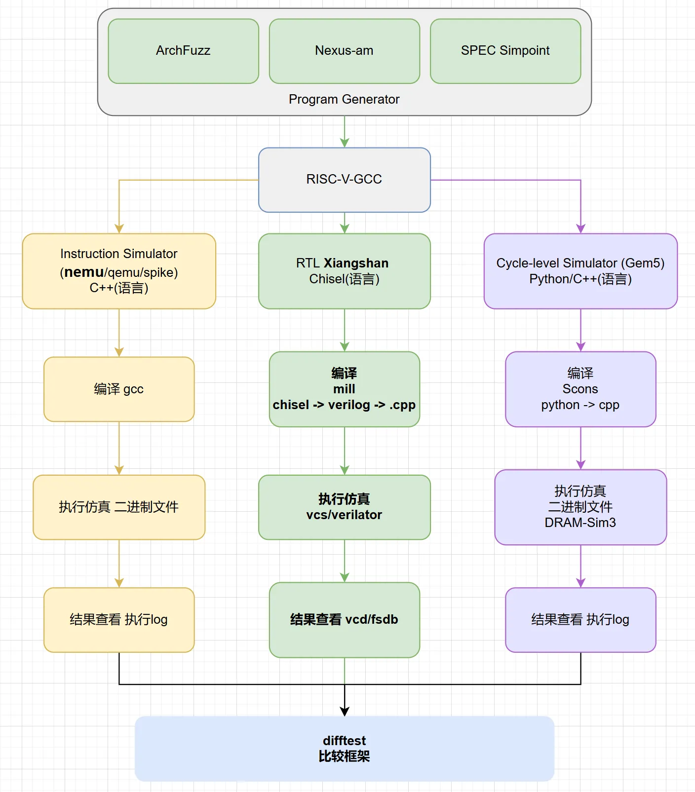
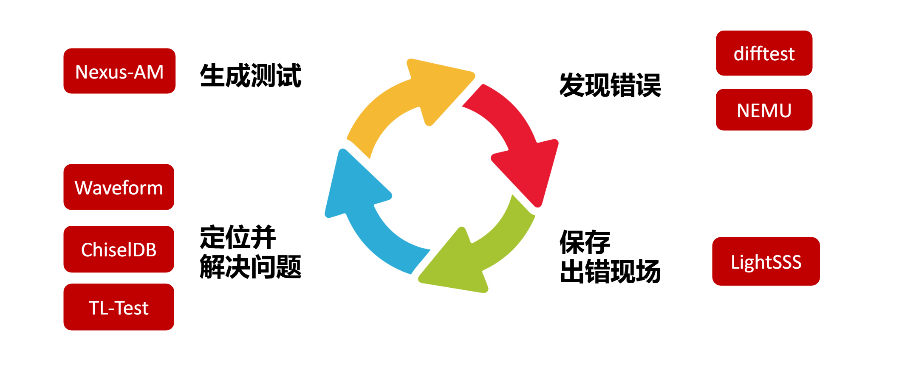
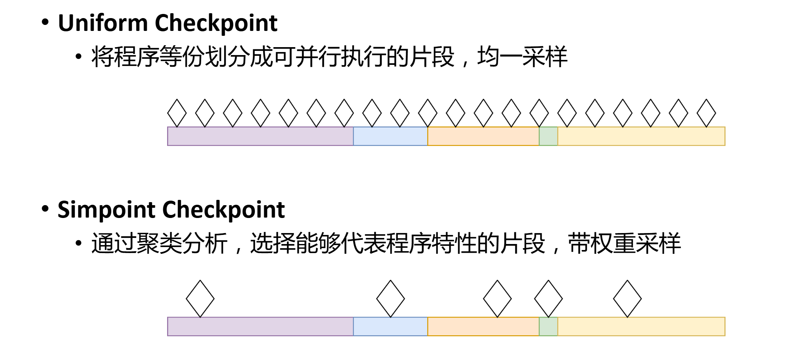

# Chapter 3: Applications

# 3 Applications

:::info

### 🎯 Chapter Objectives

By the end of this chapter, you should be able to:

* **Understand the Logic:** Explain why XiangShan cannot directly run standard .exe or .elf files.
* **Master the Tools:** Understand the significance of the AM (Abstract Machine) layer and become proficient in using the ARCH parameter.
* **Advanced Concepts:** Understand the fundamentals of performance evaluation (CoreMark/SPEC) and accelerated simulation (SimPoint).

:::



本章讲解横向绿色板块

### **1️⃣**\*\* Let’s start with the question: Why can’t a program run directly on the CPU?\*\*

When you double-click an `.exe`file on Windows, it runs because the Windows operating system manages memory, the display, and files for you.\
**But XiangShan is currently just a “bare-bones” system:**

1. It has no operating system (Linux/Windows).
2. It lacks display drivers.
3. It doesn’t even know where memory begins.

**Conclusion:**\
To run a program on this “bare-metal” CPU, a **“translation”** is required. This translation is performed by the **AM (Abstract Machine)**.

## 3.1 Nexus-am Framework

### **2️⃣**\*\* What exactly is AM?  \*\*

**Engineering Definition:**\
AM is the **minimal runtime interface layer** between programs and hardware.

**Block Diagram:**

> **Application (App)** *(e.g., Hello XiangShan)*\
>      ↓ Calls\
> **AM (Abstract Machine)** *(Interpreter: responsible for translating “print” into “write to register”)*\
>      ↓ Execution\
> **CPU (XiangShan/NEMU)** (The Laborer: Responsible only for executing the simplest addition, subtraction, and branch operations)

:::danger
**A Fact Beginners Must Understand:**\
The CPU does not directly execute your C code; it only executes a stream of binary instructions that have been wrapped by AM and are tailored to the specific hardware environment.

:::

### 3.1.1 nexus-am Overview

Source code: [GitHub - OpenXiangShan/nexus-am](https://github.com/OpenXiangShan/nexus-am)

#### Core Objectives:

* **Agilely** generate workloads in the absence of an operating system
* Provide a runtime framework for **bare-metal** systems (such as XiangShan)

**Advantages:**

* Lightweight and easy to use
* Implements basic **system call interfaces and exception handling**
* Supports multiple ISAs and configurations



Figure 1: Structure of the Nexus-AM framework

**Figure 1 Explanation:**

This figure illustrates the overall architecture of the nexus-am (Abstract Machine) framework, a lightweight runtime framework designed for bare-metal environments:

1. **Application Layer** (Top)
   * Various applications written by users
   * Includes test programs such as Hello XiangShan and CoreMark
   * Written in standard C/C++
2. **Abstract Machine Interface** (Middle)
   * Provides a unified system call interface
   * Includes file operations, memory management, thread scheduling, etc.
   * Absorbs differences in underlying hardware
3. **Platform Adaptation Layer** (Bottom)
   * Implementations for different hardware platforms
   * Includes XiangShan (xs), NEMU, QEMU, etc.
   * Provides hardware-specific drivers and initialization

#### Key Features:

nexus-am allows developers to write and run programs as if they were in an operating system environment, even without an operating system.

### 3.1.2 Using Commands

#### 3️⃣ How is the program compiled?

Understanding the compilation pipeline is key to troubleshooting “file not found” issues:

Flowchart:\
`C source code`→ `Makefile (cooking recipe)`→ `Select ARCH (choose utensils)`→ `RISC-V GCC (chef)`→ `RISC-V binary image (.bin)`

```plain
C program (source code)
 ↓
Makefile (cooking recipe)
 ↓
ARCH selection (Selecting utensils)
 ↓
RISC-V GCC (Chef)
 ↓
RISC-V program, i.e., RISC-V binary image (.bin)
```

:::danger
**Core variables:**

* `$AM_HOME`: Tells the system where AM’s source code is located; this is the cornerstone of compilation
* ARCH determines the target platform

:::

[Using AM to generate a custom workload - XiangShan](https://xiangshan-doc-test.readthedocs.io/next/en/tools/gen-workload-with-am/)

#### 3.1.2.1 Program Compilation Framework

##### 3.1.2.1.1 Makefile Build System

The entire framework is compiled using Makefile command files.

Please reference: [Detailed Explanation of Makefile](https://bosc.yuque.com/staff-xmw8rg/fb7qy3/aa0v630i80i1y4g1)

:::danger
**Tip for Beginners:** A Makefile is like a cookbook📖—it tells the system how to “cook” an executable program step by step.

:::

#### 3.1.2.2 How to Use the Framework?

1. Create your own example using `mkdir`in the `apps`directory where the application is stored.
2. Create a `makefile`and modify it according to the specified format
3. Create the source file `xx.c`(including the necessary header files)
4. Use the compilation command: `make ARCH=riscv64-xs`(The parameter selection here is explained below when analyzing the parameter passing process in the makefile, where you can see the file path)
5. The resulting application will be generated in the `build`folder
6. You can then use the image here to run it on the processor

### 3.1.3 Example: Generating a workload using AM

[AM](https://github.com/OpenXiangShan/nexus-am) is a bare-metal runtime environment that users can use to compile programs to run on XiangShan bare-metal systems. An example of compiling a program using AM is as follows:

Navigate to the instance’s directory: Run the command `make ARCH=riscv64-xs -j8`

Common **runtime errors**:

```shell
yourhome@open01:~/xs-env/nexus-am/apps/coremark$ make ARCH=riscv64-xs -j8
Makefile:8: /Makefile.app: No such file or directory
make: *** No rule to make target '/Makefile.app'.  Stop.
yourhome@open01:~/xs-env$ source env.sh
SET XS_PROJECT_ROOT: /nfs/home/yourhome/xs-env
SET NOOP_HOME (XiangShan RTL Home): /nfs/home/yourhome/xs-env/XiangShan
SET NEMU_HOME: /nfs/home/yourhome/xs-env/NEMU
SET AM_HOME: /nfs/home/yourhome/xs-env/nexus-am
SET DRAMSIM3_HOME: /nfs/home/yourhome/xs-env/DRAMsim3
yourhome@open01:~/xs-env$ cd ..
yourhome@open01:~$ cd xs-env/nexus-am/apps/coremark
yourhome@open01:~/xs-env/nexus-am/apps/coremark$ make ARCH=riscv64-xs -j8
# Building coremark [riscv64-xs] with AM_HOME {/nfs/home/yourhome/xs-env/nexus-am}
+ CC src/core_portme.c
make: riscv64-unknown-linux-gnu-gcc: No such file or directory
make: *** [/nfs/home/yourhome/xs-env/nexus-am/Makefile.compile:29: /nfs/home/yourhome/xs-env/nexus-am/apps/coremark/build/riscv64-xs//./src/core_portme.o] Error 127
```

**Solution:** Missing `$AM_HOME`environment variable and gcc compiler path variable

1. For the former, run `env.sh`to set the environment variables
2. For the latter, add the environment variable: `export PATH=$PATH:where gcc is installed`.

The generated `coremark-riscv64-xs.bin`can be used as the program input for simulation. Use AM to generate a custom workload.

After successful compilation, you can find the build directory in the corresponding folder, which contains the bin files needed for the next steps.

```bash
.
├── build
│   ├── hello-riscv64-xs.bin # Pure binary machine code, without format or address markers, typically comprising a computer's instruction set
│   ├── hello-riscv64-xs.elf # The Executable and Linkable Format (ELF) is a standardized, versatile file format that contains machine code, data, and a wealth of auxiliary information, including symbol tables, debugging information, and segment descriptions. ELF files support the entire development workflow—from compilation and linking to debugging—and are suitable for complex systems with operating systems.
│   ├── hello-riscv64-xs.txt # Disassembly code
│   └── riscv64-xs
│       ├── hello.d
│       └── hello.o
├── hello.c
└── Makefile
```

### 3.1.4 Key Configuration Parameters (Passing Parameters Within a Makefile)

#### The commands included in `ARCH` in `make ARCH=riscv64-xs` and common commands used in XiangShan

View the `Makefile`for the `hello`instance

```makefile
NAME = coremark # Name
SRCS = $(shell find -L ./src/ -name "*.c")# Source code
ifdef ITERATIONS # Whether to iterate
CFLAGS += -DITERATIONS=$(ITERATIONS)
NAME = coremark-$(ITERATIONS)-iteration
endif

include $(AM_HOME)/Makefile.app
```

This primarily contains the `makefile.app`file located in the home directory (the file extension is used to distinguish its purpose; fundamentally, it is still a Makefile).

```makefile
APP_DIR ?= $(shell pwd)
INC_DIR += $(APP_DIR)/include/
DST_DIR ?= $(APP_DIR)/build/$(ARCH)/    	# Target directories, categorized by architecture
BINARY  ?= $(APP_DIR)/build/$(NAME)-$(ARCH)	# Set the executable file path to $(APP_DIR)/build/app-name-architecture
BINARY_REL = $(shell realpath $(BINARY) --relative-to .)

## Paste in "Makefile.check" here
# $(info ...) is a built-in function in Makefile used to output information.
# It prints the specified string during the Makefile parsing phase, rather than during the rule execution phase like @echo does.
include $(AM_HOME)/Makefile.check # The makefile.check file was imported.
$(info # Building $(NAME) [$(ARCH)] with AM_HOME {$(AM_HOME)})

## Default: Build a runnable image
default: image

LIBS    += klib
INC_DIR += $(addsuffix /include/, $(addprefix $(AM_HOME)/libs/, $(LIBS)))

## Paste in "Makefile.compile" here
include $(AM_HOME)/Makefile.compile # This section contains the main compilation files

## Produce a list of files to be linked: app objects, AM, and libraries
LINK_LIBS  = $(sort $(LIBS))
LINK_FILES = \
  $(OBJS) \
  $(AM_HOME)/am/build/am-$(ARCH).a \
  $(addsuffix -$(ARCH).a, $(join \
    $(addsuffix /build/, $(addprefix $(AM_HOME)/libs/, $(LINK_LIBS))), \
    $(LINK_LIBS) \
))

$(OBJS): $(PREBUILD)
image:   $(OBJS) am $(LIBS) prompt
prompt:  $(OBJS) am $(LIBS)
run:     default

prompt:
    @echo \# Creating binary image [$(ARCH)]

clean-am:
    @$(MAKE) -s -C $(AM_HOME)/am clean

clean: 
    rm -rf $(APP_DIR)/build/

.PHONY: default run image prompt clean
```

Take a look at the `makefile.check` file that was included. It contains the range of valid values for the `ARCH` variable.

```makefile
## Always build "default"
.DEFAULT_GOAL = default

## Ignore checks for make clean
ifneq ($(MAKECMDGOALS),clean)

## Check: Environment variable $AM_HOME must exist
ifeq ($(AM_HOME),) 
$(error Environment variable AM_HOME must be defined.)
endif

## Check: Environment variable $ARCH must be in the supported list
ARCH  ?= native
ARCHS := $(basename $(notdir $(shell ls $(AM_HOME)/am/arch/*.mk)))
ifeq ($(filter $(ARCHS), $(ARCH)), )
$(error Invalid ARCH. Supported: $(ARCHS))
endif

## ARCH=x86-qemu -> ISA=x86; PLATFORM=qemu
ARCH_SPLIT  = $(subst -, ,$(ARCH))
ISA        ?= $(word 1,$(ARCH_SPLIT))
PLATFORM   ?= $(word 2,$(ARCH_SPLIT))

include $(AM_HOME)/am/arch/$(ARCH).mk

endif

```

The available architectures are located in the corresponding path\
`ARCHS := $(basename $(notdir $(shell ls $(AM_HOME)/am/arch/*.mk)))`\
Under this path, you can see the available `ARCH` options

```plain
~/openxiangshan/xs-env/nexus-am/am/arch<master>$ tree
.
├── am_native-navy.mk
├── isa
│   ├── mips32.mk
│   ├── riscv32.mk
│   ├── riscv64.mk
│   ├── x86_64.mk
│   └── x86.mk
├── mips32-navy.mk
├── mips32-nemu.mk
├── mips32-sdi.mk
├── native.mk
├── platform
│   ├── navy.mk
│   ├── nemu.mk
│   └── sdi.mk
├── riscv32-navy.mk
├── riscv32-nemu.mk
├── riscv32-noop.mk
├── riscv32-sdi.mk
├── riscv64-navy.mk
├── riscv64-nemu.mk
├── riscv64-noop.mk
├── riscv64-nutshell.mk
├── riscv64-sdi.mk
├── riscv64-xs-dual.mk
├── riscv64-xs-flash.mk
├── riscv64-xs.mk
├── riscv64-xs-southlake-flash.mk
├── riscv64-xs-southlake.mk
├── x86_64-qemu.mk
├── x86-navy.mk
├── x86-nemu.mk
├── x86-qemu.mk
└── x86-sdi.mk

```

These various `.mk` files define the specific values of the variables used (taking `riscv64.mk` as an example)

```plain
MARCH ?= rv64gc

ifeq ($(LINUX_GNU_TOOLCHAIN),1)
CROSS_COMPILE := riscv64-linux-gnu-
else
CROSS_COMPILE := riscv64-unknown-linux-gnu-
endif

COMMON_FLAGS  := -fno-pic -march=$(MARCH) -mcmodel=medany
CFLAGS        += $(COMMON_FLAGS) -static
ASFLAGS       += $(COMMON_FLAGS) -O0
LDFLAGS       += -melf64lriscv

```

## 3.2 arch-fuzz framework

:::info
This chapter will help you realize a crucial shift in understanding:

**CPU verification is not about running software, but about verifying the correctness of the architecture.**

:::

As a result, we have:

```plain
arch-fuzz
```

Its purpose is to automatically generate extreme test cases to evaluate the CPU’s boundary behavior.

This represents a cognitive leap **from a software testing mindset to a chip verification mindset**.

### **<font style="color:rgb(38, 38, 38);">4️⃣</font>\*\*\*\*<font style="color:rgb(38, 38, 38);"> The ARCH parameter serves as a decision-making guide </font>**

During compilation, you will encounter `make ARCH=???`. What confuses beginners the most is what to enter here. Please refer to the table below:

| <font style="color:rgb(38, 38, 38);">ARCH parameter</font> | <font style="color:rgb(38, 38, 38);">Applicable Scenarios</font> | <font style="color:rgb(38, 38, 38);">Why choose it?</font> |
| --- | --- | --- |
| <font style="color:rgb(38, 38, 38);background-color:rgba(0, 0, 0, 0.06);">native</font> | <font style="color:rgb(38, 38, 38);">Native test</font> | <font style="color:rgb(38, 38, 38);">Quickly check C code for bugs; this does not involve RISC-V.</font> |
| <font style="color:rgb(38, 38, 38);background-color:rgba(0, 0, 0, 0.06);">riscv64-nemu</font> | <font style="color:rgb(38, 38, 38);">Software emulator</font> | **Most commonly used.** Verifies whether the program runs correctly under the RISC-V instruction set. |
| <font style="color:rgb(38, 38, 38);background-color:rgba(0, 0, 0, 0.06);">riscv64-xs</font> | **<font style="color:rgb(38, 38, 38);">XiangShan Simulation</font>** | **Key parameter.** The generated image is specifically designed to run in the XiangShan simulation environment. |
| <font style="color:rgb(38, 38, 38);background-color:rgba(0, 0, 0, 0.06);">riscv64-qemu</font> | <font style="color:rgb(38, 38, 38);">Standard Emulator</font> | <font style="color:rgb(38, 38, 38);">If you suspect there's a bug in NEMU, use it for cross-checking.</font> |

### 3.2.1 Overview

The `arch-fuzz` project provides a variety of test suites for fuzz testing RISC-V processors and simulators. Each test suite uses different strategies to generate test cases in order to uncover potential issues in processor implementations.

### 3.2.2 Core components

* **Generators:** Responsible for generating assembly instructions, operands, basic blocks, and programs
* **Publishers:** Responsible for compiling and running test cases, and collecting results
* **InstructionSet:** Provides metadata and constraint information for RISC-V instructions

### 3.2.3 Instructions

1. **First, generate the appropriate YAML file**

Refer to the object format in the YAML file; the relevant optional values are defined in the `base.py` file.

```python
class InstructionConstraint(ABC):
    extension = ""
    format

    def __init__(
        self,
        mnemonic: str,
        operands: List[OperandConstraint],
        format: InstructionFormat,
        type: str = ""
    ):
        self.mnemonic = mnemonic.replace("_", ".")
        self.operands = operands
        self.format = format
        self.type = type
```

Operand constraint: `data_structure.py`

```python
class OperandConstraint:
    type: str  # 'reg', 'imm', 'csr', 'vreg', 'freg', 'label', 'vm' etc.
    literal:str = ""
    width: int = 5
    signed: bool = False
    alignment: int = 1
    range: tuple = (-1, -1)  # 对于立即数
    reg_type: Optional[RegisterType] = None  # 寄存器类型
    required: str = ""
    field:str = ''
    option:bool = False
    mem:bool = False
```

2. Then, based on the names of the YAML files you added, add the corresponding set of instructions to the appropriate locations in the `config.py` and `build.py` files.
3. Run the `generate_instruction.py` and `main.py` files

:::info

#### 🔟 Verification Tool: Arch-Fuzz \[Advanced]

Once you feel confident that your program runs stably on XiangShan, you can try **Arch-Fuzz**.

* **What it does:** It randomly generates various “bizarre” instruction combinations to try to cause the CPU to fail.
* **Purpose:** This falls under the advanced verification stage (extreme testing); beginners can ignore it at first.

:::

## 3.3 Performance Evaluation Methods

### 3.3.1 Overview of SimPoint

Official Documentation: [SimPoint - XiangShan Official Documentation](https://docs.xiangshan.cc/zh-cn/latest/tools/simpoint/)

Research into modern computer architectures requires an understanding of the processor’s cycle-by-cycle behavior when executing applications. This necessitates simulators that model every single cycle. However, doing so comes at the expense of speed. Worse still, to balance performance, complexity, area, and power consumption, benchmarks must be simulated across different architectural configurations.

SimPoint is indispensable for computer architecture research. To measure the performance of an implemented microarchitecture, it is typically necessary to run large-scale benchmark programs on the new architecture—commonly referred to as “benchmarking.” Among the wide variety of benchmarking software, SPEC has essentially dominated the field of CPU performance testing. SPEC imposes strict constraints on manufacturers, requiring that SPEC benchmark programs be run in strict accordance with specified rules; consequently, the resulting scores more accurately reflect the performance of the microarchitecture. However, SPEC programs are very slow. To speed up simulation, the checkpoint method can be employed.

#### 5️⃣ Benchmark: A measure of how fast a CPU is \[Understanding]

Why do we need 5️⃣?

Just like benchmarking software, we need standardized programs to measure XiangShan’s performance.

Therefore, Benchmark is used to measure CPU performance.

| <font style="color:rgb(38, 38, 38);">Benchmark</font> | <font style="color:rgb(38, 38, 38);">Usage</font> |
| --- | --- |
| **Hello** | <font style="color:rgb(38, 38, 38);">Environment Validation (Just a Test)</font> |
| **CoreMark** | <font style="color:rgb(38, 38, 38);">Performance benchmarks, preliminary performance testing (measuring clock speed and pipeline efficiency).</font> |
| **SPEC CPU** | <font style="color:rgb(38, 38, 38);">Architecture evaluation, ultimate performance testing (simulating real-world industrial workloads; highly complex).</font> |

### 3.3.2 Core Idea

The instruction stream executed during program runtime is divided into continuous, non-overlapping **intervals**. **Intervals** exhibiting similar behavior are then grouped into a single phase. From each cluster, a representative instruction **interval** is selected. During GEM5 simulation, only the selected instruction **interval** is executed. Weights are then assigned to the executed instruction **intervals** based on the size of the continuous, non-overlapping **intervals** within each cluster. Summing these weighted values yields the benchmark score of the original program. Experiments have shown that, under identical instruction set and compiler conditions, this result is approximately equal to that of the original program, making it suitable for comparing microarchitectural performance under identical instruction set and compiler conditions.

### 3.3.3 How do you slice a complex performance test program?

#### 6️⃣\*\*<font style="color:rgb(38, 38, 38);"> Why Can’t SPEC Be Run Directly?</font>\*\*

**The Core Problem:**

* **Simulation is too slow:** For every second of real time that the XiangShan simulator runs, it may only simulate a few hundredths of a millisecond of CPU activity.
* **Data volume is too large:** Running a full SPEC test may require executing trillions of instructions, which would take the simulator years to complete.

<font style="color:rgb(38, 38, 38);">Solution:</font>

```plain
SimPoint
```

Reference: [Generating Simpoint from SPEC](https://bosc.yuque.com/yny0gi/fzefxm/fd3ll585d99xl7k0)

Compiling SPEC:  [Compiling SPEC 2006](https://bosc.yuque.com/yny0gi/fzefxm/agbcrhau8zz2g1qu)

```bash
# Use commands
git clone git@github.com:OpenXiangShan/riscv-rootfs.git
cd riscv-rootfs
export RISCV_ROOTFS_HOME=$PWD
make
echo $PWD
# Compile spec06
export PATH=$PATH:/nfs/home/wangran/toolchain/gcc-ubuntu241108/bin 
export SPEC=/nfs/home/share/cpu2006v99
export SPEC_LITE=$(pwd)
 cd CPU2006LiteWrapper/

pushd $SPEC && source shrc && popd

git clone git@github.com:xyyy1420/checkpoint_scripts.git
cd checkpoint_scripts/checkpoint_scripts
source /nfs/home/share/workload_env/env.sh
export XIANGSHAN_FDT=/nfs/home/share/workload_env/workload_build_env/dts/build/xiangshan.dtb
export GCPT_HOME=/nfs/home/share/workload_env/LibCheckpointAlpha
export RISCV_ROOTFS_HOME=/nfs/home/liruoshi/riscv-rootfs # Replace this with the root directory mentioned earlier.
```

### 3.3.4 How to Run Spec Slices Using Xiangshan

The SPEC suite of tests is designed to measure and compare the computationally intensive performance of various hardware platforms using workloads derived from real-world application development. These benchmarks are provided in source code form, and users must be proficient in using compiler commands and executing other commands via a console or command prompt window to generate executable binaries.

[Instructions for Performance Evaluation of XiangShan SPEC Checkpoints via Simulation Testing](https://bosc.yuque.com/yny0gi/gr7hyo/simulation-perf-test): After configuring permissions, run the out-of-the-box script:\
The main functional modules include:

1. Environment Configuration (set\_env function)

* Load environment variables
* Configure two test datasets (compiled with GCC12, O3 optimization, 30%/80% coverage)
* Set checkpoint paths and configuration file paths

2. Parameter Configuration

* Server list: 7 small servers (open07-open15)
* Number of threads: 16
* Version identifier: kunminghu
* Test directory name: Customizable or automatically generated (format: SPEC06\_EmuTasks\_MonthDay\_HourMinute)

3. Compilation Phase (Currently commented out)

* Compile the simulator using 200 parallel tasks
* Enable DRAMSim3 memory simulation and tracing features

4. Execution Phase

* Distributed execution of simulation tests across 7 servers (supports resuming from breakpoints)
* Generate test reports and save them to log files
* Optional: Send email notifications (Currently commented out)

\*\*Output after successfully running the script: \*\*

```makefile
yourhome@open01:~/xs-env/XiangShan$ bash tmp/cr-run.sh
SET XS_PROJECT_ROOT: /nfs/home/yourhome/xs-env
SET NOOP_HOME (XiangShan RTL Home): /nfs/home/yourhome/xs-env/XiangShan
SET NEMU_HOME: /nfs/home/yourhome/xs-env/NEMU
SET AM_HOME: /nfs/home/yourhome/xs-env/nexus-am
SET DRAMSIM3_HOME: /nfs/home/yourhome/xs-env/DRAMsim3
checkpoint test: SPEC06_EmuTasks_0126_1713
========== make start at 2026年 01月 26日 星期一 17:13:17 CST ==========
========== make end at 2026年 01月 26日 星期一 17:13:17 CST ==========
********** cal start at 2026年 01月 26日 星期一 17:13:17 CST **********
RESUME: True
evaluate execute hours: 15.2768976
opitimize execute hours: 15.2768976
All:   142
First: bwaves_28260_0.701585
Last:  xalancbmk_23785_0.079368
2026年 01月 26日 星期一 17:13:26 CST
ssh yourhome@open07 NOOP_HOME=/nfs/home/yourhome/xs-env/XiangShan numactl -m 0 -C 0-15 /nfs/home/yourhome/xs-env/XiangShan/build/emu --diff /nfs/home/yourhome/xs-env/XiangShan/ready-to-run/riscv64-nemu-interpreter-so --enable-fork -W 20000000 -I 40000000 -r /nfs-nvme/home/share/zyy/shared_payloads/old-gcpt-restorer/gcpt.bin -i /nfs-nvme/home/share/checkpoints_profiles/spec06_rv64gcb_o3_20m_gcc12-fpcontr-off/take_cpt/bwaves/28260/_28260_0.701585_.gz -s 7412
2026年 01月 26日 星期一 17:13:43 CST
ssh yourhome@open08 NOOP_HOME=/nfs/home/yourhome/xs-env/XiangShan numactl -m 0 -C 32-47 /nfs/home/yourhome/xs-env/XiangShan/build/emu --diff /nfs/home/yourhome/xs-env/XiangShan/ready-to-run/riscv64-nemu-interpreter-so --enable-fork -W 20000000 -I 40000000 -r /nfs-nvme/home/share/zyy/shared_payloads/old-gcpt-restorer/gcpt.bin -i /nfs-nvme/home/share/checkpoints_profiles/spec06_rv64gcb_o3_20m_gcc12-fpcontr-off/take_cpt/cactusADM/16088/_16088_0.670211_.gz -s 8281
2026年 01月 26日 星期一 17:13:59 CST
ssh yourhome@open08 NOOP_HOME=/nfs/home/yourhome/xs-env/XiangShan numactl -m 1 -C 64-79 /nfs/home/yourhome/xs-env/XiangShan/build/emu --diff /nfs/home/yourhome/xs-env/XiangShan/ready-to-run/riscv64-nemu-interpreter-so --enable-fork -W 20000000 -I 40000000 -r /nfs-nvme/home/share/zyy/shared_payloads/old-gcpt-restorer/gcpt.bin -i /nfs-nvme/home/share/checkpoints_profiles/spec06_rv64gcb_o3_20m_gcc12-fpcontr-off/take_cpt/calculix/200664/_200664_0.243956_.gz -s 9119
```

### 3.3.5 The Principles Behind SimPoint

#### 7️⃣\*\*<font style="color:rgb(38, 38, 38);"> SimPoint and Checkpoint: A Triumph of Statistics </font>\*\*

To solve the “too slow” problem mentioned above, XiangShan employed **SimPoint** technology:

* **Essence: SimPoint = Replacing full execution with sampling.**
* **Logic:**
  1. **Analysis:** First, run the program through a fast simulator to identify which segments are repetitive.
  2. **Sampling:** Select only the most representative segments (e.g., just 100 million instructions).
  3. **Save (Checkpoint)**: Save the CPU state at the start of these 100 million instructions.
  4. **Fast-forward:** During simulation, “teleport” directly to this state to begin.

:::danger
**In a nutshell:** SimPoint = Replacing full execution with statistics

<font style="color:rgb(38, 38, 38);">Through SimPoint, simulation time was reduced from several years to a few hours, while maintaining an accuracy of over 98%.</font>

:::

<font style="color:rgb(38, 38, 38);"></font>



Figure 2: SimPoint Technology Principles

**Figure 2 Explanation:**

This figure illustrates the core operating principle of SimPoint technology, a sampling technique designed to accelerate processor performance testing:

1. **Full Program Execution** (Left)
   * Traditional performance testing requires running the entire program
   * This is extremely time-consuming; SPEC programs may take days or even weeks
   * Every instruction must be simulated
2. **Program Feature Analysis** (Center)
   * Analyze the program’s execution characteristics (e.g., instruction mix, branch behavior, etc.)
   * Divide the program into multiple contiguous intervals
   * Compute the feature vector for each interval
3. **Cluster Analysis** (Bottom Center)
   * Use clustering algorithms (e.g., K-means) to group similar intervals
   * Each group represents a “phase” of the program
   * Intervals within the same phase exhibit similar behavioral characteristics
4. **Representative Sampling** (Right)
   * Select one representative interval from each cluster
   * Execute only these representative intervals
   * Weight the results based on cluster size
5. **Performance Estimation** (Bottom)
   * The weighted results approximate the results of running the full program
   * Accuracy typically falls within a 1–3% error margin
   * Speed improvements can reach tens or even hundreds of times

**Key Advantage:** SimPoint technology enables SPEC tests that would normally take days to complete to be finished in a matter of hours, significantly accelerating the evaluation of processor performance.

### 3.3.6 Checkpoint (Simpoint) speeds up spec testing

#### **<font style="color:rgb(38, 38, 38);">9️⃣</font>\*\*\*\*<font style="color:rgb(38, 38, 38);"> What is a checkpoint? (Following SimPoint) \[Understanding]</font>**

<font style="color:rgb(38, 38, 38);">Relationship:</font>

```plain
SimPoint → Find key frames
checkpoint → Save state
```

[SimPoint - XiangShan Official Documentation](https://docs.xiangshan.cc/zh-cn/latest/tools/simpoint/)

[香山SimPoint](https://bosc.yuque.com/staff-xmw8rg/ygobtw/tdvf6kbfl0q74ilm)

Reference paper:<https://cseweb.ucsd.edu//~calder/papers/ASPLOS-02-SimPoint.pdf>

It can be used to speed up the simulation process for NEMU XiangShan and similar systems; by default, the sampling technique described here is included in the XiangShan `spec` tests.

SimPoint is an important tool for architectural research. Its core idea is to partition the instruction stream of a program into distinct segments, cluster these segments so that similar types are grouped together, select a representative segment from each cluster, execute the representative segment using simulation software, and then perform a weighted calculation based on the size of the cluster to which the segment belongs. This yields a performance score approximately equivalent to that of the original program (This requires execution under identical instruction set and compiler conditions.)

## Learning Path Planning

### 3.4.1 Phase 1: Basic Applications (1 week)

**Objective:** Master the compilation and execution of simple applications\
**Tasks:**

1. Read this chapter to understand the basic concepts of the Nexus-AM framework
2. Compile and run “Hello XiangShan” following the steps in Section 1.3.2
3. Try modifying the “Hello XiangShan” program to output different content

### 3.4.2 Phase 2: Performance Testing Programs (2 weeks)

**Objective:** Master the compilation and execution of performance testing programs\
**Tasks:**

1. Compile and run the CoreMark performance testing program
2. Understand the meaning of performance metrics
3. Attempt to analyze the test results

### 3.4.3 Phase 3: Advanced Benchmarking (3 weeks)

**Objective:** Learn how to use SPEC benchmarks\
**Tasks:**

1. Learn the basic principles of SimPoint technology
2. Understand how checkpoints work
3. Try running simple SPEC test scripts

### 3.4.4 Phase 4: Advanced Testing Techniques (4 weeks)

**Objective:** Master advanced testing and validation techniques\
**Tasks:**

1. Learn the arch-fuzz fuzz testing framework
2. Understand how to write automated test scripts
3. Try writing simple test cases

# Summary and Recommendations

### 1 Overview of Application Types

By the end of this chapter, you should have gained an understanding of the three types of applications commonly used in XiangShan processor testing:

1. **Simple test programs** (e.g., Hello XiangShan)
   * Purpose: To verify that basic functions are working properly
   * Characteristics: Simple, fast, and easy to debug
2. **Performance test programs** (e.g., CoreMark)
   * Purpose: To evaluate processor performance metrics
   * Characteristics: Standardized, comparable, moderate complexity
3. **Complex benchmark tests** (e.g., SPEC)
   * Purpose: To comprehensively evaluate processor performance
   * Characteristics: Complex, time-consuming, highly authoritative

### 2 Overview of Testing Techniques

1. **Traditional End-to-End Testing**
   * Runs the entire program
   * Accurate results but extremely time-consuming
2. **SimPoint Sampling Testing**
   * Runs representative program fragments
   * Fast speed, acceptable accuracy
   * Suitable for rapid iterative development
3. **Fuzz Testing** (arch-fuzz)
   * Automatically generates test cases
   * Identifies boundary conditions and abnormal behavior
   * Suitable for validation testing

:::info
**If you can answer the following questions, it means you have successfully completed this lesson:**

* \[ ] Why is AM needed? (Hint: interface layer)
* \[ ] What should you enter for ARCH when running the XiangShan simulation? (Hint: riscv64-xs)
* \[ ] What message indicates that the program has run successfully? (Hint: HIT GOOD TRAP)
* \[ ] Why can’t you run the entire SPEC suite? (Hint: Simulation is too slow)

:::

Application testing is a critical component of processor development; it ensures that processors not only function but also operate efficiently and reliably. Mastering these testing techniques will lay a solid foundation for your journey in processor design.

We wish you every success on your journey in processor testing!


> 更新: 2026-04-16 05:07:50  
> 原文: <https://bosc.yuque.com/staff-xmw8rg/fb7qy3/ss7kmehbk5g0m92f>