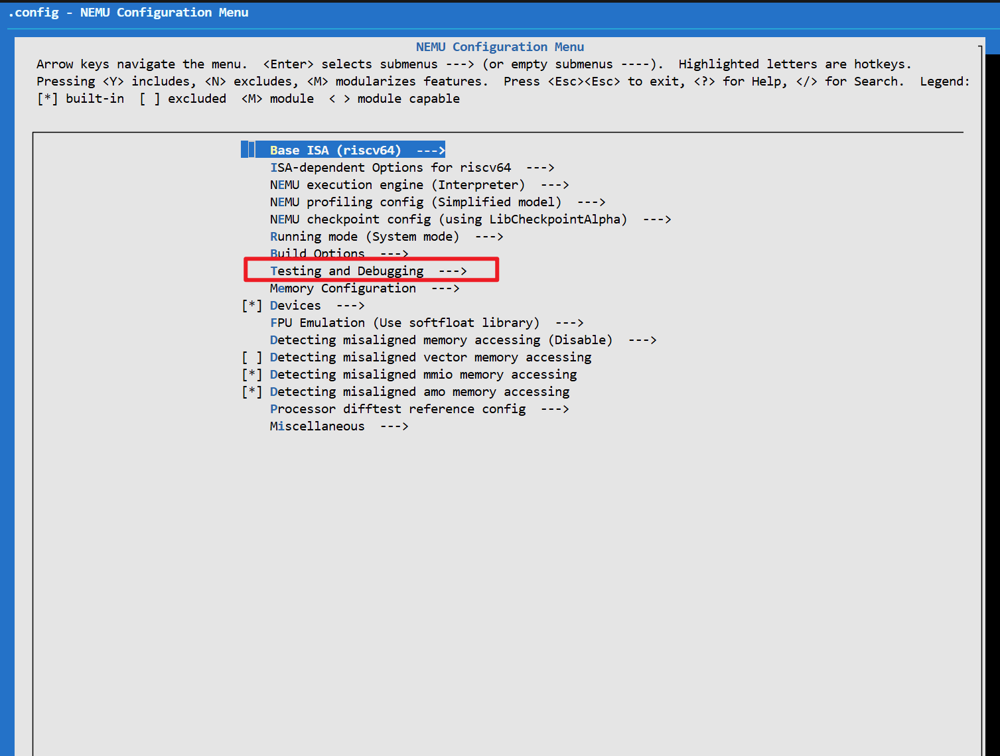

# Chapter 4: Instruction Emulator: CPU Simulation and Reference Models (NEMU + Spike)

# 4 Emulators

:::info

### 🎯\*\*<font style="color:rgb(38, 38, 38);"> Chapter Objectives</font>\*\*

<font style="color:rgb(38, 38, 38);">By the end of this chapter, you should be able to answer the following questions:</font>

* <font style="color:rgb(38, 38, 38);">Why can programs run even before the CPU has been built?</font>
* <font style="color:rgb(38, 38, 38);">What is a simulated CPU?</font>
* <font style="color:rgb(38, 38, 38);">Why does the system have two emulators?</font>
* <font style="color:rgb(38, 38, 38);">What are the respective roles of Spike and NEMU?</font>
* <font style="color:rgb(38, 38, 38);">How does the system determine whether the CPU is functioning correctly?</font>

:::

## 

## 4.1 The Role of Emulators

### 4.1.1 Why Do We Need to “Emulate CPU”?

Before the actual XiangShan CPU hardware (circuit logic) is fully implemented, or when you suspect there are bugs in the hardware design, you still need a way to run programs, test them, verify that the CPU is functioning correctly, and debug the CPU design.

:::info
Narrator: Have you ever wondered?

* <font style="color:rgb(38, 38, 38);">Before a real CPU was even built, where did the programs that had already been written run?</font>
* How do we know if the CPU’s output of `1 + 1 = 3` is due to a coding error or a wiring mistake?

:::

But the reality is:

```plain
The CPU doesn't exist yet,
but the program has already been written.
```

A program must run on a CPU.

There is only one solution:

> Temporarily, use software to emulate a CPU.

This type of software is called:

> CPU Emulators

***

:::color4
📌 In a nutshell, **an emulator is a software implementation of a CPU**.

:::

### <font style="color:rgb(31, 31, 31);">4.1.2 What is a “reference model”?</font>

When designing a CPU, you encounter a fundamental problem:

> How do you know you’ve done it right?

You must have:

> A standard of execution that is always correct

This standard is called:

> The Reference Model

Its purpose is:

```plain
The results of your CPU’s execution
must == the results of the Reference Model’s execution
```

Otherwise, it means:

> The CPU has bugs

**<font style="color:rgb(31, 31, 31);">Therefore, the Reference Model is your “correct answer.”</font>**

When you write code to implement the `add` instruction, how do you know if your logic is correct? The Reference Model is the model that **never makes mistakes**.

* **Rule:** Compare the results of the XiangShan implementation with the results of the Reference Model.
* **Mismatch:** Any difference indicates that XiangShan has a bug.

### **<font style="color:rgb(38, 38, 38);">4.1.3 Why must both NEMU and Spike be present?</font>**

Many beginners ask:

> Isn’t one emulator enough?

No, because one can only execute code, while two are needed for verification. It is essential to have:

```plain
Correlation Relationship
```

The process is as follows:

```plain
Program
 ↓
Feed into two CPUs simultaneously

        ┌──────────┐
        │  Spike   │ → Standard Result A
        └──────────┘

        ┌──────────┐
        │  NEMU    │ → Your Result B
        └──────────┘

             ↓
         Result Comparision
```

And if：

```plain
A == B → CPU Correct
A ≠ B → CPU has bug
```

This mechanism is called:

> Differential testing, which will be covered in detail in Chapter 8.

***

### 4.1.4 The Core Roles of NEMU and Spike

| Dimension | Spike | NEMU |
| --- | --- | --- |
| Role | Correct Answer | CPU under test |
| Can this be modified? | Not recommended | Frequent revisions |
| Purpose | Determine the design under test is correct or not | Implement features |
| Credibility | Highest | - |

:::color4
In a nutshell:

Spike is responsible for providing the criteria for determining right and wrong.

NEMU is responsible for attempting to implement them.

:::

<font style="color:rgb(31, 31, 31);">Whether in Spike or NEMU, the actual execution logic of the program in the emulator is the same:</font>

```plain
Repeat the following steps:
{
    Fetch an instruction
    Decode the instruction
    Execute the instruction
    Update the registers
}
```

<font style="color:rgb(31, 31, 31);">In other words:</font>

> <font style="color:rgb(31, 31, 31);">The emulator emulates the CPU's instruction cycle within the software.</font>

***

### 4.1.5 The entire system operation process (from a holistic perspective)

The actual complete execution chain is as follows:

```plain
Program source code
 ↓
Compiler
 ↓
Executable program
 ↓
Emulator (Spike / NEMU)
 ↓
Emulate CPU execution
 ↓
Output result
```

Once the actual CPU is finished:

```plain
Program
 ↓
Real CPU
 ↓
Result
```

The goal is to ensure that:

```plain
Actual CPU results == Spike results
```

:::color4
Key point of this chapter: Spike is the reference CPU, while NEMU is your implementation. Only by comparing the two can you verify whether your design is correct.

:::

## <font style="color:rgb(31, 31, 31);">4.2 RISC-V Instruction Set emulator (Introduction to and Operation of NEMU)</font>

### <font style="color:rgb(38, 38, 38);">4.2.1 NEMU's role within the system</font>

:::info
In the XiangShan development process, NEMU serves as the **“gold standard”**:

* **Real world:** Program → Real CPU (XiangShan hardware) → Execution result.
* **Development world:** Program → NEMU (simulated CPU) → Execution result.

When we compare the results from these two environments, if they differ, it must be that the “XiangShan hardware”—the apprentice—has made a mistake.

:::

Since the actual CPU isn't ready yet, **NEMU is temporarily acting as the CPU**.

### **<font style="color:rgb(38, 38, 38);">4.2.2 What exactly does NEMU simulate?</font>**

:::info
NEMU simulates the very essence of a CPU—the CPU instruction execution process (core CPU behavior):

* **Fetch:** Retrieves instructions from memory.
* **Decode:** Interprets what the instructions are supposed to do.
* **Execute:** Updates registers and memory.

<font style="color:rgb(38, 38, 38);">It does not simulate graphics cards, sound cards, or flashy interfaces; it focuses solely on ensuring that programs run logically.</font>

:::

### **<font style="color:rgb(38, 38, 38);">4.2.3 Emulator vs. Simulator</font>**

Many beginners confuse these two terms.

| Concept | Meaning | Accuracy |
| --- | --- | --- |
| Emulator | Simulate behavior | Somewhat rough |
| Simulator | Simulate internal execution | More accurate |

NEMU is classified as: **Simulator-level**

This means it:

✔ Runs step-by-step according to the actual CPU’s execution logic

✔ Executes every instruction in real time

### 4.2.4 What happens when you run NEMU?

When you enter a command, what actually happens is:

```plain
Load program
↓
NEMU begins simulating the CPU
↓
Execute the instructions one by one
↓
Output results
```

The actual execution logic is as follows:

```plain
while (the program hasn't finished) {
    Fetch an instruction
    Decode
    Execute
}
```

In other words:

NEMU acts as the CPU execution loop in the software.

### 4.2.5 Learn NEMU Step by Step

[Introduction to the NEMU Code](https://ysyx.oscc.cc/slides/2306/07.html)

We use the NEMU emulator as a reference implementation for XiangShan. The NEMU emulator is an interpreted instruction-set emulator. Compared to other RISC-V interpreted instruction-set emulators (such as Spike), NEMU offers an order-of-magnitude advantage in terms of execution speed.

#### 4.2.5.1 The Uses of NEMU

##### 1. Authoritative Verification Baseline

As an officially recommended ISA reference design, NEMU provides a standardized instruction set emulator that serves as a reference model for verifying other implementations. It ensures the correctness and consistency of instruction set implementations, providing a reliable basis for verification in chip design, compiler development, and other related tasks.

##### 2. Efficient Development Experience

* **Simple and User-Friendly:** NEMU’s design philosophy is straightforward, reducing the learning and usage curve so developers can quickly get started with verification tasks.
* **Superior Performance:** After optimization, NEMU’s performance rivals that of QEMU, delivering an efficient simulation experience while maintaining accuracy.

##### 3. Powerful Support Features

NEMU provides a series of APIs to assist in microarchitecture comparison and verification for chips such as XiangShan. These APIs simplify the verification process, improve verification efficiency, and help developers identify and resolve issues more quickly.

##### 4. Broad Applicability

NEMU is not only suitable for instruction set verification but can also be used in various fields such as education and research. It provides developers with a flexible, scalable platform capable of meeting the needs of different scenarios.

#### 4.2.5.2 Toolchain

##### Makefiles

* `nemu/Makefile`
  * `SRCS`: Similar to YEMU (an even simpler NEMU, for educational use in OSOC), these are source files that need to be compiled
  * `CFLAGS`: The compilation options just saw
  * `include $(NEMU_HOME)/scripts/native.mk`: Include other files
* `nemu/scripts/native.mk`
  * Some pseudo-targets for running and cleaning up compilation results
* `nemu/scripts/build.mk`
  * Compilation Rules
  * Includes dependencies between source files and header files (generated by GCC's `-MMD` option and processed using the `fixdep` tool)

##### Debugging and Configuration Tools

Debugging and Configuration Tools\
GDB (GNU Debugger) is an open-source debugger developed under the GNU project, primarily used for debugging C/C++ programs. `kconfig`/`menuconfig` is used to modify compilation and environment configurations

* **Kconfig:** A configuration language used to define configuration options (typically found in files named Kconfig). Each configuration option can specify a type (Boolean, integer, string, etc.), dependencies, default values, and more.
* menuconfig: A text-based configuration tool that reads Kconfig files to generate menus. Users can select configuration options from the menu and generate configuration files (typically `.config` files).

NEMU’s compilation settings can be configured by running the `menuconfig` command in the NEMU directory to configure compilation options, such as whether to use `debug` mode.

### 4.2.6  Compiling and Configuring NEMU

#### 4.2.6.1 Compilation Overview

NEMU is the golden model used as a reference in the diftest mechanism.

#### 4.2.6.2 Compilation Configuration

Mainly use the `config` for configuration:

| Configuration Name | Intended Use | Key Features | Typical Use Cases |
| --- | --- | --- | --- |
| **riscv64-xs\_defconfig** | Basic XiangShan Configuration | Basic XiangShan processor simulation configuration | Daily development, functional verification |
| **riscv64-xs-ref\_defconfig** | XiangShan Reference Configuration | Performance basic configuration with limited debugging features | Performance Regression Testing and Comparative Analysis |
| **riscv64-xs-diff-spike\_defconfig** | Differential Test Configuration | Designed specifically for comparison with the Spike emulator | Instruction-level correctness verification, emulator verification |
| **riscv64-gem5-ref\_defconfig** | Gem5 Reference Configuration | Compatible with the Gem5 emulator | System-Level Functionality/Performance Comparison, Peripheral Verification |
| **riscv64-xs-dual-ref\_defconfig** | Dual-Core XiangShan Reference Configuration | Supports simulating multi-core processors | Multicore Program Development and Multicore Performance Evaluation |
| **riscv64-xs-dual-ref-debug\_defconfig** | Dual-Core XiangShan Debugging Configuration | Multi-core configuration with enhanced debugging capabilities | Multicore Problem Identification and Concurrency Debugging |

#### 4.2.6.3 Compile NEMU using commands

When running a workload using the NEMU emulator, we need to **align the emulator's virtual peripherals with XiangShan's peripheral address space**. Navigate to the `/xs-env/NEMU` directory and run the following command:

```bash
cd $NEMU_HOME
make clean
# Here, you need to run different configurations to compile NEMU
# NEMU has different configurations for different features and purposes.
make riscv64-xs_defconfig
# Compile NEMU for bare metal so that the Coremark from the previous step can run
make -j

# The configuration of the NEMU emulator for co-simulation with XiangShan Core
# differs slightly from that for standalone operation. We use the following
# commands to compile the NEMU used to simulate:
make clean-softfloat / make clean-all
make riscv64-xs-ref_defconfig
# If you don't want to run `make clean-softfloat` or `make clean-all`,
# and you need to compile `-so`, you can start by compiling
# `make riscv64-xs-ref_defconfig`
```

The `riscv64-xs-ref_defconfig` file here is a pre-configured file located in the `configs` directory. Specifically:

* `riscv64-xs-ref_defconfig` is the configuration used to generate dynamic libraries for `difftest`.
* `riscv64-xs_defconfig` is a NEMU emulator that is aligned with the XiangShan peripherals and can be executed directly.

#### 4.2.6.4 Problem Solving

##### Handling Compilation Errors

When using the `riscv64-xs-ref_defconfig` configuration, an error occurs during compilation:

```shell
+ ccache g++ /nfs/home/yourhome/xs-env/NEMU/build/riscv64-nemu-interpreter-so
/usr/bin/ld: resource/softfloat/build/softfloat.a(s_mulAddF64.o): warning: relocation against `softfloat_roundingMode' in read-only section `.text'
/usr/bin/ld: resource/softfloat/build/softfloat.a(f16_roundToInt.o): relocation R_X86_64_PC32 against symbol `softfloat_exceptionFlags' can not be used when making a shared object; recompile with -fPIC
/usr/bin/ld: final link failed: bad value
collect2: error: ld returned 1 exit status
make: *** [/nfs/home/yourhome/xs-env/NEMU/scripts/build.mk:81: /nfs/home/yourhome/xs-env/NEMU/build/riscv64-nemu-interpreter-so] Error 1
```

##### Solution:

The `ready-to-run` folder contains pre-compiled Nemu shared libraries that are ready to use; simply add the folder's path when you need them later.

```shell
yourhome@open01:~/xs-env/NEMU$ cd ready-to-run
yourhome@open01:~/xs-env/NEMU/ready-to-run$ ls
auto_bump.sh             copy_and_run.bin          microbench.bin                          
riscv64-nemu-interpreter-so
bump_all_from_docker.sh  coremark-2-iteration.bin  README.md                               
riscv64-nutshell-spike-so
bump-nemu.sh             Dockerfile                riscv64-nemu-interpreter-debug-so       
riscv64-spike-so
bump-spike-nutshell.sh   flash_recursion_test.bin  riscv64-nemu-interpreter-dual-debug-so
bump-spike.sh            linux.bin                 riscv64-nemu-interpreter-dual-so
```

##### Using NEMU as a test program for XiangShan

Using the XiangShan simulation program, NEMU dynamic link library, and workload generated earlier, you can run a **specified application on the XiangShan core by default while the differential testing framework is open**. Navigate to the `/xs-env/XiangShan` directory and execute the command `./build/emu -i MY_WORKLOAD.bin`. Replace `MY_WORKLOAD.bin` with the path to the image you want to run—for example, the Coremark image generated earlier—to have the XiangShan emulator simulate the specified program. For example:

`./build/emu -i $NOOP_HOME/ready-to-run/linux.bin`

### 4.2.7 NEMU Execution and Debugging

#### 4.2.7.1 Load binary file

Run `./build/riscv64-nemu-interpreter -b MY_WORKLOAD.bin`, replacing `MY_WORKLOAD.bin` with the path to the image you want to run (such as the coremark generated in the previous section), to have the NEMU emulator execute the specified program. For example:\
`./build/riscv64-nemu-interpreter -b $NOOP_HOME/ready-to-run/linux.bin`

View the results:

```bash
yourhome@open01:~/xs-env/NEMU$ ./build/riscv64-nemu-interpreter -b /nfs/home/yourhome/xs-env/nexus-am/apps/coremark/build/coremark-riscv64-xs.bin
[src/isa/riscv64/init.c:234,init_isa] NEMU will start from pc 0x80000000
[src/device/io/port-io.c:35,add_pio_map_with_diff] Add port-io map 'uartlite' at [0x00000000000003f8, 0x0000000000000404]
[src/device/io/port-io.c:35,add_pio_map_with_diff] Add port-io map 'screen' at [0x0000000000000100, 0x0000000000000107]
[src/device/io/port-io.c:35,add_pio_map_with_diff] Add port-io map 'keyboard' at [0x0000000000000060, 0x0000000000000063]
[src/device/sdcard.c:137,init_sdcard] Can not find sdcard image: 
[src/monitor/image_loader.c:204,load_img] Loading image (checkpoint/bare metal app/bbl) from cmdline: /nfs/home/yourhome/xs-env/nexus-am/apps/coremark/build/coremark-riscv64-xs.bin

[src/monitor/image_loader.c:260,load_img] Read 16544 bytes from file /nfs/home/yourhome/xs-env/nexus-am/apps/coremark/build/coremark-riscv64-xs.bin to 0x0x772df9ff4000
[src/monitor/monitor.c:63,welcome] Debug: OFF
[src/monitor/monitor.c:68,welcome] Build time: 16:35:39, Jan 15 2026
Welcome to riscv64-NEMU!
For help, type "help"
Running CoreMark for 10 iterations
2K performance run parameters for coremark.
CoreMark Size    : 666
Total time (ms)  : 24439
Iterations       : 10
Compiler version : GCC15.0.0 20241107 (experimental)
seedcrc          : 0xe9f5
[0]crclist       : 0xe714
[0]crcmatrix     : 0x1fd7
[0]crcstate      : 0x8e3a
[0]crcfinal      : 0xfcaf
Finished in 24439 ms.
==================================================
CoreMark Iterations/Sec 409.18
[/nfs/home/yourhome/xs-env/NEMU/src/isa/riscv64/include/../instr/special.h:38,execute] nemu_trap case 0
[src/cpu/cpu-exec.c:938,cpu_exec] nemu: HIT GOOD TRAP at pc = 0x0000000080001c30
[src/cpu/cpu-exec.c:944,cpu_exec] trap code:0
[src/cpu/cpu-exec.c:155,monitor_statistic] host time spent = 30,130 us
[src/cpu/cpu-exec.c:157,monitor_statistic] total guest instructions = 3,156,150
[src/cpu/cpu-exec.c:158,monitor_statistic] vst count = 0, vst unit count = 0, vst unit optimized count = 0
[src/cpu/cpu-exec.c:161,monitor_statistic] simulation frequency = 104,751,078 instr/s
[src/utils/state.c:30,is_exit_status_bad] NEMU exit with good state: 2, halt ret: 0
```

The terminal output here shows that a binary file was loaded at \[src/monitor/image\_loader.c: 204,load\_img].\
Use the `--help` command to view the available options. The `-b` option is used here to run in batch mode; if you want to run the program step-by-step, remove this option.\
Output of step-by-step execution:

```bash
yourhome@open01:~/xs-env/NEMU$ ./build/riscv64-nemu-interpreter  /nfs/home/yourhome/xs-env/nexus-am/apps/coremark/build/coremark-riscv64-xs.bin
[src/isa/riscv64/init.c:234,init_isa] NEMU will start from pc 0x80000000
[src/device/io/port-io.c:35,add_pio_map_with_diff] Add port-io map 'uartlite' at [0x00000000000003f8, 0x0000000000000404]
[src/device/io/port-io.c:35,add_pio_map_with_diff] Add port-io map 'screen' at [0x0000000000000100, 0x0000000000000107]
[src/device/io/port-io.c:35,add_pio_map_with_diff] Add port-io map 'keyboard' at [0x0000000000000060, 0x0000000000000063]
[src/device/sdcard.c:137,init_sdcard] Can not find sdcard image: 
[src/monitor/image_loader.c:204,load_img] Loading image (checkpoint/bare metal app/bbl) from cmdline: /nfs/home/yourhome/xs-env/nexus-am/apps/coremark/build/coremark-riscv64-xs.bin

[src/monitor/image_loader.c:260,load_img] Read 16544 bytes from file /nfs/home/yourhome/xs-env/nexus-am/apps/coremark/build/coremark-riscv64-xs.bin to 0x0x7773f84f7000
[src/monitor/monitor.c:63,welcome] Debug: OFF
[src/monitor/monitor.c:68,welcome] Build time: 09:19:15, Jan 22 2026
Welcome to riscv64-NEMU!
For help, type "help"
(nemu) si 
[src/cpu/cpu-exec.c:155,monitor_statistic] host time spent = 470 us
[src/cpu/cpu-exec.c:157,monitor_statistic] total guest instructions = 75
[src/cpu/cpu-exec.c:158,monitor_statistic] vst count = 0, vst unit count = 0, vst unit optimized count = 0
[src/cpu/cpu-exec.c:161,monitor_statistic] simulation frequency = 159,574 instr/s
(nemu) help
help - Display information about all supported commands
c - Continue the execution of the program
si - step
info - info r - print register values; info w - show watch point state
x - Examine memory
p - Evaluate the value of expression
w - Set watchpoint
d - Delete watchpoint
detach - detach diff test
attach - attach diff test
save - save snapshot
load - load snapshot
q - Exit NEMU
(nemu) 
```

#### 4.2.7.2 What file formats can NEMU load?

##### Differences in File Formats

| Features | **BIN file** | **ELF file** |
| --- | --- | --- |
| **Full name** | Binary file | Executable and Linkable Format |
| **File Structure** | Pure binary data, no header | Structured format, consisting of multiple sections |
| **Address Information** | No address information; an external loading address must be specified | Includes metadata such as the load address and entry point |
| **Debug information** | Does not include debug information | May include a symbol table and debugging information (DWARF) |
| **Relocation Information** | No | Includes relocation information |
| **Section** | There are no clear section breaks | Clearly separated into .text, .data, .bss, etc. |
| **File size** | Typically smaller (containing only code and data) | Usually larger (contains additional information) |
| **Readability** | Cannot be read directly | You can analyze it using tools such as readelf or objdump. |
| **Typical Applications** | Firmware, Bootloaders, Embedded Systems | Operating system executables, shared libraries |
| **Cross-platform compatibility** | Dependent on a specific hardware architecture | It defines a platform-independent structure, but there are still many architecture- and platform-specific components. |
| **Load Complexity** | It's simple—just copy it to memory. | Complex; requires analysis and reorientation |

According to the description of Nemu in the GitHub README:

**What is NOT supported:**

* Cannot directly run an ELF
  * GEM5's System call emulation is not supported.（[What is system call emulation](https://stackoverflow.com/questions/48986597/when-to-use-full-system-fs-vs-syscall-emulation-se-with-userland-programs-in-gem)？）
  * QEMU's User space emulation is not supported.（[What is user space emulation](https://www.qemu.org/docs/master/user/main.html)？）

#### 4.2.7.3 How does NEMU execute commands sequentially?

NEMU commands:

Introduction to parameters related to the NEMU Checkpoint section. For details, please RTFSC:

1. `-b`: Run in `batch` mode (if omitted, NEMU will pause after starting and wait for command input)
2. `-D`: Specifies the working directory for generating checkpoints. The specified directory will be automatically created; you can choose any directory, e.g., `-D simpoint_checkpoint`
3. `-C`: Describes the task name (e.g., “Profiling” or “Cluster” from the three-step process in the previous section); you can choose any name, e.g., `-C profiling`
4. `-w`: Specifies the workload name; you can choose any name, e.g., `-w bbl`
5. `--simpoint-profile`: Performs SimPoint profiling, used during the profiling phase
6. `--cpt-interval`: For the profiling phase: the sampling interval size, measured in instructions; for the checkpointing phase: sets the checkpoint interval, which must match the `--cpt-interval` parameter used during profiling
7. `-S`: Specifies the Cluster phase results; used during the Checkpointing phase
8. `--checkpoint-format`: Supports generating checkpoints in either `gz` or `zstd` format; if this parameter is not specified, the default is `gz`
9. `-r` or `--cpt-restorer`: Specifies the path to the GCPT restoration program binary file `gcpt.bin`. Once the path is specified, the recovery program will be loaded at `0x80000000` or the starting address of the FLASH. The first 1MB of memory starting from this address is reserved for storing the recovery program and the architectural state saved during the checkpointing phase. This parameter overrides the portion of the recovery program within this memory space, regardless of whether the user-specified workload or FLASH image has reserved this space.

Use step-by-step execution to view debug prints and execution logs (add the `-b` option for batch execution; without any additional settings, step-by-step execution is used by default).\
Sample output

```bash
(nemu) si
[src/cpu/cpu-exec.c:740,fetch_decode] (M) 0x0000000080000000:   93 00 00 00     p_li_0     ra
(M)0x0000000080000000:   93 00 00 00     p_li_0     ra
[src/cpu/cpu-exec.c:740,fetch_decode] (M) 0x0000000080000004:   13 01 00 00     p_li_0     sp
(M)0x0000000080000004:   13 01 00 00     p_li_0     sp
[src/cpu/cpu-exec.c:740,fetch_decode] (M) 0x0000000080000008:   93 01 00 00     p_li_0     gp
(M)0x0000000080000008:   93 01 00 00     p_li_0     gp
[src/cpu/cpu-exec.c:740,fetch_decode] (M) 0x000000008000000c:   13 02 00 00     p_li_0     tp
(M)0x000000008000000c:   13 02 00 00     p_li_0     tp
[src/cpu/cpu-exec.c:740,fetch_decode] (M) 0x0000000080000010:   93 02 00 00     p_li_0     t0
(M)0x0000000080000010:   93 02 00 00     p_li_0     t0
[src/cpu/cpu-exec.c:740,fetch_decode] (M) 0x0000000080000014:   13 03 00 00     p_li_0     t1
(M)0x0000000080000014:   13 03 00 00     p_li_0     t1
[src/cpu/cpu-exec.c:740,fetch_decode] (M) 0x0000000080000018:   93 03 00 00     p_li_0     t2
(M)0x0000000080000018:   93 03 00 00     p_li_0     t2
[src/cpu/cpu-exec.c:740,fetch_decode] (M) 0x000000008000001c:   13 04 00 00     p_li_0     s0
```

#### 4.2.7.4 How to generate a configuration file compatible with Gem5/RTL

Method 1 (Recommended):

```makefile
git clone https://github.com/OpenXiangShan/NEMU.git
cd NEMU
export NEMU_HOME=`pwd`
make riscv64-gem5-ref_defconfig # Configure NEMU as a reference model
make -j 10
# Set the environment variables required for GEM5
export GCB_REF_SO=`realpath build/riscv64-nemu-interpreter-so`
```

Method 2: Use the `menuconfig` tool to modify the configuration, then recompile.

#### 4.2.7.5 The debugging process

Use the `menuconfig` command to configure the object you want to view, then select it and enter `debug`.



Figure 1: NEMU `menuconfig` configuration interface

**Chart Analysis:**

This image shows NEMU's menuconfig configuration interface, which is a text-based interactive configuration tool:

1. \*\*Config Menu \*\*(left)
   * Displays all configurable options in a hierarchical view
   * Use the arrow keys to navigate; press the spacebar to select or deselect
   * Supports a search function to quickly locate configuration items
2. \*\*Configuration Options \*\*(right)
   * Displays a detailed description of the currently selected configuration item
   * Includes the purpose, dependencies, and default values of the configuration item
   * Helps users understand the meaning of each configuration item
3. **Configuration Type**
   * `[ ]`: Boolean option (On/Off)
   * `( )`: Radio button (Select one)
   * `{ }`: Dependent option (Depends on other options)
   * `< >`: Numeric or string option
4. **Common Configuration Areas**
   * **Debug options:** Enable debugging features such as instruction tracing and memory access tracing
   * **Performance Options:** Settings to optimize the performance of simulating objects
   * **Feature Options:** Enable/disable specific feature modules

**Recommendations for use:** Beginners can start by using the default settings and adjust specific configurations as needed as they gain a deeper understanding of NEMU.

## 4.3 Spike emulator

Spike is an official reference-level RISC-V CPU model.

Its features:

| Feature | Description |
| --- | --- |
| Extremely accurate | Executes strictly according to the specification |
| Highly stable | Rarely encounters errors |
| Simple implementation | Does not simulate complex hardware details |

:::color4
In a nutshell: Spike is the “gold standard CPU model.”

:::

***

### 4.3.1 Spike Overview

[Spike Emulator](https://risc-v.ibugone.com/toolchain/spike/)

<https://zhuanlan.zhihu.com/p/641312376>

Spike is an open-source RISC-V instruction set architecture (ISA) emulator primarily used to simulate the operation and behavior of RISC-V CPUs.

### 4.3.2 Spike's Features and Use Cases

**RISC-V Simulation:** Spike can simulate the functional models of one or more RISC-V processors and supports various RISC-V ISA extensions, including basic instruction sets such as RV32I and RV64I.

**System Simulation:** Spike can be used in conjunction with other tools (such as pk and fesrv) to simulate systems, supporting the development of bare-metal programs, real-time operating systems (RTOS), and more.

**Performance Analysis:** Spike also simulates performance, helping developers analyze and optimize program performance.

**Debugging Support:** Spike supports integration with debugging tools such as GDB, making it easier for developers to debug RISC-V programs.

### 4.3.3 How Spike Works

**Communication Mechanism:** Spike uses the tohost and fromhost registers to facilitate data exchange between the target system (the RISC-V processor being simulated) and the host machine, supporting input/output processing, system calls, and exception handling.

**Program Execution:** Spike’s program startup logic includes parameter parsing, memory and processor initialization, and program loading; the simulator executes instructions via a main loop.

### 4.3.4 How to Use Spike

**Installing Spike:** Users can clone Spike’s GitHub repository and follow the instructions to compile and install it. Once installed, they can use the `spike` command to run RISC-V programs.

Running Programs: For example, users can directly run a bare-metal RISC-V program, such as `hello.elf`, to test Spike’s functionality.

## 4.4 Summary and Recommendations

### 4.4.1 Overview of Simulators

By the end of this chapter, you should have gained an understanding of the two simulators commonly used in XiangShan processor development:

1. **NEMU (Instruction Set Simulator)**
   * Purpose: Serves as a reference model to verify the correctness of the instruction set
   * Features: Fast speed, high precision, and debugging support
   * Use Cases: Daily development, functional verification, and performance testing
2. **Spike (Fast Simulator)**
   * Purpose: Rapid functional verification and performance evaluation
   * Features: Extremely fast, relatively simple functionality
   * Use Cases: Rapid iteration, early-stage verification

### 4.4.2 The Role of the Simulator in the Development of XiangShan

1. **Verification:** Ensures the correct implementation of the XiangShan processor’s instruction set
2. **Debugging:** Provides detailed execution traces and debugging information
3. **Performance:** Serves as a benchmark for performance comparisons
4. **Development:** Accelerates software development by eliminating the need to wait for hardware

### 4.4.3 Tips for Beginners

1. **Start with NEMU:** NEMU is the most commonly used simulator in XiangShan development; master it first
2. **Understand the configurations:** Different configurations are suitable for different scenarios; understand the differences
3. **Make Good Use of Debugging:** The simulator offers powerful debugging features; learn how to use them.
4. **Learn by Comparison:** Deepen your understanding of simulation technology by comparing different simulators.
5. **Focus on Hands-On Practice:** Get hands-on experience; start with a simple “Hello Xiangshan” project.

### 4.4.4 Next Steps

1. If you have successfully compiled and run NEMU, try using different configurations.
2. If you want to delve deeper, explore NEMU’s source code implementation.
3. If you’re interested in performance, compare the performance differences between NEMU and Spike.
4. Consider joining the XiangShan Open Source Community to learn more tips and tricks for using simulators.

Simulators are indispensable tools in processor development. They allow developers to “simulate” hardware operation within software, significantly improving development efficiency and success rates. Mastering the use of simulators will lay a solid foundation for your processor design journey.

We wish you continued success on your journey in processor simulation!

# Learning Path Planning

### 4.6.1 Phase 1: Basic Concepts of Simulators (1 week)

**Objective:** Understand the basic concepts and functions of simulators\
**Tasks:**

1. Read this chapter to understand the basic concepts of NEMU and Spike
2. Understand the differences between instruction-set simulators and cycle-accurate simulators
3. Master the role of simulators in processor development

### 4.6.2 Phase 2: NEMU Basics (2 weeks)

**Objective:** Master the basics of compiling and running NEMU\
**Tasks:**

1. Compile NEMU following the steps in Section 1.3.3
2. Try compiling NEMU with different configurations
3. Run a simple test program (e.g., “Hello World”)

### 4.6.3 Phase 3: Advanced NEMU Features (3 weeks)

**Objective:** Master advanced NEMU features and debugging techniques\
**Tasks:**

1. Learn to configure NEMU using menuconfig
2. Master NEMU debugging commands and techniques
3. Understand NEMU’s role in difftest

### 4.6.4 Phase 4: Comparison of Multiple Simulators (2 weeks)

**Objective:** Understand the characteristics and applicable scenarios of different simulators\
**Tasks:**

1. Learn the basic usage of the Spike simulator
2. Compare the features and performance of NEMU and Spike
3. Understand the roles of different simulators in XiangShan development


> 更新: 2026-04-22 01:44:17  
> 原文: <https://bosc.yuque.com/staff-xmw8rg/fb7qy3/fsi3msesgt1p5hz3>