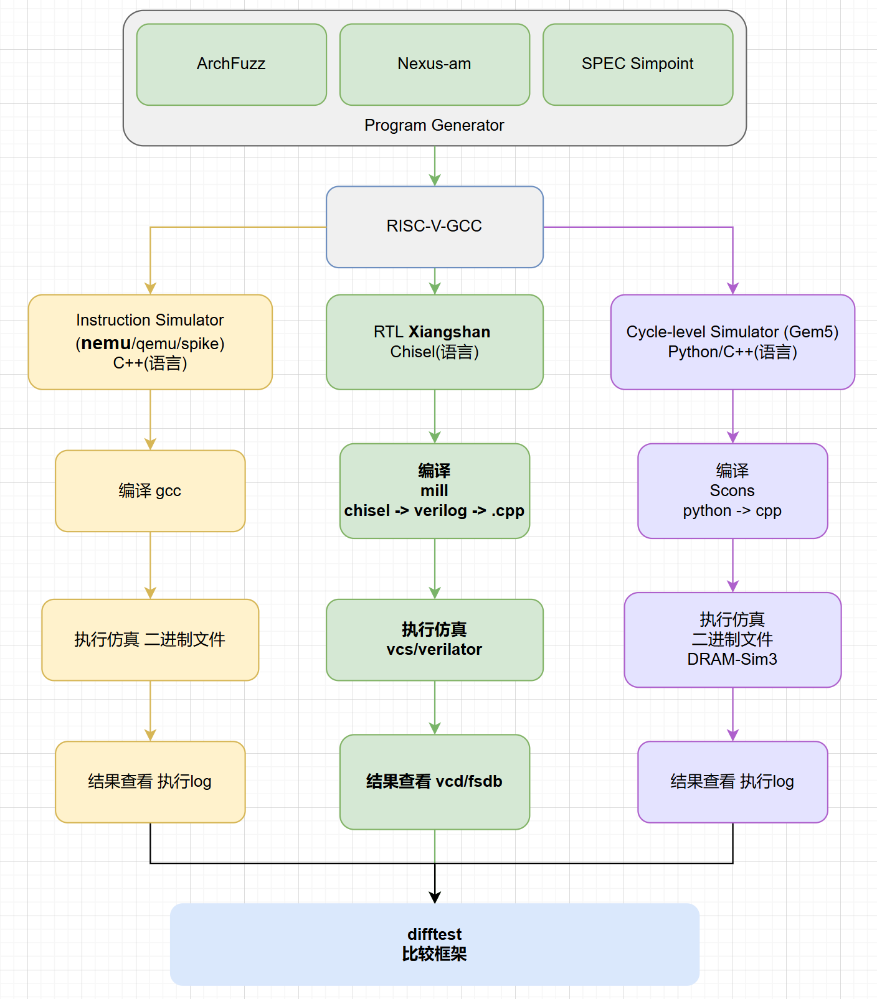

# Chapter 5: DRAMsim3 Memory Simulation

# 5 Memory Simulation

:::info

### 🎯\*\*<font style="color:rgb(38, 38, 38);"> Chapter Objectives</font>\*\*

By the end of this chapter, you should be able to answer the following questions:

* Why must CPU simulations be combined with memory simulations?
* What role does DRAMsim3 play in the system?
* Why does memory performance determine CPU performance?
* How does data flow during simulation?
* How do you simulate memory?

:::



## 5.1 About Memory Simulation

### 5.1.1 Why does the CPU need “memory simulation”?

First, start with a question:

> What happens if the CPU is fast but the memory is slow?

Answer:

> The CPU will constantly have to wait for the memory.

In reality, the bottleneck in processor performance is often not computation, but rather **memory access speed**.

Therefore:

```plain
Simulating only the CPU ≠ simulating the performance of a real system
```

Must add:

```plain
Memory Behavior Simulation
```

:::info
To illustrate:

* **The Problem:** If we compare the CPU to a craftsman working at lightning speed, memory is like a warehouse located far out in the suburbs. If the craftsman has to make a trip to the suburbs every time he needs a part, then no matter how fast he works, it won’t make a difference.
* **The Current Situation:** In complex XiangShan development, we need to understand the specific impact of memory latency (transport time) and bandwidth (transport capacity) on CPU performance (IPC).

:::

:::color4
📌 Key Takeaway (Core Concept of This Chapter) **Memory Simulation = Simulating Real-World Memory Response Times**

:::

Therefore, the most important aspect of this chapter is this diagram:

```plain
Program
 ↓
CPU Simulator
 ↓
Memory Request
 ↓
DRAMsim3
 ↓
Return data
 ↓
CPU Continue Execution
```

### 5.1.2 What is DRAMsim3?

Definition:

> DRAMsim3 is a software model designed to simulate the behavior of real DRAM memory.
>
> It simulates: access latency, bandwidth limits, timing constraints, and concurrency conflicts.

DRAMsim3 is not memory itself, but rather a **“digital twin”** of the memory system:

* **Functionality:** It accurately simulates every operation of real memory (such as DDR4 and LPDDR4), including queuing, charging, refreshing, and data transfer.
* **Purpose:** When simulating XiangShan, DRAMsim3 informs the CPU: “Due to severe memory queuing, you will need to wait 100 cycles to retrieve this data.”

### 5.1.3 The Role of DRAMsim3 in the System

System Roles:

| Module | Purpose |
| --- | --- |
| Spike | Correct Implementation of Standards |
| NEMU | CPU Behavior Simulation |
| DRAMsim3 | Memory Behavior Simulation |

:::color4
Summary of Relationships:

* The CPU determines processing speed
* Memory determines wait time

:::

## 5.2 Basic Concepts of Memory

### 5.2.1 SRAM (Static Random-Access Memory)

The “static” nature of SRAM is reflected in how it stores data. SRAM uses flip-flops to store data, which remains intact as long as power is supplied.

**Principle:** SRAM consists of multiple flip-flops, each capable of storing one bit of data. A flip-flop is a bistable circuit that can maintain one of two states, representing 0 and 1, respectively.

**Features:** Extremely fast, with virtually no limits on read and write speeds; relatively high power consumption; lower integration density—for the same capacity, SRAM is larger in size than DRAM.

**Beginner’s analogy:** SRAM is like a sticky note 📝 on your desk—you can read and write on it quickly at any time, but space is limited, and it needs a constant power source (stuck to the desk) to retain its contents.

### 5.2.2 DRAM (Dynamic Random Access Memory)

The “dynamic” aspect of DRAM is that it requires periodic refreshing to retain data. DRAM uses capacitors to store data, and these capacitors discharge over time, leading to data loss. Therefore, the capacitors must be periodically recharged—this process is called refreshing.

**Principle:** DRAM consists of a large number of capacitors and transistors, with each capacitor capable of storing one bit of data. Since capacitors leak charge, they must be periodically refreshed to retain the data.

**Features:** Slightly slower than SRAM, but much faster than non-volatile memory; relatively low power consumption; high integration—DRAM has a smaller physical footprint than SRAM for the same capacity.

**Beginner’s analogy:** DRAM is like a library bookshelf 📚—it has a large capacity, but the books need to be organized (refreshed) periodically to prevent loss, and access speeds are slightly slower than a sticky note.

### 5.2.3 Comparison of SRAM and DRAM

| Features | **SRAM** | **DRAM** |
| --- | --- | --- |
| **Storage principles** | Flip-flop circuit | Capacitor charge |
| **Refresh requirements** | No need to refresh | Needs to be refreshed periodically |
| **Access speed** | Extremely fast (1–10 ns) | Relatively fast (10–100 ns) |
| **Power consumption** | Higher | Lower |
| **Integration level** | Lower (larger area) | Higher (smaller area) |
| **Cost** | Higher | Lower |
| **Typical Applications** | CPU cache, registers | Main memory, video memory |
| **Analogy** | The sticky notes on the desk | The library shelves |

### 5.2.4 The Three Key Metrics of Memory Performance

| Metrics | Meaning | Analogy |
| --- | --- | --- |
| Latency | Amount of time to wait | Food delivery times |
| Bandwidth | How much data can be transmitted at a time? | Carrier size |
| Parallelism | How many requests can it handle simultaneously? | Number of delivery personnel |

## 5.3 DRAMsim3 Memory Simulator

### 5.3.1 DRAMsim3 Overview

**DRAMsim3 is a powerful, multi-protocol Dynamic Random Access Memory (DRAM) simulation tool that supports a wide range of memory protocols**, including DDR3, DDR4, LPDDR3, LPDDR4, GDDR5, GDDR6, HBM, and STT-MRAM. Implemented in C++ and designed as a configurable, object-oriented model, it includes parametric DRAM bank models, memory controllers, command queues, and system-level interfaces for integration with CPU emulators (such as GEM5 and ZSim) or trace-based workloads.

### 5.3.2 Main Uses of DRAMsim3

This project is suitable for a variety of scenarios:

1. **Academic Research:** Researchers can use DRAMsim3 to validate new memory architectures or algorithms and perform performance and power consumption analyses.
2. **System Optimization:** Developers can use DRAMsim3 to fine-tune the performance of memory subsystems and improve the efficiency of application execution.
3. **Teaching and Learning:** It is also suitable for educational settings, helping students understand and simulate the complex behavior of memory systems.

### 5.3.3 DRAMsim3 Project Features

* **Accuracy:** DRAMsim3 provides precise cycle-by-cycle simulation, ensuring the reliability of results.
* **Compatibility:** Supports multiple mainstream memory protocols and adapts to various hardware environments.
* **Extensibility:** The CMake build system and object-oriented design make it easy to add new memory models and controllers.
* **Integration:** Seamlessly integrates with CPU emulators such as GEM5, SST, and ZSim to provide a complete system simulation solution.
* **Visualization:** Provides scripts for statistical output and data visualization, facilitating the interpretation of results.

**Tip for Beginners:** DRAMsim3 is like a “flight simulator”✈️ for memory systems, allowing developers to test and optimize memory designs in software without the need to build physical hardware.

### 5.3.4 What Actually Happens When You Simulate? (A Flow-Level Understanding)

When the program runs, the actual execution flow is as follows:

```plain
CPU executes an instruction
 ↓
Encounters a load/store
 ↓
Sends a memory request
 ↓
DRAMsim3 calculates the access latency
 ↓
Returns data
 ↓
CPU continues
```

:::color4
Key Point: DRAMsim3 determines how long the CPU waits

:::

## 5.4 Example of Integrating XiangShan with DRAMsim3

### 5.4.1 Environment Setup and Compilation

```makefile
# Set the DRAMsim3 path (replace with the actual path)
export DRAMSIM3_HOME=/nfs/home/yourhome/xs-env/DRAMsim3
cd $DRAMSIM3_HOME
rm -rf build  # If you've compiled it before, clean first
mkdir build && cd build
cmake -D COSIM=1 ..
make -j$(nproc)  # Use an appropriate number of parallel processes, typically equal to the number of CPU cores

cd $NOOP_HOME
# Clean previous builds (optional)
make clean
# Compile XiangShan with DRAMsim3
make sim-verilog WITH_DRAMSIM3=1 WITH_CHISELDB=1 DRAMSIM3_HOME=/nfs/home/yourhome/xs-env/DRAMsim3
make emu -j$(($(nproc)+1)) CONFIG=KunminghuV2Config WITH_DRAMSIM3=1 WITH_CHISELDB=1 EMU_THREADS=4 EMU_TRACE=fst

# Run the simulation, specify the DRAMsim3 configuration file, and modify it to use your actual file path.
./build/emu --dramsim3-ini $DRAMSIM3_HOME/configs/xiangshan_kmh_default.ini -i /path/to/your/riscv/binary --diff /path/to/ready-to-run/riscv64-nemu-interpreter-so
```

### 5.4.2 Configuration Notes

1. <code>**DRAMSIM3_HOME**</code>\*\* environment variable:\*\* Points to the DRAMsim3 installation directory
2. <code>**WITH_DRAMSIM3=1**</code>**:** Enable DRAMsim3 integration
3. <code>**WITH_CHISELDB=1**</code>**:** Enable Chisel debug information
4. <code>**CONFIG=KunminghuV2Config**</code>**:** Use the Kunminghu V2 configuration
5. <code>**EMU_THREADS=4**</code>**:** Set the number of simulator threads
6. <code>**EMU_TRACE=fst**</code>**:** Generate waveform files in FST format

### 5.4.3 Sample Configuration File

DRAMsim3 configuration files are typically located in the `$DRAMSIM3_HOME/configs/` directory. Commonly used configuration files for XiangShan include:

* `xiangshan_kmh_default.ini`: Default configuration for the Kunming Lake version
* `ddr4_2400_8x8.ini`: DDR4 2400MHz configuration
* `lpddr4_3200_1x16.ini`: LPDDR4 3200MHz configuration

## 5.5 Memory Simulation Workflow

### 5.5.1 Overview of the Simulation Process

The complete workflow for memory simulation can be divided into the following steps:

1. **Environment Setup:** Configure paths and install dependencies
2. **DRAMsim3 Compilation:** Compile the memory simulator
3. **XiangShan Compilation:** Compile the XiangShan processor that contains memory simulation
4. **Test Program Preparation:** Prepare the RISC-V program to be run
5. **Run Simulation:** Execute the memory simulation
6. **Results Analysis:** Analyze memory access performance

### 5.5.2 Explanation of Key Concepts

#### Memory Controller

The memory controller acts as a bridge between the CPU and memory, responsible for managing memory access requests, including address mapping, command scheduling, and refresh management.

#### Memory Timing

Memory access must adhere to specific timing requirements, including:

* **tRCD:** Row-to-Column Delay
* **tRP:** Row Precharge Time
* **tRAS:** Row Active Time
* **CL:** CAS Latency

#### Memory Bandwidth

The amount of data that a memory system can transfer per unit of time, typically measured in GB/s.

#### Memory Latency

The time required from issuing a memory request to receiving the data, typically measured in clock cycles or nanoseconds.

## 5.6 Key Takeaways from This Chapter

> CPU performance ≠ CPU-only performance\
> CPU performance = a combination of CPU and memory performance

:::color4
Therefore: Without memory simulation, there can be no accurate performance evaluation.

:::

:::info
**If you can answer the following questions, you have successfully mastered this chapter:**

* Why does CPU simulation alone not provide enough information?
* What does DRAMsim3 simulate?
* Why is memory access slow?
* How does data flow during simulation?
* What is the difference between latency and bandwidth?

:::

###

## 5.7 Learning Path Planning

### 5.7.1 Phase 1: Basic Concepts of Memory (1 week)

**Objective:** Understand the basic concepts of memory systems

**Tasks:**

1. Read Section 1.2 of this chapter and understand the differences between SRAM and DRAM
2. Learn about the memory hierarchy (cache, main memory, secondary storage)
3. Master memory performance metrics (bandwidth, latency, capacity)

### 5.7.2 Phase 2: Basic Use of DRAMsim3 (2 weeks)

**Objective:** Master the basic installation and use of DRAMsim3

**Tasks:**

1. Compile DRAMsim3 following the steps in Section 1.4.1
2. Learn the DRAMsim3 configuration file format
3. Simulate a simple memory example

### 5.7.3 Phase 3: XiangShan Memory Simulation Integration (3 weeks)

**Objective:** Master the integration of XiangShan with DRAMsim3

**Tasks:**

1. Compile the XiangShan processor with DRAMsim3
2. Run a complete memory simulation workflow
3. Analyze memory access performance data

### 5.7.4 Phase 4: Advanced Memory Optimization (4 weeks)

**Objective:** Master memory system optimization techniques

**Tasks:**

1. Study memory controller scheduling algorithms
2. Analyze memory access patterns
3. Optimize memory system configuration
4. Compare the performance of different memory protocols


> 更新: 2026-04-23 11:01:07  
> 原文: <https://bosc.yuque.com/staff-xmw8rg/fb7qy3/swu3swgomyxe7df9>