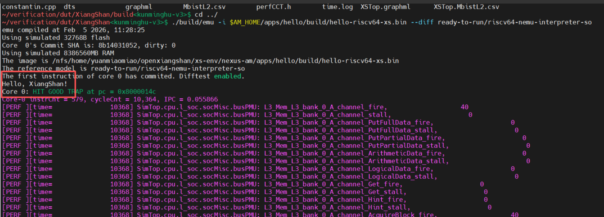
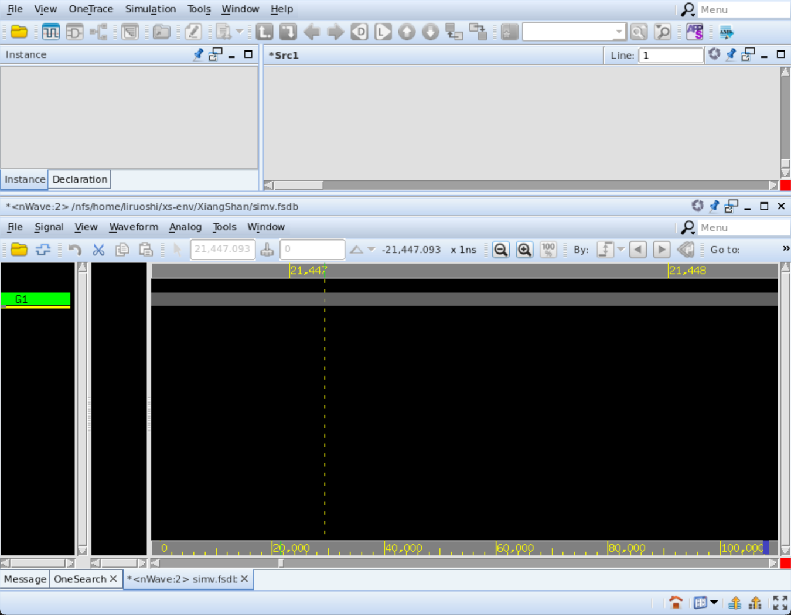

# Chapter 6: The XiangShan Simulation Process

# 6 The XiangShan Simulation Process

:::info

### 🎯\*\*<font style="color:rgb(38, 38, 38);"> Chapter Objectives</font>\*\*

By the end of this chapter, you will be able to clearly answer the following questions:

* **How do programs run on the XiangShan CPU?** (Understand the execution chain)
* **Why must CPU designs be simulated first?** (Understand the engineering rationale)
* **What is the role of each component in the simulation process?** (Understand each one)
* **How does the system determine whether the CPU is functioning correctly?** (Master the principles of differential testing)
* **What is the standard instruction for simulating something completely?** (Master core operations)

:::


## 6.1 Why It Is Essential to Simulate CPUs

In the field of chip design, **the cost of “tape-out” (manufacturing a physical chip) is extremely high, often running into the tens of millions or even hundreds of millions of dollars**.

```plain
Design → Tape-out → Manufacturing → Testing
```

If errors are discovered after manufacturing, the entire chip is scrapped, and the tape-out costs are wasted.

:::info
Narration: If we only discover after manufacturing that `1 + 1 = 3`, the entire project will be completely scrapped. This would be a major failure.

:::

Therefore, from an engineering perspective, it is essential to first: simulate the operation of the future CPU on a computer using software before manufacturing.

* **Purpose:** To identify all logic bugs before physical manufacturing.

:::color4
**📌**\*\* Key takeaway from this chapter:\*\* CPU simulation = Running and verifying a CPU that “has not yet been manufactured” on a computer in advance.

:::

### 6.1.1 Overview of the System for Simulation

Before you start typing commands, be sure to keep this logical map in mind:

```plain
Program (.bin) 
 ↓
AM Runtime Environment
 ↓
CPU Emulator NEMU (XiangShan Core)
 ↓
Reference Model (Spike)
 ↓
Determine Correctness (Result Comparison)
 ↓
Determine if Correct
```

### **6.1.2 What are the different components?**

**There are many terms used in the system, which can be confusing for beginners. Let’s break it down below:**

| **Component** | **Core Role** | **Analogy** |
| :---: | :---: | :---: |
| Program | Test Input | Exam Questions |
| AM | Runtime Environment | Exam Room Rules |
| XiangShan Core | CPU Under Test | Student |
| Reference Model | Correct Answer | Correct Answer |
| Comparator | Grading System | Teacher |

:::color4
**Don’t forget: The most important thing to remember is that the XiangShan Core is the subject of the test, not the correct answer.**

:::

## 6.2 Overall Simulation Workflow for the XiangShan Core

:::warning
**Overall Simulation Workflow for XiangShan Core:**

1. **Chisel to SystemVerilog conversion** – Converting high-level hardware descriptions into standard hardware languages
2. **Simulation tools such as Verilator convert SystemVerilog to C++** – Generating a model that can be simulated in C++
3. \*\*The simulator compiles the C++ into an executable program \*\*<code>**emu**</code> - Generates a program that can be run directly
4. \*\*Run the workload using \*\*<code>**emu**</code> - Execute the test program in the simulator

**Main Commands Used:**

* `**make verilog**` - Generates SV code, which can be used for FPGA verification
* `**make sim-verilog**` - Generates SV code for simulation
* `**make emu**` - Simulates Verilator and directly outputs an executable program
* `**make clean**` - Clears the difftest directory, deletes the entire build directory, and removes previously generated SV files; rebuilds after modifying compilation parameters
* `--help` - View command options

:::

:::info
**For beginners:** Imagine you’re baking a cake🎂:

1. **Write the recipe** (Chisel code) – describe how to make the cake
2. **Standardize the recipe** (SystemVerilog) – Write the method in a standard format
3. **Prepare the kitchen tools** (Verilator compilation) – Get all the kitchen tools ready
4. **Start baking** (run emu) – Begin making the cake according to the recipe
5. **Taste test** (run workload) – Test whether the cake turned out successfully

:::

## 6.3 Xiangshan Sample Commands

### 6.3.1 Basic Environment Setup

Commands required when using Xiangshan standalone:

```bash
git clone https://github.com/OpenXiangShan/XiangShan.git
cd XiangShan; git fetch origin; git checkout origin/xxx; make init;
export NOOP_HOME=`pwd`
make_verilog
# If the clone fails due to network issues, causing the compilation to fail, simply re-run the commands above.
```

When cloning and running XiangShan independently, the version of Nemu used for comparison with diftest is included in the ready-to-run directory.

## 6.4 A Detailed Explanation of the Compilation Process

### 6.4.1 Links to reference documents

[XiangShan Front-end Development Environment](https://docs.xiangshan.cc/zh-cn/latest/tools/xsenv-en/)

### 6.4.2 Generating a Simulation Program for the XiangShan Core Using Verilator

Verilator’s core function is to **efficiently compile** hardware circuit designs described in Verilog/SystemVerilog (such as the XiangShan Core RTL code) **into C++ or SystemC intermediate libraries**. Developers then write C++ wrapper files to call these libraries and use a standard C compiler to **link them into an executable simulation program that can simulate the XiangShan Core**; This process transforms hardware simulation into high-performance software execution, significantly improving simulation speed, making it particularly suitable for functional verification and regression testing of large-scale processors (such as the XiangShan Core).

```bash
make emu EMU_TRACE=1 -j32
```

The different options for the `CONFIG` parameter are specified in the config file.

### 6.4.3 Configurable Parameter System

The XiangShan processor offers a wide range of configuration options, which are defined in the file `/xs-env/XiangShan/src/main/scala/top/Configs.scala`. The main configuration classes include:

1. **MinimalConfig** - Minimal configuration, used to perform rapid simulation (generally not used)
2. **DefaultConfig** - Default configuration, balancing performance and area
3. **MediumConfig** - Medium configuration, offering better performance
4. **FpgaDefaultConfig** - FPGA-specific configuration
5. **KunminghuV2Config** - Kunminghu V2 configuration

### 6.4.4 Running executable code on XiangShan

Using Verilator, how to simulate execution on XiangShan:

```shell
# Using the downloaded nemu
./build/emu -i $AM_HOME/apps/hello/build/hello-riscv64-xs.bin --diff ready-to-run/riscv64-nemu-interpreter-so
# Using a self-compiled NEMU
./build/emu -i $AM_HOME/apps/hello/build/hello-riscv64-xs.bin --diff /nfs/home/yourhome/xs-env/NEMU/build/riscv64-nemu-interpreter-so
```

Load the corresponding bin file, then simulate on `emu`.

Final successful output: If the terminal displays `hello xiangshan`, the process was successful.\
Reference example:：



Figure 1: XiangShan simulates the “Hello World” program

**Figure caption:**

This figure shows the terminal output of XiangShan running the “Hello World” program:

1. **Simulator Startup Information** (Top)
   * Displays the simulator’s compilation time and configuration information
   * Includes the number of processor cores, cache configuration, etc.
   * Verifies that the environment is set up correctly
2. **Program Loading Process** (Middle)
   * Displays binary file loading information
   * Includes the loading address, file size, etc.
   * Verifies that the program has loaded successfully
3. **Program Execution Output** (Lower Middle)
   * Displays program execution results
   * “Hello, XiangShan!” indicates successful program execution
   * Verifies that the processor is functioning normally
4. **Simulation Statistics** (Bottom)
   * Displays simulation performance data
   * Includes the number of executed instructions, simulation speed, etc.
   * Helps evaluate simulation efficiency

**Key point:** If you see the output “Hello, XiangShan!”, it means the entire process—from the Chisel code to simulating the result—has been successful!

### 6.4.5 How to Convert Chisel Code to SystemVerilog

Run `make verilog` in the `/xs-env/XiangShan` directory. This command will compile the XiangShan Chisel code and generate **SystemVerilog**. The output file is located at `XiangShan/build/rtl/XSTop.sv`.

**Use Mill to run the Chisel compiler and generate SystemVerilog:**

```makefile
verilog: $(call docker-deps,$(TOP_V))

$(SIM_TOP_V): $(SCALA_FILE) $(TEST_FILE)
  mkdir -p $(@D)
  @echo -e "\n[mill] Generating Verilog files..." > $(TIMELOG)
  @date -R | tee -a $(TIMELOG)
    #Key Mill Compilation Commands
    #Using Mill as a Build Tool
    #Running Specific Main Classes in the Test Suite
    #Passing Hardware Configuration Parameters (Number of Cores, Issue Width, etc.)
    #Controlling How to Simulate (Number of Cycles, Waveforms, etc.)
    #Outputting to a Specified Directory for Later Analysis
  $(TIME_CMD) mill -i $(MILL_BUILD_ARGS) xiangshan.test.runMain $(SIMTOP)    \
    --target-dir $(@D) --config $(CONFIG) --issue $(ISSUE) $(SIM_MEM_ARGS)    \
    --num-cores $(NUM_CORES) $(SIM_ARGS) --full-stacktrace
    
    ifeq ($(CHISEL_TARGET),systemverilog)# Here, define the target file type is sv
    $(MEM_GEN_SEP) "$(MEM_GEN)" "$@.conf" "$(@D)"
    @{ git log -n 1; git diff; } | sed 's/^/\/\// ' > $(dir $@).__diff__
    @cat $(dir $@).__diff__ $@ > $(dir $@).__out__ && mv $(dir $@).__out__ $@
ifeq ($(PLDM),1)
    sed -i -e 's/$$fatal/$$finish/g' $(RTL_DIR)/*.$(RTL_SUFFIX)
    sed -i -e '/sed/! { \|$(SED_IFNDEF)|, \|$(SED_ENDIF)| { \|$(SED_IFNDEF)|d; \|$(SED_ENDIF)|d; } }' $(RTL_DIR)/*.$(RTL_SUFFIX)
else
ifeq ($(ENABLE_XPROP),1)
    sed -i -e "s/\$$fatal/assert(1\'b0)/g" $(RTL_DIR)/*.$(RTL_SUFFIX)
else
    sed -i -e 's/$$fatal/xs_assert_v2(`__FILE__, `__LINE__)/g' $(RTL_DIR)/*.$(RTL_SUFFIX)
endif
endif
    sed -i -e "s/\$$error(/\$$fwrite(32\'h80000002, /g" $(RTL_DIR)/*.$(RTL_SUFFIX)
endif

sim-verilog: $(call docker-deps,$(SIM_TOP_V))+
```

### 6.4.6 Using the Mill Tool

* **Manage dependencies for Scala/Chisel projects**
* **Compile Scala source code**
* **Handle project module structures**

Command: `mill -i xiangshan.test.runMain $(SIMTOP)`

* `-i`: Interactive mode, allowing interaction with the build
* `xiangshan.test.runMain`: Specifies the path to the Main class to be run
* `$(SIMTOP)`: The actual name of the Main class (hardware generator)
* Mill loads and executes this Main class, triggering the Chisel compilation process

## 6.5 A Detailed Explanation of Simulation Methods

### 6.5.1 Classification of Simulation Commands

1. Behavioral simulation (make emu)
2. Synthesizable code functional simulation:
   * `make verilog -jN`- No difftest; used for tape-out
   * `make sim-verilog -jN` - With difftest; for simulation

### 6.5.2 Running the simulation using Verilator (make emu)

#### Basic commands

To generate the XiangShan Core simulation program using Verilator, navigate to the `XiangShan` directory and run the following command:

```shell
make emu CONFIG=KunminghuV2Config EMU_TRACE=1 -j32
```

:::success
**Parameter Descriptions:**

`CONFIG` - Configuration options for the XiangShan simulation program\
`EMU_TRACE=1` - Adds waveform output functionality to the simulation program, enabling waveform output during the simulation.\
By default, `EMU_TRACE=1` generates waveforms in VCD format, which can be viewed using open-source tools such as GTKWave or commercial tools like DVE. Additionally, you can generate VCD-format waveforms using the commands `EMU_TRACE=vcd` or `EMU_TRACE=VCD`; both have the same effect as `EMU_TRACE=1`. Since VCD waveforms are large and consume significant disk space, and opening them with open-source tools like GTKWave is relatively slow, we provide the `EMU_TRACE=fst` or `EMU_TRACE=FST` commands to generate FST-format waveforms. FST-format waveforms are less than 10% the size of VCD-format waveforms, but the drawback is that this format is proprietary to GTKWave and can only be opened by GTKWave.

:::

To simulate the complete XiangShan Core with the default configuration, use the following command:

```shell
make emu -j32
```

The commands for generating Verilog code for behavioral simulation and Verilog code for synthesis are different.\
The `make verilog` command generates Verilog code for synthesis;\
while `**make emu**`\*\* is used for behavioral simulation\*\*.

#### PerfCCT Performance Counter

Official documentation: [PerfCCT usage - XiangShan GEM5 Emulator Documentation](https://xs-gem5.readthedocs.io/zh-cn/latest/tools/alignToRTL/PerfCCT_usage/)

Commands used when compiling XiangShan:

```makefile
  # Generate Verilog code to simulate the design
  make sim-verilog
  # Or enable DRAMsim3, compile XiangShan, and include WITH_CHISELDB=1
  make sim-verilog WITH_DRAMSIM3=1 WITH_CHISELDB=1 DRAMSIM3_HOME=/nfs/home/yourhome/xs-env/DRAMsim3

  # Run simulation
  make emu
  # or specify the number of cores
  make emu NUM_CORES=4
  # When running emu, include the options --dump-db --dump-select-db "lifetime" to generate a DB file.
```

### 6.5.2 VCS Simulation (make simv)

Note: This can only be performed on the `eda01` server; otherwise, an error will occur.

[Introduction to the VCS Verification Framework - XiangShan Official Documentation](https://docs.xiangshan.cc/zh-cn/latest/tools/vcs/)

\[附件: \[Environment] Kunming Lake VCS+Verdi Compilation and Simulation Workflow (1).pdf]\(./attachments/fq-XsEvujGQq-3CC/\[Environment] Kunming Lake VCS+Verdi Compilation and Simulation Workflow (1).pdf)

Navigate to the XiangShan root directory, execute the commands, and compile:

```bash
-bash-4.2$ make simv RELEASE=1 CONSIDER_FSDB=1 -j16
make -C ./difftest simv NUM_CORES=1 RTL_SUFFIX=sv
make[1]: Entering directory `/nfs/home/yourhome/xs-env/XiangShan/difftest'
vcs.mk:51: *** VERDI_HOME is not set. Try whereis verdi, abandon /bin/verdi and set VERID_HOME manually.  Stop.
make[1]: Leaving directory `/nfs/home/yourhome/xs-env/XiangShan/difftest'
make: *** [simv] Error 2
```

**Error 1:** Missing environment variables. Run `source ~/.bashrc`.\
`simv` will be generated in the `difftest` directory.\
Compile the XiangShan Chisel code to generate Verilog; the output file is located at XiangShan/build/XSTop.v. The Verilog file generated by the `make verilog` command is used to generate the FPGA bitstream and for tape-out, and excludes debug modules such as `Difftest` used to simulate. The `make sim-verilog` command generates a Verilog file with `Difftest` included to simulate.

```bash
make sim-verilog -jN    # with difftest
make verilog -jN    # N can use 12
# You can also simply run `make simv`; `simv` depends on `sim-verilog`.
make simv -jN
```

**Error 2: Error occurred while generating the waveform**

When the open01 executable file (build/simv) reads the workload, uses NEMU as a reference for the difftest, and attempts to generate the fsdb waveform file, the following error occurs:

```bash
yourhome@open01:~/xs-env/XiangShan$ ./build/simv +workload=./ready-to-run/microbench.bin  +diff=./ready-to-run/riscv64-nemu-interpreter-so +dump-wave=fsdb
./build/simv: /lib/x86_64-linux-gnu/libpthread.so.0: version `GLIBC_PRIVATE' not found (required by ./build/simv)
```

The server is incorrect; you should use the eda01 server:

```bash
yourhome@eda01:~/xs-env/XiangShan$ ./build/simv +workload=./ready-to-run/microbench.bin  +diff=./ready-to-run/riscv64-nemu-interpreter-so +dump-wave=fsdb
Chronologic VCS simulator copyright 1991-2020
Contains Synopsys proprietary information.
Compiler version Q-2020.03-SP2_Full64; Runtime version Q-2020.03-SP2_Full64;  Jan 16 14:51 2026
ram image:./ready-to-run/microbench.bin
diff-test ref so:./ready-to-run/riscv64-nemu-interpreter-so
Core  x's Commit SHA is: f9fd32a05b, dirty: 0
*Verdi* Loading libsscore_vcs202003.so
FSDB Dumper for VCS, Release Verdi_R-2020.12-SP1, Linux x86_64/64bit, 03/02/2021
(C) 1996 - 2021 by Synopsys, Inc.
*Verdi* : Create FSDB file 'simv.fsdb'
*Verdi* : Begin traversing the scopes, layer (0).
*Verdi* : Enable +mda dumping.
*Verdi* : End of traversing.
*Verdi* FSDB: For performance reasons, the Memory Size Limit has been increased to 128M.
*Verdi* FSDB: For performance reasons, the Memory Size Limit has been increased to 256M.
*Verdi* FSDB: For performance reasons, the Memory Size Limit has been increased to 512M.
simv compiled at Jan 16 2026, 11:46:26
Using simulated 8386560MB RAM
The image is ./ready-to-run/microbench.bin
Using simulated 32768B flash
The reference model is ./ready-to-run/riscv64-nemu-interpreter-so
The first instruction of core 0 has commited. Difftest enabled.
*Verdi* FSDB: For performance reasons, the Memory Size Limit has been increased to 1024M.
======= Running MicroBench [input *test*] =======
[qsort] Quick sort: * Passed.
```

* `+workload`: Select the workload (.bin file) to use from the `ready-to-run` directory.
* `+diff`: Select the NEMU dynamic link library, which is typically found in the `ready-to-run` directory. If it is not present or if you wish to use environment variables from the `xs-env` directory, refer to the NEMU compilation instructions above.
* `+dump-wave=fsdb`: Omit this option if you do not want to capture waveforms.

### 6.5.3 Detailed Explanation of Simulation Configuration

XiangShan configuration parameter file: `/xs-env/XiangShan/src/main/scala/top/Configs.scala`

Custom configuration reference: [XiangShan Parameter System Documentation - XiangShan Official Documentation](https://docs.xiangshan.cc/zh-cn/latest/misc/config/)

#### Description of XiangShan processor configurable parameters

|  |  |  |  |
| --- | --- | --- | --- |
| **Parameter Name** | **Meaning and Function** | **Available options** | **Examples of Use** |
| **CONFIG** | Specify the processor configuration class to determine the microarchitecture parameters | MinimalConfig、DefaultConfig、MediumConfig、FpgaDefaultConfig、KunminghuV2Config | `make emu CONFIG=MinimalConfig` |
| **MFC** | Chisel-to-Verilog compilation parameters that control the code generation process | --target、--firtool-opt、--split-verilog、--dump-fir、--repl-seq-mem、--disable-annotation-unknown | Define in the Makefile |
| **EMU\_TRACE** | Control whether to generate simulation waveform files for debugging | 1/vcd/VCD, fst/FST, or not set | `make emu EMU_TRACE=1` or `make emu EMU_TRACE=fst` |
| **EMU\_THREADS** | Enable Verilator's multithreaded simulation to speed up simulation | 0 (single-threaded), 2, 4, 8, etc. | `make emu EMU_THREADS=2` |
| **NUM\_CORES** | Specify the number of processor cores to generate | Positive integers (1, 2, 4, 8, etc.) | `make emu NUM_CORES=2` |
| **WITH\_DRAMSIM3** | Enable DRAMSim3 to simulate DRAM timing accurately | 1 (Enabled), 0, or not set (uses the simple memory model) | `export DRAMSIM3_HOME=/path/to/dramsim3; make emu WITH_DRAMSIM3=1` |
| **WITH\_CHISELDB** | Enable the Chisel database for debugging and performance analysis | 1 (Enabled, default), 0 (Disabled) | `make emu WITH_CHISELDB=1` |

## 6.6 How to View Waveforms

### 6.6.1. Use emu to save waveform files

We can use the `--dump-wave` parameter to generate a waveform, and use the `-b` and `-e` parameters to set the start and end cycles of the waveform. For example, to generate a waveform spanning cycles 10000 to 11000, use the following command:

```plain
./build/emu -i MY_WORKLOAD.bin --dump-wave -b 10000 -e 11000
```

Note that the default values for `-b` and `-e` are 0. The waveform will only be recorded if the `-e` parameter is greater than the `-b` parameter; The waveform file will be generated in the `./build/` directory. Depending on the `EMU_TRACE` settings, the format will be either `vcd` or `fst`. `vcd` waveform files can be viewed later using open-source tools such as gtkwave or commercial tools like dve. Currently, `fst` waveform files can only be opened by gtkwave.\
The waveform here will be saved in a `.vcd` file rather than being displayed directly.

### 6.6.2. Use gtkwave to View Waveform File

Error:

Display issue:

```plain
yourhome@open01:~/xs-env/XiangShan$ gtkwave -f /nfs/home/yourhome/xs-env/XiangShan/build/2026-01-15-17-49-27_10000.vcd
Could not initialize GTK!  Is DISPLAY env var/xhost set?

VCD files and save files may be compressed with zip or gzip.
GHW files may be compressed with gzip or bzip2.
Other formats must remain uncompressed due to their non-linear access.
Note that DUMPFILE is optional if the --dump or --nocli options are specified.
SAVEFILE and RCFILE are always optional.

Report bugs to <bybell@rocketmail.com>.
```

To ensure the interface displays correctly, you must use MobaXterm to open gtkwave.\
The graphical interface is missing in VS Code.\
Simply run the command `gtkwave` to open it.

### 6.6.3. Use Verdi to view waveforms

Configure in `eda01`:

```bash
module avail  # View available EDA tools 
module load **  # Select VCS, Verdi, and License, and then you can use VCS and Verdi to compile, run, and view waveforms.
e.g. module load synopsys/vcs/Q-2020.03-SP2 synopsys/verdi/R-2020.12-SP1 license
# You can also set aliases in .bashrc:
alias modulevcs="module load synopsys/vcs/Q-2020.03-SP2 synopsys/verdi/R-2020.12-SP1 license"
```

After that, running the terminal will display

```bash
yourhome@eda01:~/xs-env/XiangShan$ Verdi -ssf ./simv.fsdb
logDir = /nfs/home/yourhome/xs-env/XiangShan/VerdiLog


                                   Verdi (R)

               Version R-2020.12-SP1 for linux64 - Mar 02, 2021

                    Copyright (c) 1999 - 2021 Synopsys, Inc.
   This software and the associated documentation are proprietary to Synopsys,
 Inc. This software may only be used in accordance with the terms and conditions
 of a written license agreement with Synopsys, Inc. All other use, reproduction,
            or distribution of this software is strictly prohibited.
rcfile = /nfs/home/yourhome/xs-env/XiangShan/novas.rc
guiConfFile (read)= /nfs/home/yourhome/xs-env/XiangShan/novas.conf (working directory)
guiConfFile (write)= /nfs/home/yourhome/xs-env/XiangShan/novas.conf (working directory)
```

Waveform interface displayed successfully:



### 6.6.4 Command for linking waveforms and code

```bash
verdi -ssf simv.fsdb -dbdir ./build/simv.daidir  
```

## 6.7 Summary and Outlook

If you can answer the following questions, it means you truly understand the material:

* Why must the CPU be simulated first?
* What roles are involved in the simulation process?
* Why is a reference model needed?
* What is the simulation system actually comparing?
* What role does the program play in the system?
* Can you distinguish the relationship between the **DUT** (XiangShan) and the **REF** (NEMU)?
* What does seeing `nemu: HIT GOOD TRAP` mean? (Hint: The simulation finished without errors.)
* Why is the `--diff` parameter needed when simulating? (Hint: To compare results.)
* Why is `make emu` so slow? (Hint: It has to “render” the hardware logic into a C++ program.)

# Learning Path Planning

### Phase 1: Understanding Basic Concepts (1 week)

**Objective:** Understand the basic workflow and concepts of XiangShan Core simulation\
**Tasks:**

1. Read Section 1.2 of this chapter to understand the complete workflow of XiangShan Core simulation
2. Learn the basic concepts of Chisel, SystemVerilog, and Verilator
3. Master the basic usage of the `make` command

### Phase 2: Setting Up the Environment and Basic Compilation (2 weeks)

**Objective:** Successfully set up the XiangShan simulation environment and complete the basic compilation\
**Tasks:**

1. Clone and configure the XiangShan environment following the steps in Section 1.3.1
2. Run `make verilog` to generate SystemVerilog code
3. Compile the minimal configuration emulation program: `make emu CONFIG=MinimalConfig`

### Phase 3: Running Simulation and Debugging (3 weeks)

**Objective:** Master the execution and debugging techniques of XiangShan simulation\
**Tasks:**

1. Run the “Hello World” program to verify the simulation environment
2. Learn to use waveform debugging tools (such as gtkwave)
3. Master the basic usage of difftest
4. Experiment with different configuration parameters during simulation

### Phase 4: Advanced Simulation Techniques (4 weeks)

**Objective:** Master advanced simulation techniques and performance analysis\
**Tasks:**

1. Learn to use VCS to simulate professionally
2. Master the use of performance counters
3. Analyze simulation performance data
4. Optimize simulation configurations and parameters


> 更新: 2026-04-23 14:19:25  
> 原文: <https://bosc.yuque.com/staff-xmw8rg/fb7qy3/rmt8f253iy66q4c9>