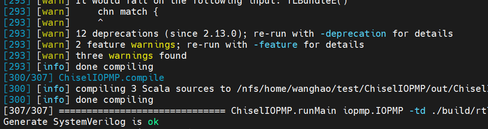
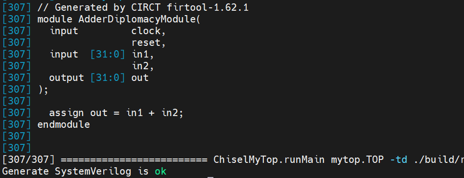
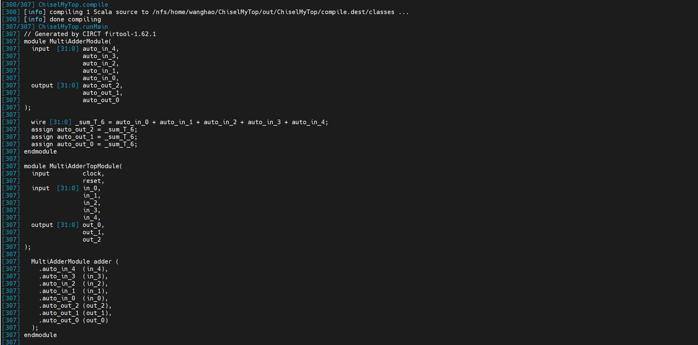

# 第十三章 Diplomacy 编程实践 

# 1.diplomacy简介

就笔者目前了解而言，Diplomacy 是 Chisel 硬件设计语言中用于构建**可参数化、可组装片上系统 (SoC)** 的框架。它的核心思想是：将模块间复杂的**连线工作**和**协议协商**，从手写、易错的硬件描述中剥离出来，提升至一个由框架管理的、类型安全的“连接层”进行声明与自动生成。

你可以将其理解为硬件模块间的“外交协议”系统。每个模块通过声明自己的接口“需求”与“承诺”（即参数），由框架在最终生成电路之前，进行全局的“谈判”，自动协商出所有互连细节（如位宽、时钟、协议转换），并确保连接的正确性。这使设计者能够专注于模块本身的**功能逻辑**，而非繁琐且易错的**连接逻辑**，极大地提升了复杂、可配置 SoC 的设计效率和可靠性。

当然，上述术语过于专业化，这里举一个十分简单的例子。

***

<font style="color:#8A8F8D;">假设你接到一个任务：制作一个模块，该模块有多个输入端口（例如多个 </font><code><font style="color:#8A8F8D;">input [31:0] in</font></code><font style="color:#8A8F8D;">），但并未告知具体数量——可能是两个，也可能是八个。同时，它也有多个输出端口，同样，数量也未确定。模块的功能是：将所有输入相加，然后将结果广播到每一个输出端口。</font>

***

这是一个非常简单的任务。但你有没有发现，如果使用 Verilog 或常规的 Chisel 来编写，我们几乎无从下手，因为端口数量是未知的。这种情况在很大程度上会阻碍开发进程。当然，一个加法器很简单，可以先随意写一个，等确定了端口数量后再修改也不难。但在实际的 CPU 开发中，这就变得有些恼人了。以香山处理器为例，它是一个多核架构，但在实际应用中，我们可能需要根据不同的情况来确定核心数量。如果没有 Diplomacy 这样的手段，纯粹依靠手动修改各种参数、配置，将是一项巨大的挑战。

<font style="background-color:#FBF5CB;">因此，Diplomacy 框架的一大优势在于：当功能需求明确（如加法操作），但具体参数未知（如端口数量，即加数的个数）时，我们仍然可以基于这个框架进行功能上的开发。</font>

以上例子是基于笔者的目前水平，对 Diplomacy 相对于基础 Chisel 或 Verilog 的优势的理解。它的优点肯定不止于此，待笔者进一步深入学习后，再对此进行补充。

所以，本笔记的学习路径大致如下：

1. 配置好 Diplomacy 环境，能够正确地将使用 Diplomacy 框架编写的 Chisel 代码转化为 SystemVerilog。
2. 通过一个简单的加法器例子（即上面所举的例子）来理解 Diplomacy 的基本用法和优势。
3. 持续更新中……

# 2.环境准备

参考网络上的教程：

[浅析Diplomacy参数协商框架设计——Chisel敏捷设计与参数化探索](https://zhuanlan.zhihu.com/p/633327505)

参考网络上的教程《浅析Diplomacy参数协商框架设计——Chisel敏捷设计与参数化探索》时，其方法依赖于在现有的 Chipyard 生态中集成 Diplomacy 库，以便调用相关API。然而，对于不熟悉 Chisel 或相关库操作的使用者来说，这种方式可能会遇到各种阻碍导致失败（笔者本人就暂未能成功）。因此，这里我们将直接使用一个现成的、更易上手的环境。

依据的项目环境是：

```plain
 git clone https://github.com/OpenXiangShan/ChiselIOPMP
```

我们将采用 ChiselIOPMP 项目的环境。与基于 Chipyard 的方案不同，ChiselIOPMP 是一个独立的 Chisel 项目。它的环境搭建不涉及在大型框架中手动配置子模块依赖，而是通过项目自带的 Makefile 脚本自动处理整个构建流程（包括获取依赖）。这类似于香山处理器的开发环境基于 rocket-chip 的方式，本项目也采用了这种方式。

搭建步骤非常简单，只需克隆项目仓库，并执行以下命令来初始化项目环境并同步所需的子模块（如 rocket-chip 等）即可。

```plain
cd ChiselIOPMP/
make init
```

初始化项目环境后，执行以下命令即可运行环境：

```plain
make verilog
```

当看到成功生成 Verilog 的提示时，表明环境已准备就绪。现在，你已经能够顺利地将使用 Diplomacy 框架编写的 Chisel 代码转换为 Verilog 代码。



生成的 Verilog 代码位于以下目录中：

```plain
ls ./build/rtl/
```

# 3.清洗环境

本项目实现了一个IOPMP（输入输出物理内存保护）模块。对于初学者而言，直接基于这样一个较为复杂的项目来学习新的框架，可能显得过于复杂和激进。因此，我们建议采取循序渐进的方式，先通过一些简单的示例来逐步掌握Diplomacy框架。为此，我们将暂时搁置IOPMP的相关内容，从编写简单的示例代码开始，由浅入深地展开学习。待后续能力建立起来之后，再回头研究此处的IOPMP实现也为时不晚。

首先，清理所有与 IOPMP 相关的原始内容，并将项目转变为我们自己的学习项目：

```plain
cd ..
# 清理 IOPMP 的构建输出和源代码
rm -rf ./ChiselIOPMP/out/
rm -rf ./ChiselIOPMP/build/
rm -rf ./ChiselIOPMP/README.md
rm -rf ./ChiselIOPMP/src/main/scala/*
# 当然，有强迫症的我也想顺便把各种项目名也改一下
sed -i '37s/$(TIME_CMD) mill -i $(TOP).runMain iopmp.IOPMP /$(TIME_CMD) mill -i $(TOP).runMain mytop.TOP /' ./ChiselIOPMP/Makefile
sed -i '6s/TOP = ChiselIOPMP/TOP = ChiselMyTop/' ./ChiselIOPMP/Makefile
sed -i '15s/@echo "ChiselIOPMP Makefile Commands:"/@echo "ChiselMyTop Makefile Commands:"/' ./ChiselIOPMP/Makefile
sed -i 's/ChiselIOPMP/ChiselMyTop/g' ./ChiselIOPMP/build.sc
# 重命名项目目录
mv ChiselIOPMP/ ChiselMyTop/
```

现在，项目已经完全转变为一个名为 `ChiselMyTop`的、属于我们自己的简易的学习项目了。

接下来，在相应的位置创建我们自己的 Scala 源文件：

```plain
touch ChiselMyTop/src/main/scala/mytop.scala
```

现在，我们只需要在这个文件中编写自己的简单项目代码，就可以开始体验 Diplomacy 框架了。

编辑ChiselMyTop/src/main/scala/mytop.scala的代码为：

```plain
package mytop

import chisel3._
import chisel3.util._
import org.chipsalliance.cde.config.Parameters
import freechips.rocketchip.diplomacy._
import freechips.rocketchip.util._
import _root_.circt.stage.ChiselStage
import chisel3.experimental.SourceInfo

class AdderDiplomacyModule()(implicit p: Parameters) extends LazyModule {
  lazy val module = new AdderDiplomacyModuleImp(this)
}

class AdderDiplomacyModuleImp(outer: AdderDiplomacyModule)
    extends LazyModuleImp(outer) {
  val in1 = IO(Input(UInt(32.W)))
  val in2 = IO(Input(UInt(32.W)))
  val out = IO(Output(UInt(32.W)))
  out := in1 + in2
}

object TOP extends App {
  println(
    ChiselStage.emitSystemVerilog(
      LazyModule(new AdderDiplomacyModule()(Parameters.empty)).module,
      firtoolOpts = Array("-disable-all-randomization", "-strip-debug-info")
    )
  )
}
```

```plain
cd ChiselMyTop/
make verilog
```



成功输出verilog代码，环境搭建成功。

下面这个是一个使用diplomacy框架稍微完善一点的教程：

```plain
package mytop

import chisel3._
import chisel3.util._
import org.chipsalliance.cde.config.Parameters
import freechips.rocketchip.diplomacy._
import freechips.rocketchip.util._
import _root_.circt.stage.ChiselStage
import chisel3.experimental.SourceInfo

class MultiAdderModule()(implicit p: Parameters) extends LazyModule {
  val node = new NexusNode(MultiAdderNodeImp)(
    { _ => },
    { _ => }
  )
  lazy val module = new MultiAdderModuleImp(this)
}

class MultiAdderModuleImp(outer: MultiAdderModule)
    extends LazyModuleImp(outer) {
  // compute sum of all inward edges
  val sum = Wire(UInt(32.W))
  sum := outer.node.in.map(_._1).reduce(_ + _)

  // copy sum to all outward edges
  outer.node.out.foreach({ case (out, _) =>
    out := sum
  })
}
// Chage one
class MultiAdderTopModule()(implicit p: Parameters) extends LazyModule {
  val inputNodes = new SourceNode(MultiAdderNodeImp)(Seq.fill(5)(()))
  val outputNodes = new SinkNode(MultiAdderNodeImp)(Seq.fill(3)(()))
  val adder = LazyModule(new MultiAdderModule)

  outputNodes :*= adder.node
  adder.node :=* inputNodes

  lazy val module = new LazyModuleImp(this) {
    // connect input to IO
    inputNodes.out.zipWithIndex.foreach({ case ((wire, _), i) =>
      val in = IO(Input(UInt(32.W))).suggestName(s"in_${i}")
      wire := in
    })

    // connect output to IO
    outputNodes.in.zipWithIndex.foreach({ case ((wire, _), i) =>
      val out = IO(Output(UInt(32.W))).suggestName(s"out_${i}")
      out := wire
    })
  }
}

object MultiAdderNodeImp extends SimpleNodeImp[Unit, Unit, Unit, UInt] {
  override def edge(
      pd: Unit,
      pu: Unit,
      p: Parameters,
      sourceInfo: SourceInfo
  ): Unit = ()
  override def bundle(ei: Unit): UInt = UInt(32.W)
  override def render(e: Unit): RenderedEdge =
    RenderedEdge(colour = "#000000" /* black */ )
}

object TOP extends App {
  val top = LazyModule(new MultiAdderTopModule()(Parameters.empty))
  println(
    ChiselStage.emitSystemVerilog(
      top.module,
      firtoolOpts = Array("-disable-all-randomization", "-strip-debug-info")
    )
  )
  os.write.over(os.pwd / "dump.graphml", top.graphML)
}

```

上面的代码运行的结果是：



```plain
package mytop

import chisel3._
import chisel3.util._
import org.chipsalliance.cde.config.Parameters
import freechips.rocketchip.diplomacy._
import freechips.rocketchip.util._
import _root_.circt.stage.ChiselStage
import chisel3.experimental.SourceInfo
import freechips.rocketchip.amba.axi4._
import device._

object MultiAdderNodeImp extends SimpleNodeImp[Int, Int, Int, UInt] {
  override def edge(
      pd: Int,
      pu: Int,
      p: Parameters,
      sourceInfo: SourceInfo
  ): Int = {
    println(s"Negotiation: upstream wants ${pu} bits, downstream wants ${pd} bits")
    val negotiated = if (pu < pd) pu else pd
    println(s"Negotiated result: ${negotiated} bits")
    negotiated
  }
  
  override def bundle(ei: Int): UInt = {
    println(s"Generating hardware: UInt(${ei}.W)")
    UInt(ei.W)
  }
  
  override def render(e: Int): RenderedEdge =
    RenderedEdge(colour = "#000000", label = s"${e}-bit")
}

class MultiAdderModule()(implicit p: Parameters) extends LazyModule {

  
  val node = new NexusNode(MultiAdderNodeImp)(
    { inParams =>
      println(s"Adder module received upstream params: ${inParams}")
      32
    },
    { outParams =>
      println(s"Adder module received downstream params: ${outParams}")
      32
    }
  )

  val outer = this
  lazy val module = new LazyModuleImp(outer){
    val inputs = outer.node.in.map { case (data, edgeParams) =>
      val width = edgeParams
      println(s"Input port width: ${width} bits")
      data
    }

    val outputs = outer.node.out.map { case (data, edgeParams) =>
      val width = edgeParams
      println(s"Output port width: ${width} bits")
      data
    }

    val sum = inputs.reduce(_ + _)
    outputs.foreach(_ := sum)

    printf(s"Adder inputs: ${inputs.length}, outputs: ${outputs.length}\n")
    printf(s"Result: 0x%x\n", sum)
  }
}

case class AXI4EdgeParameters(
  master: AXI4MasterPortParameters,
  slave:  AXI4SlavePortParameters,
  params: Parameters,
  sourceInfo: SourceInfo)
{
  val bundle = AXI4BundleParameters(master, slave)
}

class MultiAdderTopModule(
  //edge: AXI4EdgeParameters
  )(implicit p: Parameters) extends LazyModule {
  //val axiBus = AXI4Xbar()
  //val dmac = LazyModule(new AXI4DMAC(Seq(AddressSet(0x40003000L, 0xfff))))
  //val node = AXI4MasterNode(List(edge.master))
  //dmac.node := axiBus

  val adder = LazyModule(new MultiAdderModule)

  //AXI4SlaveNode
  val outputNodes = new SinkNode(MultiAdderNodeImp)( 
    Seq(16, 32, 64)
  )

  //AXI4MasterNode
  val inputNodes = new SourceNode(MultiAdderNodeImp)(
    Seq(8, 16, 32, 64, 128)
  )
  

  
  adder.node :=* inputNodes
  outputNodes :*= adder.node
  
  
  lazy val module = new LazyModuleImp(this) {
    inputNodes.out.zipWithIndex.foreach { case ((wire, edgeParams), i) =>
      val width = edgeParams
      val in = IO(Input(UInt(width.W))).suggestName(s"in_${i}_${width}bit")
      wire := in
      
      printf(s"Input port ${i}: width=${width}, value=0x%x\n", in)
    }
    
    outputNodes.in.zipWithIndex.foreach { case ((wire, edgeParams), i) =>
      val width = edgeParams
      val out = IO(Output(UInt(width.W))).suggestName(s"out_${i}_${width}bit")
      out := wire
    }
  }
}

object TOP extends App {
  println("=" * 50)
  println("Starting Diplomacy parameter negotiation")
  println("=" * 50)
  implicit val p: Parameters = Parameters.empty
  val top = LazyModule(new MultiAdderTopModule())

  //OR:val top = LazyModule(new MultiAdderTopModule()(Parameters.empty))
  
  println("\n" + "=" * 50)
  println("Generating hardware")
  println("=" * 50)
  
  println(
    ChiselStage.emitSystemVerilog(
      top.module,
      firtoolOpts = Array("-disable-all-randomization", "-strip-debug-info")
    )
  )

}
```


> 更新: 2026-05-25 16:41:13  
> 原文: <https://bosc.yuque.com/staff-xmw8rg/fb7qy3/am9lh4y7vh5y36wm>