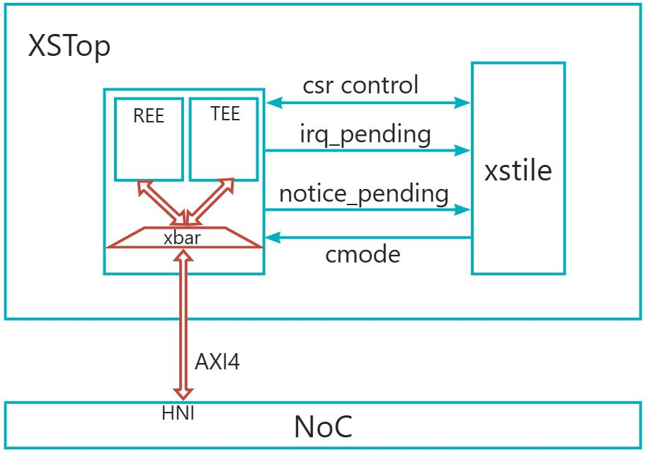
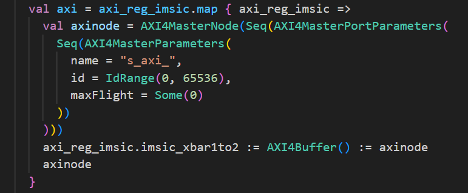
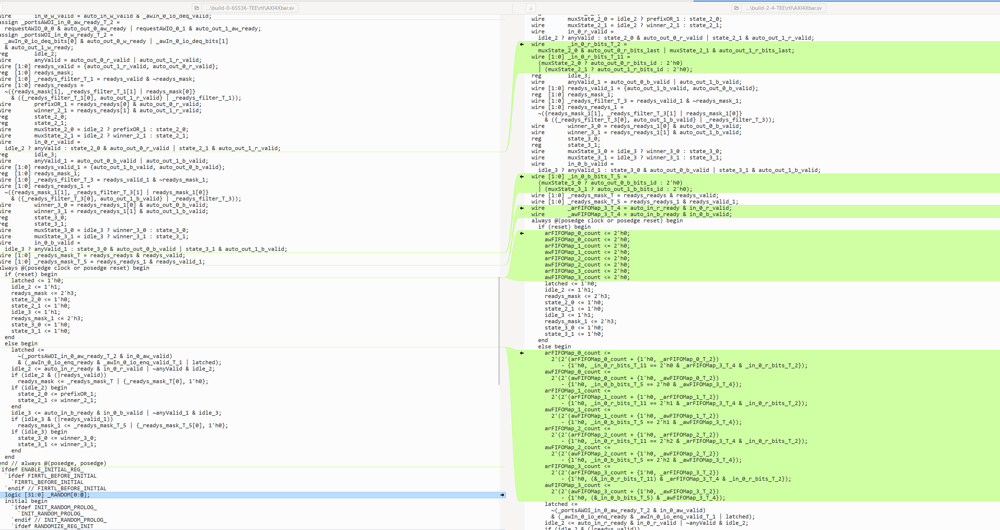
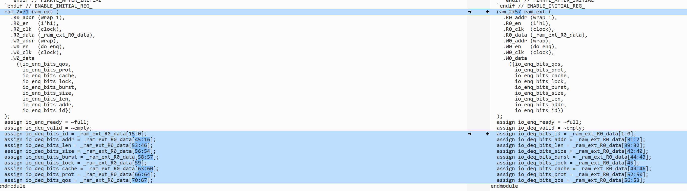

# 第十六章 Diplomacy 问题总结

1. AXI CrossBar， AXI ID [0,65536] 范围太大，导致**编译结束不了**的问题

应用场景 1 个 Master 和 2 个 Slave




代码实现

```c
  // AXI4 Bus
  val axi_reg_imsic = Option.when(soc.IMSICBusType == device.IMSICBusType.AXI)(LazyModule(new aia.AXIRegIMSIC_WRAP(soc.IMSICParams, seperateBus = false)))

  val axi = axi_reg_imsic.map { axi_reg_imsic =>
    val axinode = AXI4MasterNode(Seq(AXI4MasterPortParameters(
      Seq(AXI4MasterParameters(
        name = "s_axi_",
        id = IdRange(0, 65536),
       
      ))
    )))
    axi_reg_imsic.imsic_xbar1to2 := AXI4Buffer() := axinode
    axinode
  }
```

默认  maxFlight  = 7

编译问题

```c
make verilog MFC=1 NUM_CORES=1 WITH_CONSTANTIN=0 CONFIG=XSNoCTopConfig
```

编译 24h 依然没有结束

[附件: ca3ae03ecd6a83bb92a8552db1b7436a.mp4](./attachments/q-Dk3NGDymhXbNEK/ca3ae03ecd6a83bb92a8552db1b7436a.mp4)

暂时解决方法

```c
 // AXI4 Bus
  val axi_reg_imsic = Option.when(soc.IMSICBusType == device.IMSICBusType.AXI)(LazyModule(new aia.AXIRegIMSIC_WRAP(soc.IMSICParams, seperateBus = false)))

  val axi = axi_reg_imsic.map { axi_reg_imsic =>
    val axinode = AXI4MasterNode(Seq(AXI4MasterPortParameters(
      Seq(AXI4MasterParameters(
        name = "s_axi_",
        id = IdRange(0, 65536),
        maxFlight = Some(0)
      ))
    )))
    axi_reg_imsic.imsic_xbar1to2 := AXI4Buffer() := axinode
    axinode
  }

  val axi4 = axi.map(x => InModuleBody(x.makeIOs()))
```

a. 改为maxFlight = Some(0) 之后 可以编译成功，

b. id = IdRange(0, 4096), maxFlight 保持不变，可以编译成功

c. AXI ID 的范围 该如何设置

d. maxFlight 对应AXI 协议的哪种能力

e. 当前改法是否有副作用，对整个SoC 的影响

（1） 是否会出现死锁、活锁 (不会)

（2）是否会影响性能 （会）

**实验： 分别生成 0 maxflight+65536 ID range 和 2 maxflight+2 ID range,rtl区别如下**



变化有AXI的5个通道的id位宽和Xbar的一些计数控制逻辑，实际的第二个图片的存储部分，仍然是2个深度。

所以，我们认为：

+ 导致2max flight+65536编译不过是rocket-chip的axi编译问题，会生成成倍数的下述代码，资源增多。
+ 实际存储部分深度一致，是因为存储部分不是Xbar的，是bundle部分。
+ rocket-chip 的axi写的一般（性能），仅限于能用，后续应该减少使用。
    - 比如 maxflight 参数，rocket-chip认为与 id个数有关，并影响到了Xbar（其实没有任何关系）。





附 生成的rtl：[附件: build-TEE.tar.gz](./attachments/q-Dk3NGDymhXbNEK/build-TEE.tar.gz)


> 更新: 2026-05-26 17:10:31  
> 原文: <https://bosc.yuque.com/staff-xmw8rg/fb7qy3/bc3zn5dan1qpt9s6>