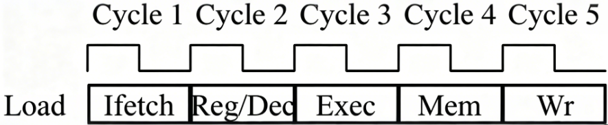
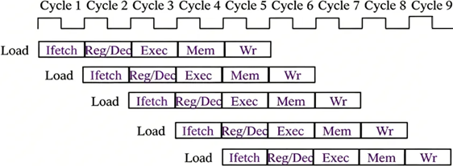
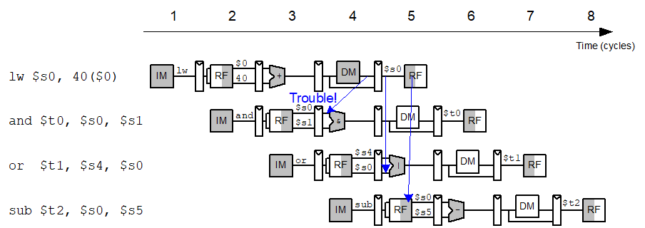
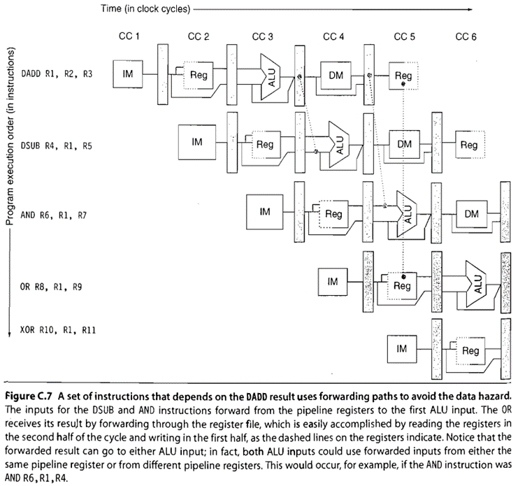

# 1. 单周期 vs. 多周期  vs. 流水线

***

[附件: 处理器架构的演进：从单周期到流水线.pptx](./attachments/9YseBDj4QSwqiGJ6/处理器架构的演进：从单周期到流水线.pptx)

## 💡 **学习目标**

* 理解单周期、多周期和流水线处理器的核心定义与执行逻辑
* 掌握三种架构的量化性能分析方法与设计权衡
* 了解流水线冒险的三种类型及对应的工程解决方案
* 建立处理器架构演进的完整认知，理解香山处理器的设计基础

## 前置基础：一条 RISC-V 指令的完整执行流程

CPU 执行程序的本质，是将高级语言编译后的一条条 RISC-V 指令，按固定流程完成执行。一条 RISC-V 整数基础指令，通常需依次完成 5 个执行阶段，且每个执行阶段有明确的输入、执行逻辑与输出：

| 执行阶段 | 缩写 | 功能定义 |
| --- | --- | --- |
| 取指阶段 | IF（Instruction Fetch） | 从指令存储器中读取当前待执行的指令，同时计算下一条指令的地址 |
| 译码阶段 | ID（Instruction Decode） | 解析指令的操作类型与操作数，从通用寄存器中读取指令所需的源操作数 |
| 执行阶段 | EX（Execute） | 通过算术逻辑单元（ALU）完成核心运算，包括算术运算、逻辑运算、分支目标地址计算 |
| 访存阶段 | MEM（Memory Access） | 针对访存类指令（Load/Store），完成数据存储器的读写操作；非访存类指令此阶段无操作 |
| 写回阶段 | WB（Write Back） | 将指令执行的最终结果写入通用寄存器，供后续指令使用 |

本文讲解的三类处理器架构，本质是\*\*三种不同的指令执行调度模式\*\*，不同的调度模式直接决定了 CPU 的性能上限、硬件成本与设计复杂度。

***

## 核心设计准则：CPU 性能的黄金公式

所有 CPU 架构的优化目标，都是缩短程序的执行总时间，其核心为计算机体系结构的黄金公式：

**程序执行总时间 = 指令总数 × CPI × 时钟周期时间**

三个核心参数的严谨定义与优化逻辑如下：

1. **指令总数**：程序执行所需的 RISC-V 指令总条数，由指令集架构与编译器优化水平决定
2. **CPI（Cycles Per Instruction）**：单条指令的平均执行时钟周期数，由指令执行的调度模式决定
3. **时钟周期时间**：CPU 的最小时序单位，对应 CPU 的核心频率（频率 = 1 / 时钟周期时间），由单周期内需要完成的最大逻辑延迟决定

本文讲解的三类架构，正是围绕 CPI 与时钟周期时间这两个核心变量，展开的工程演进与设计权衡。

***

## 第一部分：单周期处理器

**核心定义：**

单周期处理器是最基础的处理器架构，其核心特征为：**单条指令的所有有效执行阶段，在一个完整的时钟周期内串行完成；仅当前一条指令全流程执行完毕后，才启动下一条指令的取指与执行**。

### 数据通路与执行逻辑

单周期处理器的硬件设计采用全串行通路，核心特征如下：

1. 为每个执行阶段配置独立的硬件单元，各单元在同一个时钟周期内按顺序完成运算
2. 时钟周期的时长必须覆盖整条指令的最大逻辑延迟，即 5 个执行阶段的逻辑延迟之和
3. 指令执行完成时，结果直接写入通用寄存器，无中间状态缓存，控制逻辑极简
4. 单周期执行图：

### 量化性能分析

我们通过固定参数的量化计算，明确单周期处理器的性能边界：假设每个执行阶段的最大逻辑延迟均为 0.5ns，单条指令的总逻辑延迟为 5×0.5ns=2.5ns。

* 单周期处理器的时钟周期必须等于整条指令的总逻辑延迟，即 0.5ns，对应核心频率为 2GHz
* 单条指令占用 1 个时钟周期，因此 CPI=1
* 执行 100 条指令的总执行时间 = 100 × 1 × 0.5ns = 50ns = 0.05μs

### 设计权衡：优势与局限

| **核心优势** | **核心局限** |
| :--- | :--- |
| 控制逻辑极简，无复杂的状态机与时序同步设计，易于入门理解与实现 | 时钟周期由最长指令的总延迟决定，频率上限极低，无法实现高性能 |
| 单周期内完成指令执行，无中间结果缓存，无指令间的时序冲突 | 硬件资源利用率极低，各阶段的硬件单元仅在对应时段工作，其余时间处于闲置状态 |
| 固定 CPI=1，指令执行时序可预测，无执行波动 | 所有指令均需执行完整周期，短延迟指令（如无访存的算术指令）无法提前完成，造成性能浪费 |

### 香山处理器工程视角

单周期处理器仅适用于时序要求宽松、逻辑极简的嵌入式控制场景，**香山系列高性能 RISC-V 处理器未采用单周期架构**，核心工程原因如下：

1. **时序收敛与频率瓶颈**：现代高性能处理器的核心设计目标之一是提升主频，香山南湖架构主频目标为 2GHz 以上，对应时钟周期小于 0.5ns，无法将整条指令的全流程逻辑塞进单个时钟周期内，无法满足时序收敛要求
2. **PPA 优化目标不匹配**：香山处理器需兼顾性能、功耗与面积（PPA），单周期架构硬件资源利用率极低，造成芯片面积与功耗的浪费，不符合车载、服务器等场景的设计要求
3. **无法支持指令集扩展**：单周期架构无法适配 RISC-V 的乘除法、浮点、向量等扩展指令，这类指令的逻辑延迟远高于基础整数指令，会进一步拉低主频，完全不具备可扩展性

***

## 第二部分：多周期处理器

**核心定义：**

多周期处理器是对单周期架构的时序优化，其核心特征为：**将单周期的长时钟周期拆分为多个短时钟周期，每个时钟周期仅完成指令的一个执行阶段；单条指令依次经过多个时钟周期完成全流程执行，仅当前一条指令完全退出所有执行阶段后，才启动下一条指令的执行**。

相比单周期架构，多周期处理器做了两项核心的工程改进，也是现代处理器架构的基础：

1. **引入流水线寄存器**：在相邻两个执行阶段之间插入寄存器组，用于缓存上一阶段的执行结果与指令状态，确保下一阶段的输入稳定，每个时钟周期仅需完成单个阶段的逻辑运算
2. **硬件资源复用**：同一硬件单元可在不同时钟周期为不同执行阶段服务，例如 ALU 可在 EX 阶段完成算术运算，在 IF 阶段完成下一条指令的地址计算，无需配置冗余硬件，大幅降低芯片面积与成本
3. 多周期执行图：

### 量化性能分析

沿用单周期的参数设定（单阶段最大逻辑延迟 0.5ns），多周期处理器的性能表现如下：

* 多周期处理器的时钟周期仅需覆盖单个执行阶段的最大逻辑延迟，即**0.5ns**，对应核心频率为**2GHz**，是同参数下单周期架构主频的 5 倍
* 基础整数指令单条需要 5 个时钟周期完成，访存指令需 5 个周期，分支指令仅需 3 个周期，实际场景中平均 CPI 约为 4.2
* 执行 100 条指令的总执行时间 = 100 × 4.2 × 0.5ns = **210ns = 0.21μs**；对应同参数下单周期架构的总执行时间为 100 × 1 × 2.5ns = 250ns，多周期架构相比单周期架构性能提升约 16%

**关键认知**：多周期架构通过拆分时钟周期提升了主频上限，同时通过差异化的指令周期数，避免了短延迟指令的性能浪费，实现了基础的性能优化。

### 设计权衡：优势与局限

| **核心优势** | **核心局限** |
| :--- | :--- |
| 时钟周期大幅缩短，主频上限显著高于单周期架构，具备更高的性能潜力 | 单条指令需要多个时钟周期完成，平均 CPI 远高于 1，主频提升带来的性能收益被部分抵消 |
| 支持硬件资源复用，芯片面积与功耗显著优于单周期架构，PPA 更均衡 | 控制逻辑复杂度提升，需要设计状态机管理指令的执行阶段与硬件资源调度 |
| 支持不同指令配置不同的执行周期数，可灵活适配 RISC-V 扩展指令，具备可扩展性 | 硬件资源利用率仍有较大提升空间，同一时间仅一个执行阶段的硬件单元处于工作状态，其余单元闲置 |

### 香山处理器工程视角

香山高性能主流水线未采用纯多周期架构，但多周期的核心设计思想深度融入了香山的全流程设计中：

1. **复杂指令的多周期实现**：香山处理器对乘除法、浮点运算、向量运算等长延迟指令，采用多周期执行方案，避免长延迟指令拖慢主流水线的时钟周期，平衡了主频与指令执行效率
2. **访存系统的多周期设计**：香山的 Cache 访问、内存管理单元（MMU）采用多周期流水线设计，应对不同延迟的访存请求，避免访存操作阻塞主流水线
3. **生态核的设计参考**：香山生态内的低功耗 MCU 核、嵌入式控制核，大量采用多周期架构，在极低的成本与功耗下，实现了均衡的性能，覆盖了 RISC-V 全场景应用需求

***

## 第三部分：流水线处理器

**核心定义：**

流水线处理器是现代通用 CPU 的核心架构，其核心特征为：**将多个执行阶段设计为相互独立的流水级，相邻流水级之间通过流水线寄存器隔离；前一条指令完成当前流水级进入下一级时，下一条指令即可进入当前流水级，实现多条指令的重叠执行，同一时间多个流水级并行处理不同指令的不同执行阶段**。

### 核心可视化：5 级流水线时序表

流水线的核心是指令的重叠执行，通过以下时序表可清晰理解其执行逻辑：

| **时钟周期** | **IF 级** | **ID 级** | **EX 级** | **MEM 级** | **WB 级** |
| :--- | :--- | :--- | :--- | :--- | :--- |
| 1 | 指令 1 | - | - | - | - |
| 2 | 指令 2 | 指令 1 | - | - | - |
| 3 | 指令 3 | 指令 2 | 指令 1 | - | - |
| 4 | 指令 4 | 指令 3 | 指令 2 | 指令 1 | - |
| 5 | 指令 5 | 指令 4 | 指令 3 | 指令 2 | 指令 1 |
| 6 | 指令 6 | 指令 5 | 指令 4 | 指令 3 | 指令 2 |
| N | 指令 N | 指令 N-1 | 指令 N-2 | 指令 N-3 | 指令 N-4 |

从时序表可得到两个核心结论：

1. 单条指令的执行仍需 5 个时钟周期，并未缩短单条指令的延迟
2. 流水线填满后，**每个时钟周期都有一条指令完成执行并退出流水线**，理想情况下平均 CPI≈1，同时保持了多周期架构的短时钟周期与高主频上限
3. 流水线执行图

### 量化性能分析

沿用统一的参数设定（单阶段最大逻辑延迟 0.5ns，对应时钟周期 0.5ns，核心主频 2GHz，经典 5 级 RISC-V 流水线），流水线处理器的性能表现如下：

* 执行 100 条指令的总执行时间 = (流水线深度 + 指令总数 - 1) × 单时钟周期时长 = (5 + 100 - 1) × 0.5ns = 104 × 0.5ns = **52ns = 0.052μs**
* 对应同参数下，单周期架构 100 条指令总执行时间为 250ns，多周期架构为 210ns；流水线架构**相比单周期架构性能提升约 4.8 倍，相比多周期架构性能提升约 4 倍**，实现了同主频下数量级的性能飞跃

**关键认知**：流水线架构并未缩短单条指令的固有执行延迟（单条指令仍需 5 个时钟周期完成全流程），但通过指令重叠执行的并行设计，在保持 2GHz 高主频的同时，将理想状态下的平均 CPI 逼近 1，彻底释放了时序拆分带来的主频红利，也是香山等现代高性能 RISC-V 处理器实现高指令吞吐的核心基础。

### 设计权衡：优势与局限

| **核心优势** | **核心局限** |
| :--- | :--- |
| 指令吞吐率实现数量级提升，同时保持高主频上限，是现代高性能 CPU 的核心基础 | 控制逻辑复杂度最高，需要处理指令间的时序冲突与流水线冒险，设计与验证难度大幅提升 |
| 硬件资源利用率接近最大化，各流水级的硬件单元几乎全程处于工作状态，无长期闲置 | 需要额外的流水线寄存器实现流水级隔离，带来少量的面积与时序开销 |
| 架构可扩展性极强，可通过加深流水线、拓宽发射宽度实现更高的性能 | 流水线深度并非越高越好，过深的流水线会带来更高的冒险开销与时序成本，反而降低性能收益 |

### 香山处理器工程视角

**经典 5 级流水线是香山高性能 RISC-V 处理器的核心设计基石**，香山系列架构在经典流水线的基础上，实现了面向高性能场景的深度优化：

1. **深度流水线设计**：香山南湖架构采用 11 级整数流水线，将经典 5 级流水的核心阶段进一步拆分，进一步缩短了单流水级的逻辑延迟，将主频提升至 2GHz 以上；最新的香山架构通过流水线优化，实现了更高的主频与性能
2. **超标量多发射流水线**：香山采用双发射超标量流水线设计，单个时钟周期可向流水线内发射 2 条指令，理想情况下每个周期可完成 2 条指令的执行，指令吞吐率翻倍
3. **乱序执行流水线**：香山在经典顺序流水线的基础上，实现了乱序执行技术，可动态调度指令的执行顺序，避免流水线因长延迟指令阻塞，进一步提升了流水线的利用率与指令级并行度
4. **全流水功能单元**：香山的 ALU、乘除法单元、浮点运算单元均采用全流水设计，可连续接收指令，无结构性阻塞，保证了流水线的持续吞吐

***

## 第四部分：流水线的核心挑战 —— 冒险与工程解决方案

流水线架构通过指令重叠执行实现了性能飞跃，但同时也带来了新的核心挑战：**多条指令在流水线内并行执行时，会产生资源、数据与控制层面的冲突，导致流水线暂停甚至执行错误，这类冲突统称为流水线冒险**。

以下为三类核心流水线冒险，以及香山处理器对应的工程解决方案：

### 1. 结构冒险

**核心定义**：多条指令在同一时钟周期内，争抢同一硬件资源，导致无法同时执行，产生流水线冲突。**典型场景**：经典冯・诺依曼架构下，IF 级的指令取指与 MEM 级的数据访存，需要同时访问同一存储器，导致资源冲突。**工程解决方案**：

* 资源冗余设计：为冲突操作配置独立的硬件资源，例如采用哈佛架构，分离指令存储器与数据存储器，从根本上解决访存资源冲突
* 流水线停顿（插入气泡）：当资源冲突无法避免时，暂停后续指令的发射，等待资源释放后继续执行**香山工程实践**：香山处理器采用分离式指令 Cache 与数据 Cache，同时为多发射流水线配置了多套 ALU、地址生成单元等功能单元，从硬件层面消除了核心路径的结构冒险，保证了流水线的持续吞吐。

| 周期 | 1 | 2 | 3 | 4 | 5 | 6 | 7 | 8 |
| --- | --- | --- | --- | --- | --- | --- | --- | --- |
| `lw $s0` | IF | ID | EX | MEM | WB | - | - | - |
| `and $t0` | - | IF | ID | EX | MEM | WB | - | - |
| `or $t1` | - | - | IF | ID | EX | MEM | WB | - |
| `sub $t2` | - | - | - | IF | ID | EX | MEM | WB |

冲突核心：

<code>lw</code>指令的正确<code>$s0</code>值，**最早在周期 4 的 MEM 阶段结束时才能拿到**，周期 5 的 WB 阶段才会写入寄存器堆 RF。但依赖它的<code>and</code>指令：周期 3 的 ID 阶段，就要从 RF 中读取<code>$s0</code>的值；周期 4 的 EX 阶段，就要用<code>$s0</code>的值完成与运算。时序完全错位：<code>and</code>要用结果的时候，<code>lw</code>甚至还没从内存里把数据读出来，就算用数据转发（旁路），也无法解决 ——ALU 运算在周期前半段完成，内存读数据在周期后半段完成，同一个周期内根本来不及把 MEM 的结果送给 EX 阶段的 ALU。

 暂停后的正确时序如下：  

| 周期 | 1 | 2 | 3 | 4 | 5 | 6 | 7 | 8 | 9 |
| --- | --- | --- | --- | --- | --- | --- | --- | --- | --- |
| <code>lw $s0</code> | IF | ID | EX | MEM | WB | - | - | - | - |
| 气泡 | - | - | - | 空操作 | - | - | - | - | - |
| <code>and $t0</code> | - | IF | 暂停 | ID | EX | MEM | WB | - | - |
| <code>or $t1</code> | - | - | IF | 暂停 | ID | EX | MEM | WB | - |
| <code>sub $t2</code> | - | - | - | IF | 暂停 | ID | EX | MEM | WB |

### 2. 数据冒险

**核心定义**：后续指令需要使用前序指令的执行结果，但前序指令尚未完成写回操作，后续指令无法获取正确的源操作数，导致执行错误。**典型场景**：两条连续的算术指令，第二条指令的源操作数为第一条指令的目标寄存器，第一条指令在第 5 周期完成写回，第二条指令在第 3 周期就需要读取源操作数，产生数据依赖冲突。**工程解决方案**：

* 数据转发（bypassing，Forwarding）：无需等待前序指令完成写回，直接将前序指令 EX 级的执行结果，通过专用旁路通路转发到后续指令的 EX 级，大幅减少流水线暂停周期。Forwarding/bypass是用来**解决RAW冲突**的

核心思路：**抄近路**，即：在结果产生后第一时间送到需要它的功能部件里，而不是通过寄存器文件来传递。\*\*实现要点：\*\*数据要前送回去、多路输入要有一个选通器、要有一个冲突检测电路来控制选通器

* 流水线暂停：对于无法通过转发解决的数据依赖（如 Load 指令后紧跟依赖其结果的指令），插入暂停周期，等待数据就绪后继续执行
* 乱序执行：动态调度无数据依赖的指令优先执行，避免流水线因数据依赖空转**香山工程实践**：香山处理器实现了全通路的数据转发网络，覆盖整数、浮点、向量等所有功能单元，可处理绝大多数数据冒险；同时通过乱序执行与寄存器重命名技术，消除了伪数据依赖，最大化提升了流水线的利用率。相关技术：**重排序缓冲（Reorder Buffer，ROB）、寄存器重命名、Tomasulo算法。**

### 3. 控制冒险

**核心定义**：遇到分支跳转、异常中断等指令时，需要等待分支结果确定后，才能获取正确的下一条指令地址，此时流水线内已预取的指令全部无效，导致流水线冲刷与性能损失。**典型场景**：if-else 分支判断指令，需要在 EX 级才能确定分支是否跳转、目标地址是多少，而流水线已经预取了顺序执行的后续指令，若分支跳转，这些指令必须全部作废，重新取指。**工程解决方案**：

* 分支预测技术：通过硬件逻辑预测分支是否跳转、跳转目标地址，按预测结果预取指令并执行；若预测正确，流水线无任何停顿；若预测错误，冲刷流水线内的错误指令，重新取指
* 分支延迟槽：通过指令集架构设计，让分支指令后的一条指令必然执行，避免流水线空转**香山工程实践**：香山处理器采用了业界领先的 TAGE 分支预测器，结合返回地址栈（RAS）、间接分支预测等技术，分支预测准确率可达 99% 以上，大幅降低了控制冒险带来的流水线冲刷损失，是香山实现高性能的核心技术之一。

***

## 对比：三类处理器架构的核心差异与设计权衡

| **核心特性** | **单周期处理器** | **多周期处理器** | **流水线处理器** |
| :--- | :--- | :--- | :--- |
| 核心执行逻辑 | 单条指令在一个时钟周期内串行完成所有执行阶段 | 单条指令拆分为多个时钟周期执行，单周期完成一个阶段，前一条指令执行完毕后启动下一条 | 多条指令重叠执行，不同流水级并行处理不同指令的不同阶段，流水线填满后单周期完成一条指令 |
| 平均 CPI | 1 | >1（典型值 4-5） | ≈1（理想情况） |
| 时钟周期时长 | 最长（等于整条指令的总逻辑延迟） | 中等（等于单个执行阶段的最大逻辑延迟） | 最短（等于单个流水级的最大逻辑延迟） |
| 主频上限 | 极低 | 中等 | 极高 |
| 硬件资源利用率 | 极低 | 中等 | 极高 |
| 硬件成本与面积 | 高（无硬件复用，需冗余资源） | 低（支持硬件复用，面积最优） | 中等（需流水线寄存器与多套功能单元） |
| 控制逻辑复杂度 | 极简 | 中等 | 最复杂 |
| 设计与验证难度 | 极低 | 中等 | 极高 |
| 适用场景 | 极简嵌入式控制场景 | 低功耗 MCU、嵌入式控制场景 | 现代高性能通用 CPU、香山 RISC-V 处理器 |

***

## 结尾：从经典流水线到高性能香山架构

       本文从 RISC-V 指令的基础执行流程出发，完整梳理了 CPU 架构从单周期到多周期，再到流水线的演进路径。可以看到，所有的架构设计，本质都是围绕性能黄金公式，在主频、CPI、硬件成本之间做的工程权衡。

       经典 5 级流水线是现代高性能 CPU 的核心基石，香山 RISC-V 处理器的超标量多发射、乱序执行、分支预测、Cache 存储体系等核心技术，都是在经典流水线的基础上，为了进一步提升指令吞吐率、减少流水线停顿而设计的。

       希望本文能帮助你建立 RISC-V 处理器架构的基础认知，为后续深入理解香山处理器的核心设计、学习数字 IC 设计与处理器架构打下坚实的基础。

## 参考资料：

[ETH Zurich - Digital Design and Computer Architecture](https://safari.ethz.ch/foca/spring2025/doku.php?id=schedule) 

国科大，胡伟武，《计算机体系结构PPT》

> 更新: 2026-05-11 18:28:42  
> 原文: <https://bosc.yuque.com/staff-xmw8rg/fb7qy3/hfysfscwr90mfbwr>