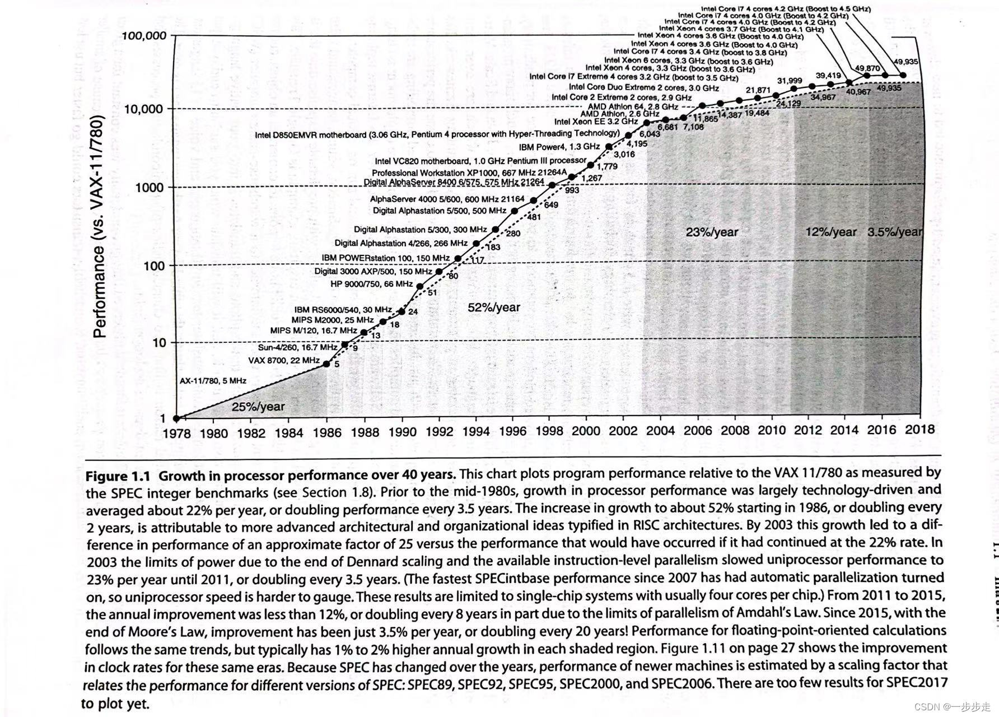

# 5. 单发射 vs. 多发射

[附件: 单发射 vs. 多发射：处理器性能的核心抉择.pptx](./attachments/CjhqwUNZSf3oW9Re/单发射 vs. 多发射：处理器性能的核心抉择.pptx)

<font style="color:rgb(0, 0, 0);background-color:rgba(0, 0, 0, 0);">💡</font><font style="color:rgb(0, 0, 0);background-color:rgba(0, 0, 0, 0);"> </font>**<font style="color:rgb(0, 0, 0);background-color:rgba(0, 0, 0, 0);">学习目标</font>**

+ <font style="color:rgb(0, 0, 0);background-color:rgba(0, 0, 0, 0);">理解单发射和多发射处理器的核心区别</font>
+ <font style="color:rgb(0, 0, 0);background-color:rgba(0, 0, 0, 0);">掌握多发射处理器的两种主要实现方式</font>
+ <font style="color:rgb(0, 0, 0);background-color:rgba(0, 0, 0, 0);">了解香山 RISC-V 从单发射到多发射的演进过程</font>
+ <font style="color:rgb(0, 0, 0);background-color:rgba(0, 0, 0, 0);">能够根据应用场景选择合适的处理器架构</font>

---

## <font style="color:rgb(0, 0, 0);background-color:rgba(0, 0, 0, 0);">1. 为什么我们需要多发射？</font>
<font style="color:rgb(0, 0, 0);background-color:rgba(0, 0, 0, 0);">处理器性能提升的两条基本路径：</font>

+ **<font style="color:rgb(0, 0, 0);background-color:rgba(0, 0, 0, 0);">提高时钟频率</font>**<font style="color:rgb(0, 0, 0);background-color:rgba(0, 0, 0, 0);">：让每个时钟周期更短，但受物理极限和散热限制</font>
+ **<font style="color:rgb(0, 0, 0);background-color:rgba(0, 0, 0, 0);">提高指令级并行性 (ILP)</font>**<font style="color:rgb(0, 0, 0);background-color:rgba(0, 0, 0, 0);">：在同一个时钟周期内做更多的事</font>

<font style="color:rgb(0, 0, 0);background-color:rgba(0, 0, 0, 0);">单发射和多发射是处理器实现指令级并行性的</font>**<font style="color:rgb(0, 0, 0);background-color:rgba(0, 0, 0, 0);">最基础架构选择</font>**<font style="color:rgb(0, 0, 0);background-color:rgba(0, 0, 0, 0);">。</font>

_<font style="color:rgb(0, 0, 0);background-color:rgba(0, 0, 0, 0);">图 1：处理器性能演进与 ILP 的贡献</font>_



**<font style="color:rgb(0, 0, 0);background-color:rgba(0, 0, 0, 0);">香山 RISC-V 的演进</font>**<font style="color:rgb(0, 0, 0);background-color:rgba(0, 0, 0, 0);">：从初代单发射的 "香山 1 号" 原型，到现在 4 发射乱序执行的 "南湖" 架构，正是沿着提高指令级并行性的路线发展。</font>

---

## <font style="color:rgb(0, 0, 0);background-color:rgba(0, 0, 0, 0);">2. 基础概念回顾</font>
<font style="color:rgb(0, 0, 0);background-color:rgba(0, 0, 0, 0);">在深入学习之前，让我们先统一几个关键术语：</font>

| **<font style="color:rgb(0, 0, 0);background-color:rgba(0, 0, 0, 0);">术语</font>** | **<font style="color:rgb(0, 0, 0);background-color:rgba(0, 0, 0, 0);">定义</font>** |
| :--- | :--- |
| <font style="color:rgb(0, 0, 0);background-color:rgba(0, 0, 0, 0);">📌</font><font style="color:rgb(0, 0, 0);background-color:rgba(0, 0, 0, 0);"> </font>**<font style="color:rgb(0, 0, 0);background-color:rgba(0, 0, 0, 0);">发射 (Issue)</font>** | <font style="color:rgb(0, 0, 0);background-color:rgba(0, 0, 0, 0);">将指令从译码阶段发送到执行单元开始执行的过程</font> |
| <font style="color:rgb(0, 0, 0);background-color:rgba(0, 0, 0, 0);">📌</font><font style="color:rgb(0, 0, 0);background-color:rgba(0, 0, 0, 0);"> </font>**<font style="color:rgb(0, 0, 0);background-color:rgba(0, 0, 0, 0);">发射宽度 (Issue Width)</font>** | <font style="color:rgb(0, 0, 0);background-color:rgba(0, 0, 0, 0);">一个时钟周期内能够发射的最大指令数</font> |
| <font style="color:rgb(0, 0, 0);background-color:rgba(0, 0, 0, 0);">📌</font><font style="color:rgb(0, 0, 0);background-color:rgba(0, 0, 0, 0);"> </font>**<font style="color:rgb(0, 0, 0);background-color:rgba(0, 0, 0, 0);">指令级并行性 (ILP)</font>** | <font style="color:rgb(0, 0, 0);background-color:rgba(0, 0, 0, 0);">程序中可以同时执行的指令数量</font> |


### <font style="color:rgb(0, 0, 0);background-color:rgba(0, 0, 0, 0);">经典 5 级流水线回顾</font>
<font style="color:rgb(0, 0, 0);background-color:rgba(0, 0, 0, 0);">所有现代处理器的基础都是流水线架构，我们以最经典的 5 级 RISC 流水线为例：</font>

1. **<font style="color:rgb(0, 0, 0);background-color:rgba(0, 0, 0, 0);">取指 (IF)</font>**<font style="color:rgb(0, 0, 0);background-color:rgba(0, 0, 0, 0);">：从指令内存中取出下一条指令</font>
2. **<font style="color:rgb(0, 0, 0);background-color:rgba(0, 0, 0, 0);">译码 (ID)</font>**<font style="color:rgb(0, 0, 0);background-color:rgba(0, 0, 0, 0);">：解析指令操作码，读取源寄存器值</font>
3. **<font style="color:rgb(0, 0, 0);background-color:rgba(0, 0, 0, 0);">执行 (EX)</font>**<font style="color:rgb(0, 0, 0);background-color:rgba(0, 0, 0, 0);">：在 ALU 中进行算术逻辑运算</font>
4. **<font style="color:rgb(0, 0, 0);background-color:rgba(0, 0, 0, 0);">访存 (MEM)</font>**<font style="color:rgb(0, 0, 0);background-color:rgba(0, 0, 0, 0);">：如果是加载 / 存储指令，访问数据内存</font>
5. **<font style="color:rgb(0, 0, 0);background-color:rgba(0, 0, 0, 0);">写回 (WB)</font>**<font style="color:rgb(0, 0, 0);background-color:rgba(0, 0, 0, 0);">：将运算结果写入目标寄存器</font>

<font style="color:rgb(0, 0, 0);background-color:rgba(0, 0, 0, 0);">🎬</font><font style="color:rgb(0, 0, 0);background-color:rgba(0, 0, 0, 0);"> 点击下方按钮运行流水线动画，观察一条 ADD 指令在 5 级流水线中的完整执行过程。</font>

```html
<!-- 5级流水线动画演示 - 开始 -->
<script>
document.addEventListener('DOMContentLoaded', function() {
  const btnRun = document.getElementById('btn-run');
  const btnStep = document.getElementById('btn-step');
  const btnReset = document.getElementById('btn-reset');
  const speedSlider = document.getElementById('speed-slider');
  const speedValue = document.getElementById('speed-value');
  const cycleCount = document.getElementById('cycle-count');
  const operationDesc = document.getElementById('operation-desc');
  
  const stages = [
    { id: 'stage-if', name: '取指', desc: '从指令内存中取出指令add x1, x2, x3' },
    { id: 'stage-id', name: '译码', desc: '解析指令操作码，读取寄存器x2和x3的值' },
    { id: 'stage-ex', name: '执行', desc: '在ALU中执行加法运算x2 + x3' },
    { id: 'stage-mem', name: '访存', desc: '加法指令不需要访存，跳过此阶段' },
    { id: 'stage-wb', name: '写回', desc: '将运算结果写入目标寄存器x1' }
  ];
  
  let currentCycle = 0;
  let isRunning = false;
  let animationInterval;
  let speed = 1000; 
  
  function createInstructionBlock() {
    const block = document.createElement('div');
    block.className = 'instruction-block';
    block.textContent = 'add';
    return block;
  }
  
  function resetPipeline() {
    clearInterval(animationInterval);
    isRunning = false;
    currentCycle = 0;
    cycleCount.textContent = '0';
    btnRun.textContent = '运行';
    operationDesc.textContent = '点击"运行"按钮开始演示';
    
    stages.forEach(stage => {
      const stageContent = document.getElementById(stage.id);
      stageContent.innerHTML = '';
      stageContent.classList.remove('active');
    });
  }
  
  function stepCycle() {
    if (currentCycle > 0 && currentCycle <= stages.length) {
      const prevStage = document.getElementById(stages[currentCycle - 1].id);
      prevStage.innerHTML = '';
      prevStage.classList.remove('active');
    }
    
    if (currentCycle >= stages.length) {
      clearInterval(animationInterval);
      isRunning = false;
      btnRun.textContent = '运行';
      operationDesc.textContent = '演示完成！点击"重置"重新开始';
      return;
    }
    
    currentCycle++;
    cycleCount.textContent = currentCycle;
    
    const currentStage = document.getElementById(stages[currentCycle - 1].id);
    const instructionBlock = createInstructionBlock();
    currentStage.appendChild(instructionBlock);
    currentStage.classList.add('active');
    
    operationDesc.textContent = `周期${currentCycle} - ${stages[currentCycle - 1].name}阶段：${stages[currentCycle - 1].desc}`;
    
    setTimeout(() => {
      instructionBlock.style.left = '10%';
    }, 10);
  }
  
  btnRun.addEventListener('click', function() {
    if (isRunning) {
      clearInterval(animationInterval);
      isRunning = false;
      btnRun.textContent = '继续';
    } else {
      isRunning = true;
      btnRun.textContent = '暂停';
      
      if (currentCycle === 0) {
        const firstStage = document.getElementById(stages[0].id);
        const instructionBlock = createInstructionBlock();
        firstStage.appendChild(instructionBlock);
        
        setTimeout(() => {
          instructionBlock.style.left = '10%';
          firstStage.classList.add('active');
          operationDesc.textContent = `周期1 - ${stages[0].name}阶段：${stages[0].desc}`;
          currentCycle = 1;
          cycleCount.textContent = '1';
        }, 10);
      }
      
      animationInterval = setInterval(stepCycle, speed);
    }
  });
  
  btnStep.addEventListener('click', function() {
    if (isRunning) {
      clearInterval(animationInterval);
      isRunning = false;
      btnRun.textContent = '继续';
    }
    stepCycle();
  });
  
  btnReset.addEventListener('click', resetPipeline);
  
  speedSlider.addEventListener('input', function() {
    const value = parseFloat(this.value);
    speedValue.textContent = `${value}x`;
    speed = 1000 / value; 
    
    if (isRunning) {
      clearInterval(animationInterval);
      animationInterval = setInterval(stepCycle, speed);
    }
  });
});
</script>
<style>
.pipeline-demo {
  background: #f8fafc;
  border-radius: 12px;
  padding: 24px;
  margin: 32px 0;
  box-shadow: 0 4px 6px rgba(0, 0, 0, 0.05);
}

.pipeline-demo h4 {
  margin-top: 0;
  margin-bottom: 16px;
  color: #1e293b;
  text-align: center;
  font-size: 18px;
}

.instruction-display {
  text-align: center;
  font-size: 16px;
  margin-bottom: 24px;
  padding: 12px;
  background: #e2e8f0;
  border-radius: 6px;
}

.instruction-display code {
  font-family: 'Consolas', 'Monaco', monospace;
  background: #1e293b;
  color: #f8fafc;
  padding: 4px 8px;
  border-radius: 4px;
}

.pipeline-container {
  display: flex;
  justify-content: space-between;
  margin-bottom: 24px;
}

.pipeline-stage {
  flex: 1;
  margin: 0 4px;
  text-align: center;
}

.stage-label {
  background: #1e293b;
  color: white;
  padding: 8px;
  border-radius: 6px 6px 0 0;
  font-weight: bold;
  font-size: 14px;
}

.stage-content {
  height: 80px;
  background: #e2e8f0;
  border-radius: 0 0 6px 6px;
  display: flex;
  align-items: center;
  justify-content: center;
  transition: background-color 0.3s ease;
  position: relative;
  overflow: hidden;
}

.stage-content.active {
  background-color: #3b82f6;
}

.instruction-block {
  width: 80%;
  height: 60px;
  background: #ef4444;
  color: white;
  border-radius: 6px;
  display: flex;
  align-items: center;
  justify-content: center;
  font-weight: bold;
  position: absolute;
  left: -100%;
  transition: left 0.5s ease;
}

.operation-description {
  background: #f0f7ff;
  border-left: 4px solid #3b82f6;
  padding: 12px 16px;
  border-radius: 0 6px 6px 0;
  margin-bottom: 24px;
  min-height: 40px;
  font-size: 14px;
}

.controls {
  display: flex;
  align-items: center;
  justify-content: center;
  gap: 12px;
  margin-bottom: 16px;
  flex-wrap: wrap;
}

.btn-primary {
  background: #3b82f6;
  color: white;
  border: none;
  padding: 10px 20px;
  border-radius: 6px;
  font-size: 16px;
  cursor: pointer;
  transition: background-color 0.2s ease;
}

.btn-primary:hover {
  background: #2563eb;
}

.btn-secondary {
  background: #64748b;
  color: white;
  border: none;
  padding: 10px 20px;
  border-radius: 6px;
  font-size: 16px;
  cursor: pointer;
  transition: background-color 0.2s ease;
}

.btn-secondary:hover {
  background: #475569;
}

.btn-primary:disabled, .btn-secondary:disabled {
  background: #cbd5e1;
  cursor: not-allowed;
}

.speed-control {
  display: flex;
  align-items: center;
  gap: 8px;
  margin-left: 24px;
}

.speed-control input[type="range"] {
  width: 100px;
}

.cycle-counter {
  text-align: center;
  font-size: 16px;
  font-weight: bold;
  color: #1e293b;
}
</style>
<div class="pipeline-demo">
  <h4>经典5级流水线动画演示</h4>

  <div class="instruction-display">
    当前执行指令：<code>add x1, x2, x3</code>
  </div>

  <div class="pipeline-container">
    <div class="pipeline-stage">
      <div class="stage-label">取指<br>IF</div>
      <div class="stage-content" id="stage-if"></div>
    </div>
    <div class="pipeline-stage">
      <div class="stage-label">译码<br>ID</div>
      <div class="stage-content" id="stage-id"></div>
    </div>
    <div class="pipeline-stage">
      <div class="stage-label">执行<br>EX</div>
      <div class="stage-content" id="stage-ex"></div>
    </div>
    <div class="pipeline-stage">
      <div class="stage-label">访存<br>MEM</div>
      <div class="stage-content" id="stage-mem"></div>
    </div>
    <div class="pipeline-stage">
      <div class="stage-label">写回<br>WB</div>
      <div class="stage-content" id="stage-wb"></div>
    </div>
  </div>

  <div class="operation-description" id="operation-desc">
    点击"运行"按钮开始演示
  </div>

  <div class="controls">
    <button id="btn-run" class="btn-primary">运行</button>
    <button id="btn-step" class="btn-secondary">单步</button>
    <button id="btn-reset" class="btn-secondary">重置</button>

    <div class="speed-control">
      <label for="speed-slider">速度：</label>
      <input type="range" id="speed-slider" min="0.5" max="2" step="0.5" value="1">
      <span id="speed-value">1x</span>
    </div>
  </div>

  <div class="cycle-counter">
    时钟周期：<span id="cycle-count">0</span>
  </div>
</div>
<!-- 5级流水线动画演示 - 结束 -->
```

---

## <font style="color:rgb(0, 0, 0);background-color:rgba(0, 0, 0, 0);">3. 单发射处理器详解</font>
### <font style="color:rgb(0, 0, 0);background-color:rgba(0, 0, 0, 0);">3.1 什么是单发射处理器</font>
**<font style="color:rgb(0, 0, 0);background-color:rgba(0, 0, 0, 0);">单发射处理器</font>**<font style="color:rgb(0, 0, 0);background-color:rgba(0, 0, 0, 0);">：</font>**<font style="color:rgb(0, 0, 0);background-color:rgba(0, 0, 0, 0);">每个时钟周期最多只能发射一条指令</font>**<font style="color:rgb(0, 0, 0);background-color:rgba(0, 0, 0, 0);">到执行单元。</font>

+ <font style="color:rgb(0, 0, 0);background-color:rgba(0, 0, 0, 0);">理想情况下，单发射流水线的 CPI（每条指令的时钟周期数）= 1</font>
+ <font style="color:rgb(0, 0, 0);background-color:rgba(0, 0, 0, 0);">实际中由于各种冒险（数据冒险、控制冒险、结构冒险），CPI 会大于 1</font>
+ <font style="color:rgb(0, 0, 0);background-color:rgba(0, 0, 0, 0);">这是最简单、最基础的处理器架构</font>

### <font style="color:rgb(0, 0, 0);background-color:rgba(0, 0, 0, 0);">3.2 单发射处理器的工作流程</font>
<font style="color:rgb(0, 0, 0);background-color:rgba(0, 0, 0, 0);">我们来看一个简单的 RISC-V 指令序列在单发射处理器中的执行过程：</font>

```plain
add x1, x2, x3   # 指令1：x1 = x2 + x3
sub x4, x5, x6   # 指令2：x4 = x5 - x6
and x7, x8, x9   # 指令3：x7 = x8 & x9
or  x10, x11, x12 # 指令4：x10 = x11 | x12
```

| **<font style="color:rgb(0, 0, 0);background-color:rgba(0, 0, 0, 0);">时钟周期</font>** | **<font style="color:rgb(0, 0, 0);background-color:rgba(0, 0, 0, 0);">1</font>** | **<font style="color:rgb(0, 0, 0);background-color:rgba(0, 0, 0, 0);">2</font>** | **<font style="color:rgb(0, 0, 0);background-color:rgba(0, 0, 0, 0);">3</font>** | **<font style="color:rgb(0, 0, 0);background-color:rgba(0, 0, 0, 0);">4</font>** | **<font style="color:rgb(0, 0, 0);background-color:rgba(0, 0, 0, 0);">5</font>** | **<font style="color:rgb(0, 0, 0);background-color:rgba(0, 0, 0, 0);">6</font>** | **<font style="color:rgb(0, 0, 0);background-color:rgba(0, 0, 0, 0);">7</font>** | **<font style="color:rgb(0, 0, 0);background-color:rgba(0, 0, 0, 0);">8</font>** |
| :--- | :--- | :--- | :--- | :--- | :--- | :--- | :--- | :--- |
| <font style="color:rgb(0, 0, 0);background-color:rgba(0, 0, 0, 0);">IF</font> | <font style="color:rgb(0, 0, 0);background-color:rgba(0, 0, 0, 0);">指令 1</font> | <font style="color:rgb(0, 0, 0);background-color:rgba(0, 0, 0, 0);">指令 2</font> | <font style="color:rgb(0, 0, 0);background-color:rgba(0, 0, 0, 0);">指令 3</font> | <font style="color:rgb(0, 0, 0);background-color:rgba(0, 0, 0, 0);">指令 4</font> | | | | |
| <font style="color:rgb(0, 0, 0);background-color:rgba(0, 0, 0, 0);">ID</font> | <font style="color:rgb(0, 0, 0);background-color:rgba(0, 0, 0, 0);"></font> | <font style="color:rgb(0, 0, 0);background-color:rgba(0, 0, 0, 0);">指令 1</font> | <font style="color:rgb(0, 0, 0);background-color:rgba(0, 0, 0, 0);">指令 2</font> | <font style="color:rgb(0, 0, 0);background-color:rgba(0, 0, 0, 0);">指令 3</font> | <font style="color:rgb(0, 0, 0);background-color:rgba(0, 0, 0, 0);">指令 4</font> | | | |
| <font style="color:rgb(0, 0, 0);background-color:rgba(0, 0, 0, 0);">EX</font> | <font style="color:rgb(0, 0, 0);background-color:rgba(0, 0, 0, 0);"></font> | <font style="color:rgb(0, 0, 0);background-color:rgba(0, 0, 0, 0);"></font> | <font style="color:rgb(0, 0, 0);background-color:rgba(0, 0, 0, 0);">指令 1</font> | <font style="color:rgb(0, 0, 0);background-color:rgba(0, 0, 0, 0);">指令 2</font> | <font style="color:rgb(0, 0, 0);background-color:rgba(0, 0, 0, 0);">指令 3</font> | <font style="color:rgb(0, 0, 0);background-color:rgba(0, 0, 0, 0);">指令 4</font> | | |
| <font style="color:rgb(0, 0, 0);background-color:rgba(0, 0, 0, 0);">MEM</font> | <font style="color:rgb(0, 0, 0);background-color:rgba(0, 0, 0, 0);"></font> | <font style="color:rgb(0, 0, 0);background-color:rgba(0, 0, 0, 0);"></font> | <font style="color:rgb(0, 0, 0);background-color:rgba(0, 0, 0, 0);"></font> | <font style="color:rgb(0, 0, 0);background-color:rgba(0, 0, 0, 0);">指令 1</font> | <font style="color:rgb(0, 0, 0);background-color:rgba(0, 0, 0, 0);">指令 2</font> | <font style="color:rgb(0, 0, 0);background-color:rgba(0, 0, 0, 0);">指令 3</font> | <font style="color:rgb(0, 0, 0);background-color:rgba(0, 0, 0, 0);">指令 4</font> | |
| <font style="color:rgb(0, 0, 0);background-color:rgba(0, 0, 0, 0);">WB</font> | | <font style="color:rgb(0, 0, 0);background-color:rgba(0, 0, 0, 0);"></font> | <font style="color:rgb(0, 0, 0);background-color:rgba(0, 0, 0, 0);"></font> | <font style="color:rgb(0, 0, 0);background-color:rgba(0, 0, 0, 0);"></font> | <font style="color:rgb(0, 0, 0);background-color:rgba(0, 0, 0, 0);">指令 1</font> | <font style="color:rgb(0, 0, 0);background-color:rgba(0, 0, 0, 0);">指令 2</font> | <font style="color:rgb(0, 0, 0);background-color:rgba(0, 0, 0, 0);">指令 3</font> | <font style="color:rgb(0, 0, 0);background-color:rgba(0, 0, 0, 0);">指令 4</font> |


**<font style="color:rgb(0, 0, 0);background-color:rgba(0, 0, 0, 0);">关键观察</font>**<font style="color:rgb(0, 0, 0);background-color:rgba(0, 0, 0, 0);">：即使这 4 条指令之间没有任何依赖关系，单发射处理器也必须一个接一个地发射它们，总共需要 8 个时钟周期才能完成。</font>

### <font style="color:rgb(0, 0, 0);background-color:rgba(0, 0, 0, 0);">3.3 单发射处理器的优缺点</font>
| **<font style="color:rgb(0, 0, 0);background-color:rgba(0, 0, 0, 0);">优点</font>** | **<font style="color:rgb(0, 0, 0);background-color:rgba(0, 0, 0, 0);">缺点</font>** |
| :--- | :--- |
| <font style="color:rgb(0, 0, 0);background-color:rgba(0, 0, 0, 0);">设计简单，验证容易</font> | <font style="color:rgb(0, 0, 0);background-color:rgba(0, 0, 0, 0);">性能上限低，无法充分利用硬件资源</font> |
| <font style="color:rgb(0, 0, 0);background-color:rgba(0, 0, 0, 0);">功耗低，面积小</font> | <font style="color:rgb(0, 0, 0);background-color:rgba(0, 0, 0, 0);">无法有效挖掘指令级并行性</font> |
| <font style="color:rgb(0, 0, 0);background-color:rgba(0, 0, 0, 0);">时序收敛容易</font> | <font style="color:rgb(0, 0, 0);background-color:rgba(0, 0, 0, 0);">随着工艺进步，性能提升空间有限</font> |


### <font style="color:rgb(0, 0, 0);background-color:rgba(0, 0, 0, 0);">3.4 香山 RISC-V 中的单发射实现</font>
+ **<font style="color:rgb(0, 0, 0);background-color:rgba(0, 0, 0, 0);">香山 1 号早期原型</font>**<font style="color:rgb(0, 0, 0);background-color:rgba(0, 0, 0, 0);">：单发射顺序执行</font>
+ **<font style="color:rgb(0, 0, 0);background-color:rgba(0, 0, 0, 0);">设计目标</font>**<font style="color:rgb(0, 0, 0);background-color:rgba(0, 0, 0, 0);">：验证 RISC-V 指令集兼容性和基础架构</font>
+ **<font style="color:rgb(0, 0, 0);background-color:rgba(0, 0, 0, 0);">代码示例</font>**<font style="color:rgb(0, 0, 0);background-color:rgba(0, 0, 0, 0);">：香山单发射处理器的指令发射逻辑（简化版）</font>

```verilog
// 单发射指令发射逻辑
always @(posedge clk) begin
  if (reset) begin
    issue_valid <= 1'b0;
  end else if (id_valid && !stall) begin
    issue_valid <= 1'b1;
    issue_inst <= id_inst;
    issue_rs1 <= id_rs1;
    issue_rs2 <= id_rs2;
    issue_rd <= id_rd;
  end else begin
    issue_valid <= 1'b0;
  end
end
```

<font style="color:rgb(0, 0, 0);background-color:rgba(0, 0, 0, 0);">🔗</font><font style="color:rgb(0, 0, 0);background-color:rgba(0, 0, 0, 0);"> </font>**<font style="color:rgb(0, 0, 0);background-color:rgba(0, 0, 0, 0);">查看完整代码</font>**<font style="color:rgb(0, 0, 0);background-color:rgba(0, 0, 0, 0);">：</font>[<font style="color:rgb(0, 102, 255);background-color:rgba(0, 0, 0, 0);">GitHub - XiangShan 单发射核心</font>](https://github.com/OpenXiangShan/XiangShan/tree/master/src/main/scala/xiangshan/core)

---

## <font style="color:rgb(0, 0, 0);background-color:rgba(0, 0, 0, 0);">4. 多发射处理器详解</font>
### <font style="color:rgb(0, 0, 0);background-color:rgba(0, 0, 0, 0);">4.1 什么是多发射处理器</font>
**<font style="color:rgb(0, 0, 0);background-color:rgba(0, 0, 0, 0);">多发射处理器</font>**<font style="color:rgb(0, 0, 0);background-color:rgba(0, 0, 0, 0);">：</font>**<font style="color:rgb(0, 0, 0);background-color:rgba(0, 0, 0, 0);">一个时钟周期内可以同时发射多条指令</font>**<font style="color:rgb(0, 0, 0);background-color:rgba(0, 0, 0, 0);">到不同的执行单元。</font>

+ <font style="color:rgb(0, 0, 0);background-color:rgba(0, 0, 0, 0);">发射宽度：常见的有 2 发射、4 发射、8 发射等</font>
+ <font style="color:rgb(0, 0, 0);background-color:rgba(0, 0, 0, 0);">目标：通过同时执行多条指令来提高指令吞吐量，降低 CPI</font>
+ <font style="color:rgb(0, 0, 0);background-color:rgba(0, 0, 0, 0);">现代高性能处理器普遍采用多发射架构</font>

### <font style="color:rgb(0, 0, 0);background-color:rgba(0, 0, 0, 0);">4.2 多发射处理器的两种主要实现方式</font>
#### <font style="color:rgb(0, 0, 0);background-color:rgba(0, 0, 0, 0);">4.2.1 超标量 (Superscalar) 处理器</font>
+ <font style="color:rgb(0, 0, 0);background-color:rgba(0, 0, 0, 0);">最常见的多发射实现方式</font>
+ **<font style="color:rgb(0, 0, 0);background-color:rgba(0, 0, 0, 0);">核心特点</font>**<font style="color:rgb(0, 0, 0);background-color:rgba(0, 0, 0, 0);">：硬件在运行时</font>**<font style="color:rgb(0, 0, 0);background-color:rgba(0, 0, 0, 0);">动态检查</font>**<font style="color:rgb(0, 0, 0);background-color:rgba(0, 0, 0, 0);">指令之间的依赖关系</font>
+ <font style="color:rgb(0, 0, 0);background-color:rgba(0, 0, 0, 0);">能够同时发射多条不相关的指令</font>
+ <font style="color:rgb(0, 0, 0);background-color:rgba(0, 0, 0, 0);">通常与乱序执行结合使用</font>
+ **<font style="color:rgb(0, 0, 0);background-color:rgba(0, 0, 0, 0);">代表</font>**<font style="color:rgb(0, 0, 0);background-color:rgba(0, 0, 0, 0);">：现代 x86 处理器、ARM Cortex-A 系列、香山南湖架构</font>

#### <font style="color:rgb(0, 0, 0);background-color:rgba(0, 0, 0, 0);">4.2.2 超长指令字 (VLIW) 处理器</font>
+ **<font style="color:rgb(0, 0, 0);background-color:rgba(0, 0, 0, 0);">核心特点</font>**<font style="color:rgb(0, 0, 0);background-color:rgba(0, 0, 0, 0);">：由编译器在</font>**<font style="color:rgb(0, 0, 0);background-color:rgba(0, 0, 0, 0);">编译时静态安排</font>**<font style="color:rgb(0, 0, 0);background-color:rgba(0, 0, 0, 0);">指令的并行执行</font>
+ <font style="color:rgb(0, 0, 0);background-color:rgba(0, 0, 0, 0);">一条长指令包含多个操作，每个操作对应一个执行单元</font>
+ <font style="color:rgb(0, 0, 0);background-color:rgba(0, 0, 0, 0);">硬件复杂度低，依赖编译器的优化能力</font>
+ **<font style="color:rgb(0, 0, 0);background-color:rgba(0, 0, 0, 0);">代表</font>**<font style="color:rgb(0, 0, 0);background-color:rgba(0, 0, 0, 0);">：DSP 处理器、早期的 IA-64 架构</font>

### <font style="color:rgb(0, 0, 0);background-color:rgba(0, 0, 0, 0);">4.3 多发射处理器的工作流程</font>
<font style="color:rgb(0, 0, 0);background-color:rgba(0, 0, 0, 0);">我们还是用刚才的 4 条无依赖指令，看看它们在</font>**<font style="color:rgb(0, 0, 0);background-color:rgba(0, 0, 0, 0);">2 发射超标量处理器</font>**<font style="color:rgb(0, 0, 0);background-color:rgba(0, 0, 0, 0);">中的执行过程：</font>

<font style="color:rgb(0, 0, 0);background-color:rgba(0, 0, 0, 0);">表格</font>

| **<font style="color:rgb(0, 0, 0);background-color:rgba(0, 0, 0, 0);">时钟周期</font>** | **<font style="color:rgb(0, 0, 0);background-color:rgba(0, 0, 0, 0);">1</font>** | **<font style="color:rgb(0, 0, 0);background-color:rgba(0, 0, 0, 0);">2</font>** | **<font style="color:rgb(0, 0, 0);background-color:rgba(0, 0, 0, 0);">3</font>** | **<font style="color:rgb(0, 0, 0);background-color:rgba(0, 0, 0, 0);">4</font>** | **<font style="color:rgb(0, 0, 0);background-color:rgba(0, 0, 0, 0);">5</font>** | **<font style="color:rgb(0, 0, 0);background-color:rgba(0, 0, 0, 0);">6</font>** |
| :--- | :--- | :--- | :--- | :--- | :--- | :--- |
| <font style="color:rgb(0, 0, 0);background-color:rgba(0, 0, 0, 0);">IF</font> | <font style="color:rgb(0, 0, 0);background-color:rgba(0, 0, 0, 0);">指令 1, 指令 2</font> | <font style="color:rgb(0, 0, 0);background-color:rgba(0, 0, 0, 0);">指令 3, 指令 4</font> | | | | |
| <font style="color:rgb(0, 0, 0);background-color:rgba(0, 0, 0, 0);">ID</font> | <font style="color:rgb(0, 0, 0);background-color:rgba(0, 0, 0, 0);"></font> | <font style="color:rgb(0, 0, 0);background-color:rgba(0, 0, 0, 0);">指令 1, 指令 2</font> | <font style="color:rgb(0, 0, 0);background-color:rgba(0, 0, 0, 0);">指令 3, 指令 4</font> | | | |
| <font style="color:rgb(0, 0, 0);background-color:rgba(0, 0, 0, 0);">EX</font> | | <font style="color:rgb(0, 0, 0);background-color:rgba(0, 0, 0, 0);"></font> | <font style="color:rgb(0, 0, 0);background-color:rgba(0, 0, 0, 0);">指令 1, 指令 2</font> | <font style="color:rgb(0, 0, 0);background-color:rgba(0, 0, 0, 0);">指令 3, 指令 4</font> | | |
| <font style="color:rgb(0, 0, 0);background-color:rgba(0, 0, 0, 0);">MEM</font> | | | <font style="color:rgb(0, 0, 0);background-color:rgba(0, 0, 0, 0);"></font> | <font style="color:rgb(0, 0, 0);background-color:rgba(0, 0, 0, 0);">指令 1, 指令 2</font> | <font style="color:rgb(0, 0, 0);background-color:rgba(0, 0, 0, 0);">指令 3, 指令 4</font> | <font style="color:rgb(0, 0, 0);background-color:rgba(0, 0, 0, 0);"></font> |
| <font style="color:rgb(0, 0, 0);background-color:rgba(0, 0, 0, 0);">WB</font> | | | | <font style="color:rgb(0, 0, 0);background-color:rgba(0, 0, 0, 0);"></font> | <font style="color:rgb(0, 0, 0);background-color:rgba(0, 0, 0, 0);">指令 1, 指令 2</font> | <font style="color:rgb(0, 0, 0);background-color:rgba(0, 0, 0, 0);">指令 3, 指令 4</font> |


**<font style="color:rgb(0, 0, 0);background-color:rgba(0, 0, 0, 0);">关键对比</font>**<font style="color:rgb(0, 0, 0);background-color:rgba(0, 0, 0, 0);">：同样的 4 条指令，单发射需要 8 个周期，2 发射只需要 6 个周期，性能提升了</font>**<font style="color:rgb(0, 0, 0);background-color:rgba(0, 0, 0, 0);">33%</font>**<font style="color:rgb(0, 0, 0);background-color:rgba(0, 0, 0, 0);">！</font>

<font style="color:rgb(0, 0, 0);background-color:rgba(0, 0, 0, 0);">🎬</font><font style="color:rgb(0, 0, 0);background-color:rgba(0, 0, 0, 0);"> 拖动滑块调整发射宽度（1-4），观察相同指令序列的执行时间变化。</font>

```html
<!-- 单发射vs多发射对比动画 - 开始 -->
<script>
  // 单发射vs多发射对比动画逻辑
document.addEventListener('DOMContentLoaded', function() {
  // 获取DOM元素
  const issueWidthSlider = document.getElementById('issue-width-slider');
  const issueWidthValue = document.getElementById('issue-width-value');
  const pipelineBody = document.getElementById('pipeline-body');
  const totalCycles = document.getElementById('total-cycles');
  const performanceGain = document.getElementById('performance-gain');
  const btnRunMulti = document.getElementById('btn-run-multi');
  const btnResetMulti = document.getElementById('btn-reset-multi');
  const speedSliderMulti = document.getElementById('speed-slider-multi');
  const speedValueMulti = document.getElementById('speed-value-multi');
  
  // 指令和阶段定义
  const instructions = ['add', 'sub', 'and', 'or'];
  const stages = ['IF', 'ID', 'EX', 'MEM', 'WB'];
  const stageClasses = ['if', 'id', 'ex', 'mem', 'wb'];
  
  // 状态变量
  let currentIssueWidth = 1;
  let isRunningMulti = false;
  let animationIntervalMulti;
  let speedMulti = 500; // 每个步骤的毫秒数
  let currentStep = 0;
  let maxSteps = 0;
  
  // 计算执行时间表
  function calculateSchedule(issueWidth) {
    const schedule = [];
    let currentCycle = 1;
    
    for (let i = 0; i < instructions.length; i++) {
      // 计算当前指令的发射周期
      const issueCycle = Math.floor(i / issueWidth) + 1;
      
      // 每个指令的5个阶段
      const instructionSchedule = [];
      for (let j = 0; j < stages.length; j++) {
        instructionSchedule.push(issueCycle + j);
      }
      
      schedule.push(instructionSchedule);
      
      // 更新最大周期数
      const lastCycle = instructionSchedule[instructionSchedule.length - 1];
      if (lastCycle > maxSteps) {
        maxSteps = lastCycle;
      }
    }
    
    return schedule;
  }
  
  // 初始化流水线表格
  function initPipelineTable(issueWidth) {
    pipelineBody.innerHTML = '';
    const schedule = calculateSchedule(issueWidth);
    
    // 创建表格行
    for (let i = 0; i < instructions.length; i++) {
      const row = document.createElement('tr');
      
      // 指令名称单元格
      const instCell = document.createElement('td');
      instCell.textContent = instructions[i];
      instCell.style.fontWeight = 'bold';
      row.appendChild(instCell);
      
      // 周期单元格
      for (let cycle = 1; cycle <= 8; cycle++) {
        const cell = document.createElement('td');
        cell.className = 'pipeline-cell';
        cell.dataset.instruction = i;
        cell.dataset.cycle = cycle;
        
        // 检查当前周期是否是该指令的某个阶段
        const stageIndex = schedule[i].indexOf(cycle);
        if (stageIndex !== -1) {
          cell.dataset.stage = stageIndex;
          cell.textContent = stages[stageIndex];
        }
        
        row.appendChild(cell);
      }
      
      pipelineBody.appendChild(row);
    }
    
    // 更新总周期数和性能提升
    totalCycles.textContent = maxSteps;
    const gain = Math.round((1 - maxSteps / 8) * 100);
    performanceGain.textContent = `性能提升：${gain}%（与1发射相比）`;
  }
  
  // 运行动画
  function runAnimation() {
    if (isRunningMulti) return;
    
    isRunningMulti = true;
    btnRunMulti.textContent = '暂停';
    btnRunMulti.disabled = false;
    btnResetMulti.disabled = true;
    issueWidthSlider.disabled = true;
    
    // 如果是第一次运行，重置所有单元格
    if (currentStep === 0) {
      const cells = document.querySelectorAll('.pipeline-cell');
      cells.forEach(cell => {
        cell.classList.remove(...stageClasses);
      });
    }
    
    animationIntervalMulti = setInterval(() => {
      currentStep++;
      
      // 高亮当前周期的所有单元格
      const cells = document.querySelectorAll(`.pipeline-cell[data-cycle="${currentStep}"]`);
      cells.forEach(cell => {
        if (cell.dataset.stage !== undefined) {
          const stageIndex = parseInt(cell.dataset.stage);
          cell.classList.add(stageClasses[stageIndex]);
        }
      });
      
      // 动画结束
      if (currentStep >= maxSteps) {
        clearInterval(animationIntervalMulti);
        isRunningMulti = false;
        btnRunMulti.textContent = '运行动画';
        btnResetMulti.disabled = false;
        issueWidthSlider.disabled = false;
      }
    }, speedMulti);
  }
  
  // 重置动画
  function resetAnimation() {
    clearInterval(animationIntervalMulti);
    isRunningMulti = false;
    currentStep = 0;
    btnRunMulti.textContent = '运行动画';
    btnRunMulti.disabled = false;
    btnResetMulti.disabled = false;
    issueWidthSlider.disabled = false;
    
    // 清除所有高亮
    const cells = document.querySelectorAll('.pipeline-cell');
    cells.forEach(cell => {
      cell.classList.remove(...stageClasses);
    });
  }
  
  // 发射宽度滑块事件
  issueWidthSlider.addEventListener('input', function() {
    currentIssueWidth = parseInt(this.value);
    issueWidthValue.textContent = `${currentIssueWidth}发射`;
    maxSteps = 0;
    initPipelineTable(currentIssueWidth);
    resetAnimation();
  });
  
  // 运行按钮事件
  btnRunMulti.addEventListener('click', function() {
    if (isRunningMulti) {
      clearInterval(animationIntervalMulti);
      isRunningMulti = false;
      btnRunMulti.textContent = '继续';
      btnResetMulti.disabled = false;
      issueWidthSlider.disabled = false;
    } else {
      runAnimation();
    }
  });
  
  // 重置按钮事件
  btnResetMulti.addEventListener('click', resetAnimation);
  
  // 速度调节滑块事件
  speedSliderMulti.addEventListener('input', function() {
    const value = parseFloat(this.value);
    speedValueMulti.textContent = `${value}x`;
    speedMulti = 500 / value;
    
    // 如果正在运行，实时更新速度
    if (isRunningMulti) {
      clearInterval(animationIntervalMulti);
      animationIntervalMulti = setInterval(() => {
        currentStep++;
        
        const cells = document.querySelectorAll(`.pipeline-cell[data-cycle="${currentStep}"]`);
        cells.forEach(cell => {
          if (cell.dataset.stage !== undefined) {
            const stageIndex = parseInt(cell.dataset.stage);
            cell.classList.add(stageClasses[stageIndex]);
          }
        });
        
        if (currentStep >= maxSteps) {
          clearInterval(animationIntervalMulti);
          isRunningMulti = false;
          btnRunMulti.textContent = '运行动画';
          btnResetMulti.disabled = false;
          issueWidthSlider.disabled = false;
        }
      }, speedMulti);
    }
  });
  
  // 页面加载时初始化
  initPipelineTable(1);
});
</script>
<style>
  /* 单发射vs多发射对比动画样式 */
.multi-issue-demo {
  background: #f8fafc;
  border-radius: 12px;
  padding: 24px;
  margin: 32px 0;
  box-shadow: 0 4px 6px rgba(0, 0, 0, 0.05);
}

.multi-issue-demo h4 {
  margin-top: 0;
  margin-bottom: 20px;
  color: #1e293b;
  text-align: center;
  font-size: 18px;
}

.demo-controls-top {
  display: flex;
  justify-content: space-between;
  align-items: center;
  margin-bottom: 24px;
  flex-wrap: wrap;
  gap: 16px;
}

.issue-width-control {
  display: flex;
  align-items: center;
  gap: 8px;
}

.issue-width-control input[type="range"] {
  width: 120px;
}

#issue-width-value {
  font-weight: bold;
  color: #3b82f6;
  min-width: 50px;
}

.instruction-sequence {
  font-size: 14px;
}

.instruction-sequence code {
  font-family: 'Consolas', 'Monaco', monospace;
  background: #1e293b;
  color: #f8fafc;
  padding: 2px 6px;
  border-radius: 4px;
}

.pipeline-table-container {
  overflow-x: auto;
  margin-bottom: 20px;
}

#pipeline-table {
  width: 100%;
  border-collapse: collapse;
  text-align: center;
}

#pipeline-table th,
#pipeline-table td {
  border: 1px solid #e2e8f0;
  padding: 8px;
  min-width: 40px;
  height: 40px;
}

#pipeline-table th {
  background: #1e293b;
  color: white;
  font-weight: bold;
}

.pipeline-cell {
  transition: background-color 0.3s ease;
}

.pipeline-cell.if {
  background-color: #ef4444;
  color: white;
}

.pipeline-cell.id {
  background-color: #f97316;
  color: white;
}

.pipeline-cell.ex {
  background-color: #eab308;
  color: white;
}

.pipeline-cell.mem {
  background-color: #22c55e;
  color: white;
}

.pipeline-cell.wb {
  background-color: #3b82f6;
  color: white;
}

.demo-info {
  display: flex;
  justify-content: space-between;
  align-items: center;
  margin-bottom: 20px;
  padding: 12px;
  background: #f0f7ff;
  border-radius: 6px;
}

.total-cycles {
  font-size: 16px;
  font-weight: bold;
}

#total-cycles {
  color: #ef4444;
  font-size: 18px;
}

.performance-gain {
  font-size: 16px;
  font-weight: bold;
}

#performance-gain {
  color: #22c55e;
}
</style>
<div class="multi-issue-demo">
  <h4>单发射 vs 多发射性能对比演示</h4>

  <div class="demo-controls-top">
    <div class="issue-width-control">
      <label for="issue-width-slider">发射宽度：</label>
      <input type="range" id="issue-width-slider" min="1" max="4" step="1" value="1">
      <span id="issue-width-value">1发射</span>
    </div>

    <div class="instruction-sequence">
      执行指令序列：<code>add, sub, and, or</code>（4条无依赖指令）
    </div>
  </div>

  <div class="pipeline-table-container">
    <table id="pipeline-table">
      <thead>
        <tr>
          <th>指令\周期</th>
          <th>1</th>
          <th>2</th>
          <th>3</th>
          <th>4</th>
          <th>5</th>
          <th>6</th>
          <th>7</th>
          <th>8</th>
        </tr>
      </thead>
      <tbody id="pipeline-body">
        <!-- 动态生成流水线表格内容 -->
      </tbody>
    </table>
  </div>

  <div class="demo-info">
    <div class="total-cycles">
      总执行周期：<span id="total-cycles">8</span>
    </div>
    <div class="performance-gain" id="performance-gain">
      性能提升：0%（与1发射相比）
    </div>
  </div>

  <div class="controls">
    <button id="btn-run-multi" class="btn-primary">运行动画</button>
    <button id="btn-reset-multi" class="btn-secondary">重置</button>

    <div class="speed-control">
      <label for="speed-slider-multi">速度：</label>
      <input type="range" id="speed-slider-multi" min="0.5" max="2" step="0.5" value="1">
      <span id="speed-value-multi">1x</span>
    </div>
  </div>
</div>
<!-- 单发射vs多发射对比动画 - 结束 -->
```

### <font style="color:rgb(0, 0, 0);background-color:rgba(0, 0, 0, 0);">4.4 多发射处理器的技术挑战</font>
<font style="color:rgb(0, 0, 0);background-color:rgba(0, 0, 0, 0);">多发射带来性能提升的同时，也带来了巨大的设计复杂度：</font>

1. **<font style="color:rgb(0, 0, 0);background-color:rgba(0, 0, 0, 0);">指令依赖检查</font>**<font style="color:rgb(0, 0, 0);background-color:rgba(0, 0, 0, 0);">：需要在一个周期内检查 N 条指令之间的所有 N² 种依赖关系</font>
2. **<font style="color:rgb(0, 0, 0);background-color:rgba(0, 0, 0, 0);">寄存器堆端口压力</font>**<font style="color:rgb(0, 0, 0);background-color:rgba(0, 0, 0, 0);">：需要同时读取 2N 个操作数和写入 N 个结果</font>
3. **<font style="color:rgb(0, 0, 0);background-color:rgba(0, 0, 0, 0);">执行单元资源竞争</font>**<font style="color:rgb(0, 0, 0);background-color:rgba(0, 0, 0, 0);">：需要合理分配执行单元给不同类型的指令</font>
4. **<font style="color:rgb(0, 0, 0);background-color:rgba(0, 0, 0, 0);">分支预测准确率</font>**<font style="color:rgb(0, 0, 0);background-color:rgba(0, 0, 0, 0);">：分支预测错误的代价会随着发射宽度增加而提高</font>

### <font style="color:rgb(0, 0, 0);background-color:rgba(0, 0, 0, 0);">4.5 香山 RISC-V 中的多发射实现</font>
**<font style="color:rgb(0, 0, 0);background-color:rgba(0, 0, 0, 0);">南湖 (Nanhu) 架构</font>**<font style="color:rgb(0, 0, 0);background-color:rgba(0, 0, 0, 0);">：香山第二代处理器，4 发射乱序执行</font>

| **<font style="color:rgb(0, 0, 0);background-color:rgba(0, 0, 0, 0);">核心参数</font>** | **<font style="color:rgb(0, 0, 0);background-color:rgba(0, 0, 0, 0);">数值</font>** |
| :--- | :--- |
| <font style="color:rgb(0, 0, 0);background-color:rgba(0, 0, 0, 0);">发射宽度</font> | <font style="color:rgb(0, 0, 0);background-color:rgba(0, 0, 0, 0);">4 条指令 / 周期</font> |
| <font style="color:rgb(0, 0, 0);background-color:rgba(0, 0, 0, 0);">重排序缓冲区 (ROB) 大小</font> | <font style="color:rgb(0, 0, 0);background-color:rgba(0, 0, 0, 0);">256 项</font> |
| <font style="color:rgb(0, 0, 0);background-color:rgba(0, 0, 0, 0);">物理寄存器数量</font> | <font style="color:rgb(0, 0, 0);background-color:rgba(0, 0, 0, 0);">192 个</font> |
| <font style="color:rgb(0, 0, 0);background-color:rgba(0, 0, 0, 0);">整数执行单元</font> | <font style="color:rgb(0, 0, 0);background-color:rgba(0, 0, 0, 0);">4 个</font> |
| <font style="color:rgb(0, 0, 0);background-color:rgba(0, 0, 0, 0);">浮点执行单元</font> | <font style="color:rgb(0, 0, 0);background-color:rgba(0, 0, 0, 0);">2 个</font> |
| <font style="color:rgb(0, 0, 0);background-color:rgba(0, 0, 0, 0);">加载 / 存储单元</font> | <font style="color:rgb(0, 0, 0);background-color:rgba(0, 0, 0, 0);">2 个</font> |


**<font style="color:rgb(0, 0, 0);background-color:rgba(0, 0, 0, 0);">设计亮点</font>**<font style="color:rgb(0, 0, 0);background-color:rgba(0, 0, 0, 0);">：</font>

+ <font style="color:rgb(0, 0, 0);background-color:rgba(0, 0, 0, 0);">高效的指令分发和依赖检查机制</font>
+ <font style="color:rgb(0, 0, 0);background-color:rgba(0, 0, 0, 0);">针对 RISC-V 指令集优化的执行单元布局</font>
+ <font style="color:rgb(0, 0, 0);background-color:rgba(0, 0, 0, 0);">低功耗的乱序执行设计</font>

<font style="color:rgb(0, 0, 0);background-color:rgba(0, 0, 0, 0);">📊</font><font style="color:rgb(0, 0, 0);background-color:rgba(0, 0, 0, 0);"> </font>**<font style="color:rgb(0, 0, 0);background-color:rgba(0, 0, 0, 0);">性能数据</font>**<font style="color:rgb(0, 0, 0);background-color:rgba(0, 0, 0, 0);">：南湖架构在 SPEC CPU2006 整数测试中，性能达到了单发射原型的</font>**<font style="color:rgb(0, 0, 0);background-color:rgba(0, 0, 0, 0);">3.2 倍</font>**<font style="color:rgb(0, 0, 0);background-color:rgba(0, 0, 0, 0);">。</font>

---

## <font style="color:rgb(0, 0, 0);background-color:rgba(0, 0, 0, 0);">5. 单发射 vs. 多发射全面对比</font>
| **<font style="color:rgb(0, 0, 0);background-color:rgba(0, 0, 0, 0);">对比维度</font>** | **<font style="color:rgb(0, 0, 0);background-color:rgba(0, 0, 0, 0);">单发射处理器</font>** | **<font style="color:rgb(0, 0, 0);background-color:rgba(0, 0, 0, 0);">多发射处理器</font>** |
| :--- | :--- | :--- |
| <font style="color:rgb(0, 0, 0);background-color:rgba(0, 0, 0, 0);">发射宽度</font> | <font style="color:rgb(0, 0, 0);background-color:rgba(0, 0, 0, 0);">1 条指令 / 周期</font> | <font style="color:rgb(0, 0, 0);background-color:rgba(0, 0, 0, 0);">2 条及以上指令 / 周期</font> |
| <font style="color:rgb(0, 0, 0);background-color:rgba(0, 0, 0, 0);">理想 CPI</font> | <font style="color:rgb(0, 0, 0);background-color:rgba(0, 0, 0, 0);">1</font> | <font style="color:rgb(0, 0, 0);background-color:rgba(0, 0, 0, 0);">1 / 发射宽度</font> |
| <font style="color:rgb(0, 0, 0);background-color:rgba(0, 0, 0, 0);">实际 CPI</font> | <font style="color:rgb(0, 0, 0);background-color:rgba(0, 0, 0, 0);">大于 1</font> | <font style="color:rgb(0, 0, 0);background-color:rgba(0, 0, 0, 0);">接近 1 或更低</font> |
| <font style="color:rgb(0, 0, 0);background-color:rgba(0, 0, 0, 0);">设计复杂度</font> | <font style="color:rgb(0, 0, 0);background-color:rgba(0, 0, 0, 0);">低</font> | <font style="color:rgb(0, 0, 0);background-color:rgba(0, 0, 0, 0);">高</font> |
| <font style="color:rgb(0, 0, 0);background-color:rgba(0, 0, 0, 0);">硬件开销</font> | <font style="color:rgb(0, 0, 0);background-color:rgba(0, 0, 0, 0);">小（面积、功耗）</font> | <font style="color:rgb(0, 0, 0);background-color:rgba(0, 0, 0, 0);">大（面积、功耗）</font> |
| <font style="color:rgb(0, 0, 0);background-color:rgba(0, 0, 0, 0);">性能上限</font> | <font style="color:rgb(0, 0, 0);background-color:rgba(0, 0, 0, 0);">低</font> | <font style="color:rgb(0, 0, 0);background-color:rgba(0, 0, 0, 0);">高</font> |
| <font style="color:rgb(0, 0, 0);background-color:rgba(0, 0, 0, 0);">ILP 挖掘能力</font> | <font style="color:rgb(0, 0, 0);background-color:rgba(0, 0, 0, 0);">有限</font> | <font style="color:rgb(0, 0, 0);background-color:rgba(0, 0, 0, 0);">充分</font> |
| <font style="color:rgb(0, 0, 0);background-color:rgba(0, 0, 0, 0);">适用场景</font> | <font style="color:rgb(0, 0, 0);background-color:rgba(0, 0, 0, 0);">低功耗嵌入式、微控制器、教学</font> | <font style="color:rgb(0, 0, 0);background-color:rgba(0, 0, 0, 0);">高性能计算、服务器、桌面处理器</font> |


<font style="color:rgb(0, 0, 0);background-color:rgba(0, 0, 0, 0);">✅</font><font style="color:rgb(0, 0, 0);background-color:rgba(0, 0, 0, 0);"> </font>**<font style="color:rgb(0, 0, 0);background-color:rgba(0, 0, 0, 0);">关键结论</font>**<font style="color:rgb(0, 0, 0);background-color:rgba(0, 0, 0, 0);">：单发射和多发射没有绝对的优劣，而是</font>**<font style="color:rgb(0, 0, 0);background-color:rgba(0, 0, 0, 0);">不同设计目标下的权衡</font>**<font style="color:rgb(0, 0, 0);background-color:rgba(0, 0, 0, 0);">。对于功耗和面积敏感的场景，单发射是更好的选择；对于追求极致性能的场景，多发射是必然的选择。</font>

---

## <font style="color:rgb(0, 0, 0);background-color:rgba(0, 0, 0, 0);">6. 进阶思考与拓展</font>
### <font style="color:rgb(0, 0, 0);background-color:rgba(0, 0, 0, 0);">思考题</font>
<font style="color:rgb(0, 0, 0);background-color:rgba(0, 0, 0, 0);">🤔</font><font style="color:rgb(0, 0, 0);background-color:rgba(0, 0, 0, 0);"> 如果有一个程序，所有指令之间都存在数据依赖（比如一条指令的结果是下一条指令的输入），那么多发射处理器能比单发射处理器更快吗？为什么？</font>

### <font style="color:rgb(0, 0, 0);background-color:rgba(0, 0, 0, 0);">拓展阅读</font>
+ **<font style="color:rgb(0, 0, 0);background-color:rgba(0, 0, 0, 0);">多发射的极限</font>**<font style="color:rgb(0, 0, 0);background-color:rgba(0, 0, 0, 0);">：为什么现代处理器很少超过 8 发射？</font>
+ **<font style="color:rgb(0, 0, 0);background-color:rgba(0, 0, 0, 0);">多发射与乱序执行</font>**<font style="color:rgb(0, 0, 0);background-color:rgba(0, 0, 0, 0);">：多发射是乱序执行的基础，但不是必须的</font>
+ **<font style="color:rgb(0, 0, 0);background-color:rgba(0, 0, 0, 0);">超线程 (SMT) 与多发射</font>**<font style="color:rgb(0, 0, 0);background-color:rgba(0, 0, 0, 0);">：</font>
    - <font style="color:rgb(0, 0, 0);background-color:rgba(0, 0, 0, 0);">多发射：挖掘</font>**<font style="color:rgb(0, 0, 0);background-color:rgba(0, 0, 0, 0);">单线程内</font>**<font style="color:rgb(0, 0, 0);background-color:rgba(0, 0, 0, 0);">的指令级并行性</font>
    - <font style="color:rgb(0, 0, 0);background-color:rgba(0, 0, 0, 0);">超线程：挖掘</font>**<font style="color:rgb(0, 0, 0);background-color:rgba(0, 0, 0, 0);">线程间</font>**<font style="color:rgb(0, 0, 0);background-color:rgba(0, 0, 0, 0);">的并行性</font>
+ **<font style="color:rgb(0, 0, 0);background-color:rgba(0, 0, 0, 0);">香山的未来</font>**<font style="color:rgb(0, 0, 0);background-color:rgba(0, 0, 0, 0);">：从 4 发射到更宽的发射宽度？</font>

<font style="color:rgb(0, 0, 0);background-color:rgba(0, 0, 0, 0);">📚</font><font style="color:rgb(0, 0, 0);background-color:rgba(0, 0, 0, 0);"> </font>**<font style="color:rgb(0, 0, 0);background-color:rgba(0, 0, 0, 0);">相关链接</font>**<font style="color:rgb(0, 0, 0);background-color:rgba(0, 0, 0, 0);">：</font>

+ [<font style="color:rgb(0, 102, 255);background-color:rgba(0, 0, 0, 0);">乱序执行基础概念讲解</font>](ooo-execution.html)
+ [<font style="color:rgb(0, 102, 255);background-color:rgba(0, 0, 0, 0);">超线程技术原理解析</font>](https://zhuanlan.zhihu.com/p/656032861)
+ [<font style="color:rgb(0, 102, 255);background-color:rgba(0, 0, 0, 0);">香山 RISC-V 官方文档</font>](https://xiangshan-doc.readthedocs.io/)

---

## <font style="color:rgb(0, 0, 0);background-color:rgba(0, 0, 0, 0);">7. 本章总结</font>
1. **<font style="color:rgb(0, 0, 0);background-color:rgba(0, 0, 0, 0);">单发射处理器</font>**<font style="color:rgb(0, 0, 0);background-color:rgba(0, 0, 0, 0);">：每个周期只能发射一条指令，设计简单但性能有限</font>
2. **<font style="color:rgb(0, 0, 0);background-color:rgba(0, 0, 0, 0);">多发射处理器</font>**<font style="color:rgb(0, 0, 0);background-color:rgba(0, 0, 0, 0);">：每个周期可以发射多条指令，能够充分挖掘指令级并行性</font>
3. **<font style="color:rgb(0, 0, 0);background-color:rgba(0, 0, 0, 0);">实现方式</font>**<font style="color:rgb(0, 0, 0);background-color:rgba(0, 0, 0, 0);">：多发射主要有超标量（动态调度）和 VLIW（静态调度）两种，现代高性能处理器普遍采用超标量架构</font>
4. **<font style="color:rgb(0, 0, 0);background-color:rgba(0, 0, 0, 0);">设计权衡</font>**<font style="color:rgb(0, 0, 0);background-color:rgba(0, 0, 0, 0);">：单发射适合低功耗、低成本场景，多发射适合高性能场景</font>
5. **<font style="color:rgb(0, 0, 0);background-color:rgba(0, 0, 0, 0);">香山实践</font>**<font style="color:rgb(0, 0, 0);background-color:rgba(0, 0, 0, 0);">：从单发射原型到 4 发射乱序的南湖架构，展示处理器架构的发展趋势</font>


> 更新: 2026-05-12 11:45:52  
> 原文: <https://bosc.yuque.com/staff-xmw8rg/fb7qy3/gxqhgm1yibgywucr>