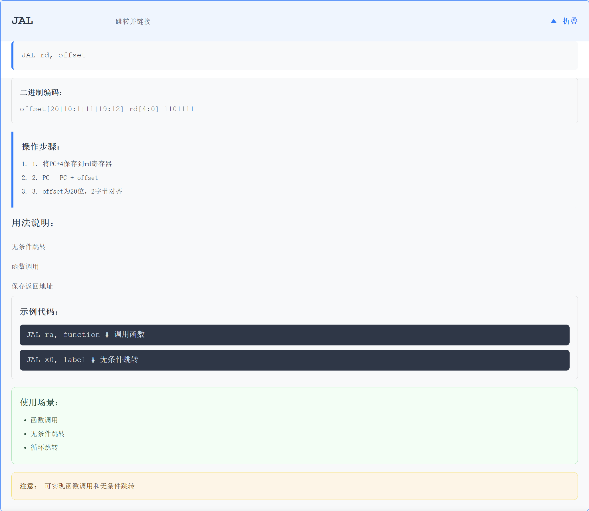
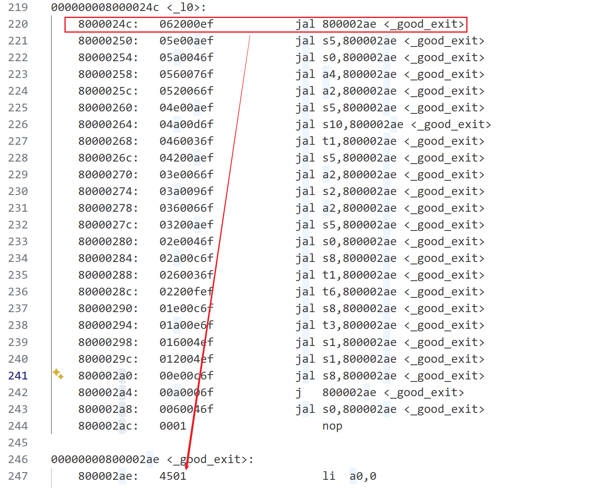
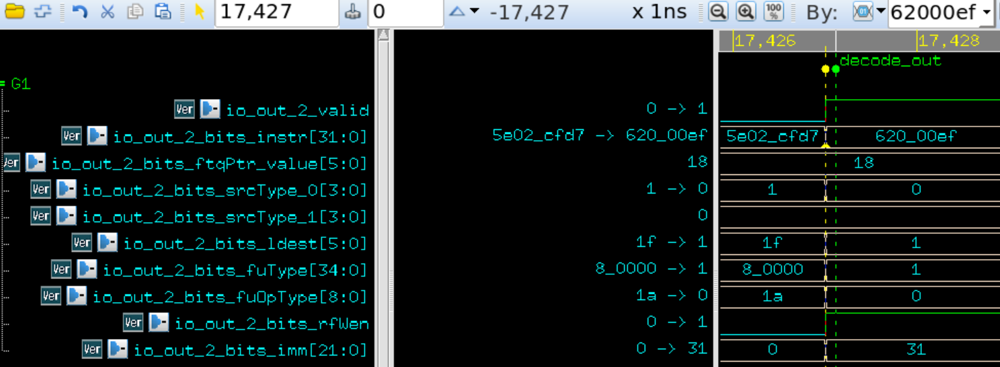
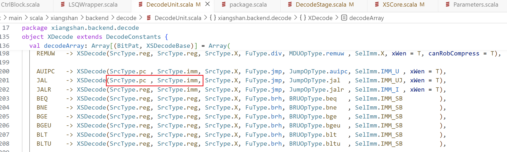
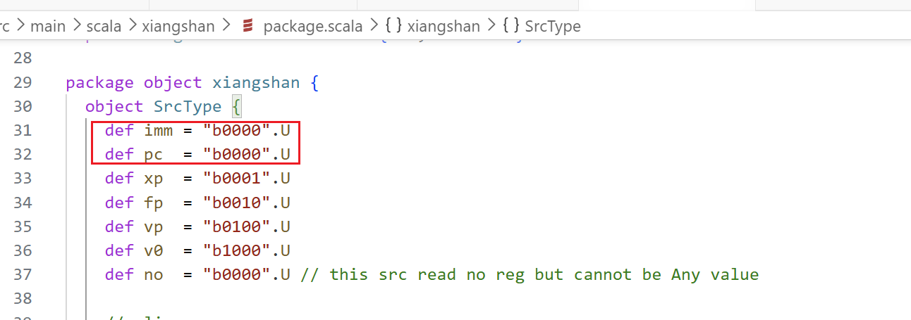
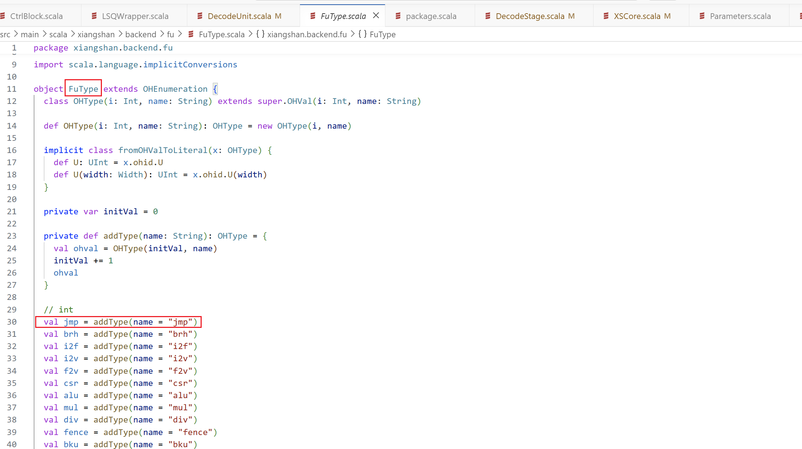
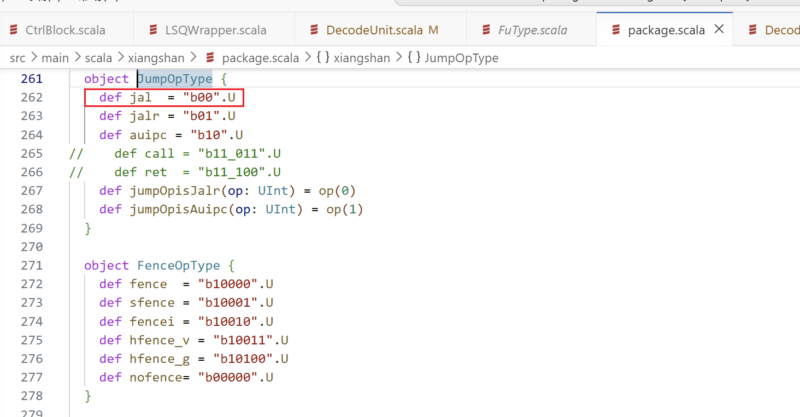
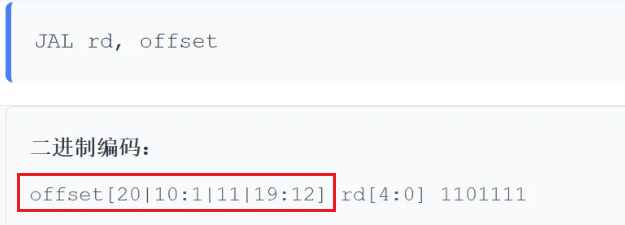

# 一条Jal/Jalr指令的执行过程

波形文件相关：/nfs/home/wanghao/xs-env/myWaves/onlyjal

# 一、找到一条合适的 `jal`指令

# 

无条件跳转，源操作数为pc以及固定数据4，跳转目标为pc加上offset。

选择的追踪指令是如下这条：

通过人工解析这条指令可知，其功能是：

将**当前指令地址（PC）** 加上立即数偏移量，结果作为目标地址，并跳转到该目标地址（`_good_exit`子程序入口）。同时，将**当前指令的下一条指令地址（PC+4）** 存入 1 号寄存器（`ra`寄存器）中，作为返回地址。

结合该指令的上下文信息，可以确定：

* 当前指令地址（PC）为 `0x8000024c`。
* 立即数偏移量为 `0x62`（即十进制 98）。这时候会注意到，98并不是4的倍数，但仔细一看地址这边的0x800002ae本身也非4字节对齐，因为他里面的指令是一条16位的指令。
* 因此，目标地址 = PC + 偏移量 = `0x8000024c`+ `0x62`= `0x800002ae`。标签 `<good_exit>`的实际地址（`0x800002ae`）正好是这么多，所以该指令的行为也就很确定了，跳转的目标是一条16位的指令。

下面就是在波形中来分析这条指令的行为了：

# 二、波形分析

## （1）译码模块（Decode）

decode的译码结果：

在波形中可以确定这些信息，包括在valid信号有效的条件下，可以确定该指令的指令码为0x062000ef，便是上面我们追踪的指令。查看对于这条指令的译码结果：

包括于*srcType\_0以及*srcType\_1两个值都是0，

看代码发现了两个源操作数是来自于pc以及imm的，行为是正确的。

而不管是来自于pc还是来自imm的数，其具体的数值都是如下的结果：

欸，和波形里的结果是一致的，结果都是0。表明源操作数的类型是一个来自于pc值，一个来自于立即数的。

其ldest的值是1，结合rfWen信号也被拉高起来了，也就表明会将最后的结果写入1号逻辑寄存器中，与我们预想的行为是一致的。

然后便是区别于其他类型指令的重要区别：

其中fuType的值是0x1，fuOpType的值是0x0，可以看一下代码来验证一下波形的正确性：

从代码中可以确定，fuType的把热编码的第0位拉高即表明当前指令是一条jump相关的指令，波形行为正确。

jump相关的指令的具体操作有如上的这些操作方式，其实也就是给jump全部的相关的指令各个操作。

会发现，如果是jal指令的话，那这个对应的值就应该被赋值为0x0。

所以说，fuType为0x1，fuOpType为0x0，综合起来两者所代表的意义就是，这是一条需要使用jump运算单元的jal指令。

最后看立即数的值是0x31。注意，这里还是需要注意一下的，

在指令格式中的立即数，会注意到没有第0位。这是因为第0位是默认一定是0的，第0位默认是0换一个表达就是意思说pc值一定是2字节对齐的，也就是说可能会有2字节大小的指令，不可能有1字节大小的指令了。

所以这里的立即数虽然是0x31，但是这是没有考虑第0位的结果，所以实际的立即数应该是0x31 \* 0x2 = 0x62。所以说这里的行为应该是对的，只是在后面的具体操作时需要对这个数据进行末尾加上第0位的数据或者说乘2的操作。

## （2）重命名模块（Rename）

> 更新: 2026-04-28 09:21:13  
> 原文: <https://bosc.yuque.com/staff-xmw8rg/fb7qy3/gupa3c9q5mepugai>