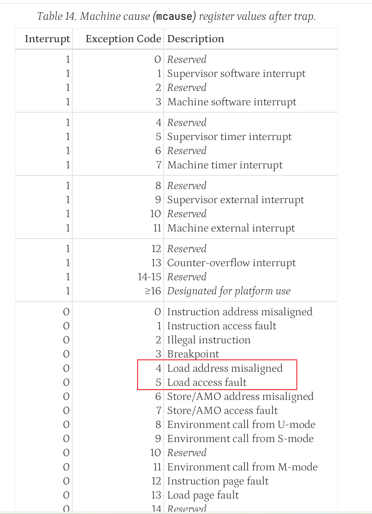
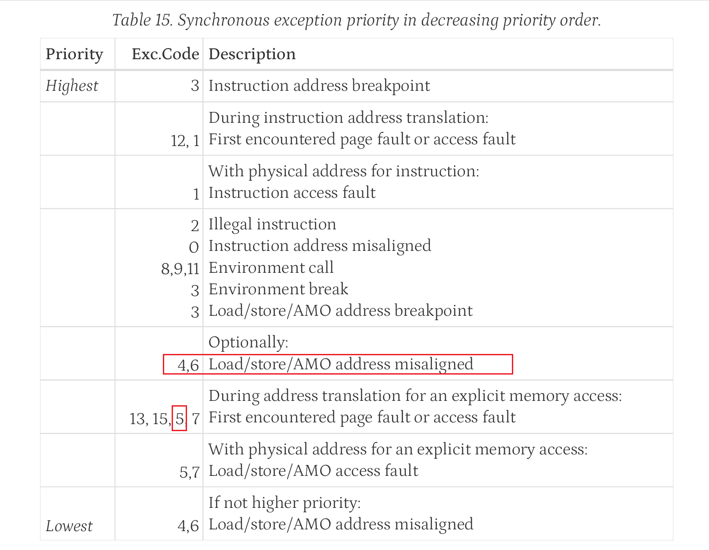

# 运行代码difftest报错问题

## 日志输出问题
```plain

liruoshi@eda01:~/new/xs-env/XiangShan$ ./build/simv +workload=/nfs/home/liruoshi/arch-fuzz/single.out/lw_45/lw_45.bin  +diff=./ready-to       -run/riscv64-nemu-interpreter-so +dump-wave=fsdb
Chronologic VCS simulator copyright 1991-2020
Contains Synopsys proprietary information.
Compiler version Q-2020.03-SP2_Full64; Runtime version Q-2020.03-SP2_Full64;  Apr 13 10:11 2026
ram image:/nfs/home/liruoshi/arch-fuzz/single.out/lw_45/lw_45.bin
diff-test ref so:./ready-to-run/riscv64-nemu-interpreter-so
Core  x's Commit SHA is: 5623d8c519, dirty: 1
*Verdi* Loading libsscore_vcs202003.so
FSDB Dumper for VCS, Release Verdi_R-2020.12-SP1, Linux x86_64/64bit, 03/02/2021
(C) 1996 - 2021 by Synopsys, Inc.
*Verdi* FSDB WARNING: The FSDB file already exists. Overwriting the FSDB file may crash the programs that are using this file.
*Verdi* : Create FSDB file 'simv.fsdb'
*Verdi* : Begin traversing the scopes, layer (0).
*Verdi* : Enable +mda dumping.
*Verdi* : End of traversing.
*Verdi* FSDB: For performance reasons, the Memory Size Limit has been increased to 128M.
*Verdi* FSDB: For performance reasons, the Memory Size Limit has been increased to 256M.
*Verdi* FSDB: For performance reasons, the Memory Size Limit has been increased to 512M.
simv compiled at Apr 13 2026, 10:01:37
Using simulated 8386560MB RAM
The image is /nfs/home/liruoshi/arch-fuzz/single.out/lw_45/lw_45.bin
Using simulated 32768B flash
The reference model is ./ready-to-run/riscv64-nemu-interpreter-so
The first instruction of core 0 has commited. Difftest enabled.
*Verdi* FSDB: For performance reasons, the Memory Size Limit has been increased to 1024M.
[src/memory/paddr.c:250,check_paddr] isa pma check failed, vaddr=0xfffffffffffff800, paddr=0xfffffffffffff800, len=0x4, type=0x1, mode=       0x3
[src/memory/paddr.c:240,check_paddr] isa pmp check failed, vaddr=0xfffffffffffff801, paddr=0xfffffffffffff801, len=0x4, type=0x1, mode=       0x3
[src/memory/paddr.c:240,check_paddr] isa pmp check failed, vaddr=0xfffffffffffffc01, paddr=0xfffffffffffffc01, len=0x4, type=0x1, mode=       0x3

============== Commit Group Trace (Core 0) ==============
commit group [00]: pc 008000002c cmtcnt 1
commit group [01]: pc 0080000030 cmtcnt 1
commit group [02]: pc 0080000010 cmtcnt 1
commit group [03]: pc 0080000014 cmtcnt 1
commit group [04]: pc 0080000018 cmtcnt 1
commit group [05]: pc 008000001c cmtcnt 1
commit group [06]: pc 0080000020 cmtcnt 3
commit group [07]: pc 008000002c cmtcnt 1
commit group [08]: pc 0080000030 cmtcnt 1
commit group [09]: pc 0080000010 cmtcnt 1
commit group [10]: pc 0080000014 cmtcnt 1
commit group [11]: pc 0080000018 cmtcnt 1
commit group [12]: pc 008000001c cmtcnt 2
commit group [13]: pc 0080000022 cmtcnt 2
commit group [14]: pc 008000002c cmtcnt 1
commit group [15]: pc 0080000030 cmtcnt 1 <--

============== Commit Instr Trace ==============
[00] commit pc 0000000080000030 inst 30200073 wen 0 dst 00 data 0000000080000250 idx 0ba
[01] exception pc 0000000080000250 inst 8014ab03 cause 0000000000000005
[02] commit pc 0000000080000010 inst 342022f3 wen 1 dst 05 data 0000000000000005 idx 0bb
[03] commit pc 0000000080000014 inst 34102373 wen 1 dst 06 data 0000000080000250 idx 0bc
[04] commit pc 0000000080000018 inst 00035383 wen 1 dst 07 data 000000000000ab03 idx 0bd (17)
[05] commit pc 000000008000001c inst 0033f393 wen 1 dst 07 data 0000000000000003 idx 0be
[06] commit pc 000000008000001c inst 00300e13 wen 1 dst 28 data 0000000000000003 idx 0bf
[07] commit pc 0000000080000022 inst 01c38463 wen 0 dst 08 data 0000000000000003 idx 0c0
[08] commit pc 0000000080000022 inst 00430313 wen 1 dst 06 data 0000000080000254 idx 0c1
[09] commit pc 000000008000002c inst 34131073 wen 0 dst 00 data 0000000000000003 idx 0c2
[10] commit pc 0000000080000030 inst 30200073 wen 0 dst 00 data 0000000000000003 idx 0c3
[11] exception pc 0000000080000254 inst c01f2c83 cause 0000000000000005
[12] commit pc 0000000080000010 inst 342022f3 wen 1 dst 05 data 0000000000000005 idx 0c4
[13] commit pc 0000000080000014 inst 34102373 wen 1 dst 06 data 0000000080000254 idx 0c5
[14] commit pc 0000000080000018 inst 00035383 wen 1 dst 07 data 0000000000002c83 idx 0c6 (19)
[15] commit pc 000000008000001c inst 0033f393 wen 1 dst 07 data 0000000000000003 idx 0c7
[16] commit pc 0000000080000020 inst 00300e13 wen 1 dst 28 data 0000000000000003 idx 0c8
[17] commit pc 0000000080000020 inst 01c38463 wen 0 dst 08 data 0000000080000254 idx 0c9
[18] commit pc 0000000080000020 inst 00430313 wen 1 dst 06 data 0000000080000258 idx 0ca
[19] commit pc 000000008000002c inst 34131073 wen 0 dst 00 data 0000000000000003 idx 0cb
[20] commit pc 0000000080000030 inst 30200073 wen 0 dst 00 data 0000000000000003 idx 0cc
[21] exception pc 0000000080000258 inst 00002e03 cause 0000000000000005
[22] commit pc 0000000080000010 inst 342022f3 wen 1 dst 05 data 0000000000000005 idx 0cd
[23] commit pc 0000000080000014 inst 34102373 wen 1 dst 06 data 0000000080000258 idx 0ce
[24] commit pc 0000000080000018 inst 00035383 wen 1 dst 07 data 0000000000002e03 idx 0cf (1d)
[25] commit pc 000000008000001c inst 0033f393 wen 1 dst 07 data 0000000000000003 idx 0d0
[26] commit pc 000000008000001c inst 00300e13 wen 1 dst 28 data 0000000000000003 idx 0d1
[27] commit pc 0000000080000022 inst 01c38463 wen 0 dst 08 data 0000000000000003 idx 0d2
[28] commit pc 0000000080000022 inst 00430313 wen 1 dst 06 data 000000008000025c idx 0d3
[29] commit pc 000000008000002c inst 34131073 wen 0 dst 00 data 0000000000000003 idx 0d4
[30] commit pc 0000000080000030 inst 30200073 wen 0 dst 00 data 0000000000000003 idx 0d5
[31] exception pc 000000008000025c inst 001f2303 cause 0000000000000005 <--

==============  REF Regs  ==============
---------------- Intger Registers ----------------
  $0: 0x0000000000000000   ra: 0x0000000000000000   sp: 0x0000000000000000   gp: 0x0000000000000000
  tp: 0x0000000000000000   t0: 0x0000000000000005   t1: 0x000000008000025c   t2: 0x0000000000000003
  s0: 0x0000000000000000   s1: 0x0000000000000000   a0: 0x0000000000000000   a1: 0x0000000000000000
  a2: 0x0000000000000000   a3: 0x0000000000000000   a4: 0x0000000000000000   a5: 0x0000000000000000
  a6: 0x0000000000000000   a7: 0x0000000000000000   s2: 0x0000000000000000   s3: 0x0000000000000000
  s4: 0x0000000000000000   s5: 0x0000000000000000   s6: 0x0000000000000000   s7: 0x0000000000000000
  s8: 0x0000000000000000   s9: 0x0000000000000000  s10: 0x0000000000000000  s11: 0x0000000000000000
  t3: 0x0000000000000003   t4: 0x0000000000000000   t5: 0x0000000000000000   t6: 0x0000000000000000
---------------- Float Registers ----------------
 ft0: 0x0000000000000000  ft1: 0x0000000000000000  ft2: 0x0000000000000000  ft3: 0x0000000000000000
 ft4: 0x0000000000000000  ft5: 0x0000000000000000  ft6: 0x0000000000000000  ft7: 0x0000000000000000
 fs0: 0x0000000000000000  fs1: 0x0000000000000000  fa0: 0x0000000000000000  fa1: 0x0000000000000000
 fa2: 0x0000000000000000  fa3: 0x0000000000000000  fa4: 0x0000000000000000  fa5: 0x0000000000000000
 fa6: 0x0000000000000000  fa7: 0x0000000000000000  fs2: 0x0000000000000000  fs3: 0x0000000000000000
 fs4: 0x0000000000000000  fs5: 0x0000000000000000  fs6: 0x0000000000000000  fs7: 0x0000000000000000
 fs8: 0x0000000000000000  fs9: 0x0000000000000000 fs10: 0x0000000000000000 fs11: 0x0000000000000000
 ft8: 0x0000000000000000  ft9: 0x0000000000000000 ft10: 0x0000000000000000 ft11: 0x0000000000000000
 fcsr: 0x0000000000000000 fflags: 0x0000000000000000 frm: 0x0000000000000000
---------------- Privileged CSRs ----------------
pc: 0x0000000080000010  privilege mode: M (mode: 3  v: 0  debug: 0)
   mstatus: 0x8000040a00467e00   sstatus: 0x8000000200046600  vsstatus: 0x0000000200000000
   hstatus: 0x0000000200000000  mnstatus: 0x0000000000000008
    mcause: 0x0000000000000004      mepc: 0x000000008000025c     mtval: 0x0000000000000001
    scause: 0x0000000000000000      sepc: 0x0000000000000000     stval: 0x0000000000000000
   vscause: 0x0000000000000000     vsepc: 0x0000000000000000    vstval: 0x0000000000000000
   mncause: 0x0000000000000000     mnepc: 0x0000000000000000 mnscratch: 0x0000000000000000
    mtval2: 0x0000000000000000     htval: 0x0000000000000000
    mtinst: 0x0000000000000000    htinst: 0x0000000000000000
  mscratch: 0x0fd3531fb84d7e70  sscratch: 0x650923ca7f65b9fe vsscratch: 0x2289854525e35f4b
     mtvec: 0x0000000080000010     stvec: 0x0000000000000000    vstvec: 0x0000000000000000
       mip: 0x0000000000000000       mie: 0x0000000000000000
   mideleg: 0x0000000000001666   medeleg: 0x0000000000000300
   hideleg: 0x0000000000000000   hedeleg: 0x0000000000000000
      satp: 0x0000000000000000     hgatp: 0x0000000000000000     vsatp: 0x0000000000000000
 mcounteren: 0x0000000000000000 scounteren: 0x0000000000000000 hcounteren: 0x0000000000000000
  miselect: 0x0000000000000000  siselect: 0x0000000000000000 vsiselect: 0x0000000000000000
     mireg: 0x0000000000000000     sireg: 0x0000000000000000    vsireg: 0x0000000000000000
     mtopi: 0x0000000000000000     stopi: 0x0000000000000000    vstopi: 0x0000000000000000
     mvien: 0x0000000000000000     hvien: 0x0000000000000000      mvip: 0x0000000000000000
    mtopei: 0x0000000000000000    stopei: 0x0000000000000000   vstopei: 0x0000000000000000
    hvictl: 0x0000000000000000  hviprio1: 0x0000000000000000  hviprio2: 0x0000000000000000
---------------- PMP CSRs ----------------
pmp: 32 entries active, details:
 0: cfg:0x0f addr:0x00003fffffffffff| 1: cfg:0x00 addr:0x0000000000000000
 2: cfg:0x00 addr:0x0000000000000000| 3: cfg:0x00 addr:0x0000000000000000
 4: cfg:0x00 addr:0x0000000000000000| 5: cfg:0x00 addr:0x0000000000000000
 6: cfg:0x00 addr:0x0000000000000000| 7: cfg:0x00 addr:0x0000000000000000
 8: cfg:0x00 addr:0x0000000000000000| 9: cfg:0x00 addr:0x0000000000000000
10: cfg:0x00 addr:0x0000000000000000|11: cfg:0x00 addr:0x0000000000000000
12: cfg:0x00 addr:0x0000000000000000|13: cfg:0x00 addr:0x0000000000000000
14: cfg:0x00 addr:0x0000000000000000|15: cfg:0x00 addr:0x0000000000000000
16: cfg:0x00 addr:0x0000000000000000|17: cfg:0x00 addr:0x0000000000000000
18: cfg:0x00 addr:0x0000000000000000|19: cfg:0x00 addr:0x0000000000000000
20: cfg:0x00 addr:0x0000000000000000|21: cfg:0x00 addr:0x0000000000000000
22: cfg:0x00 addr:0x0000000000000000|23: cfg:0x00 addr:0x0000000000000000
24: cfg:0x00 addr:0x0000000000000000|25: cfg:0x00 addr:0x0000000000000000
26: cfg:0x00 addr:0x0000000000000000|27: cfg:0x00 addr:0x0000000000000000
28: cfg:0x00 addr:0x0000000000000000|29: cfg:0x00 addr:0x0000000000000000
30: cfg:0x00 addr:0x0000000000000000|31: cfg:0x00 addr:0x0000000000000000
32: cfg:0x00 addr:0x0000000000000000|33: cfg:0x00 addr:0x0000000000000000
34: cfg:0x00 addr:0x0000000000000000|35: cfg:0x00 addr:0x0000000000000000
36: cfg:0x00 addr:0x0000000000000000|37: cfg:0x00 addr:0x0000000000000000
38: cfg:0x00 addr:0x0000000000000000|39: cfg:0x00 addr:0x0000000000000000
40: cfg:0x00 addr:0x0000000000000000|41: cfg:0x00 addr:0x0000000000000000
42: cfg:0x00 addr:0x0000000000000000|43: cfg:0x00 addr:0x0000000000000000
44: cfg:0x00 addr:0x0000000000000000|45: cfg:0x00 addr:0x0000000000000000
46: cfg:0x00 addr:0x0000000000000000|47: cfg:0x00 addr:0x0000000000000000
48: cfg:0x00 addr:0x0000000000000000|49: cfg:0x00 addr:0x0000000000000000
50: cfg:0x00 addr:0x0000000000000000|51: cfg:0x00 addr:0x0000000000000000
52: cfg:0x00 addr:0x0000000000000000|53: cfg:0x00 addr:0x0000000000000000
54: cfg:0x00 addr:0x0000000000000000|55: cfg:0x00 addr:0x0000000000000000
56: cfg:0x00 addr:0x0000000000000000|57: cfg:0x00 addr:0x0000000000000000
58: cfg:0x00 addr:0x0000000000000000|59: cfg:0x00 addr:0x0000000000000000
60: cfg:0x00 addr:0x0000000000000000|61: cfg:0x00 addr:0x0000000000000000
62: cfg:0x00 addr:0x0000000000000000|63: cfg:0x00 addr:0x0000000000000000
---------------- PMA CSRs ----------------
pma: 32 entries active, details:
 0: cfg:0x00 addr:0x0000000000000000| 1: cfg:0x00 addr:0x0000000000000000
 2: cfg:0x00 addr:0x0000000000000000| 3: cfg:0x00 addr:0x0000000000000000
 4: cfg:0x00 addr:0x0000000000000000| 5: cfg:0x00 addr:0x0000000000000000
 6: cfg:0x00 addr:0x0000000000000000| 7: cfg:0x00 addr:0x0000000000000000
 8: cfg:0x00 addr:0x0000000000000000| 9: cfg:0x00 addr:0x0000000000000000
10: cfg:0x00 addr:0x0000000000000000|11: cfg:0x00 addr:0x0000000000000000
12: cfg:0x00 addr:0x0000000000000000|13: cfg:0x00 addr:0x0000000000000000
14: cfg:0x00 addr:0x0000000000000000|15: cfg:0x00 addr:0x0000000000000000
16: cfg:0x00 addr:0x0000000000000000|17: cfg:0x00 addr:0x0000000000000000
18: cfg:0x00 addr:0x0000000000000000|19: cfg:0x0b addr:0x0000000004000000
20: cfg:0x0f addr:0x0000000008000000|21: cfg:0x0b addr:0x000000000c004000
22: cfg:0x0b addr:0x000000000c014000|23: cfg:0x0b addr:0x000000000e008000
24: cfg:0x0f addr:0x000000000e008400|25: cfg:0x0b addr:0x000000000e008800
26: cfg:0x0b addr:0x000000000e400000|27: cfg:0x0b addr:0x000000000e400800
28: cfg:0x08 addr:0x000000000e800000|29: cfg:0x0b addr:0x0000000020000000
30: cfg:0x6f addr:0x0000020000000000|31: cfg:0x18 addr:0x00001fffffffffff
---------------- Vector Registers ----------------
v0 : 0xffffffffffffffff_ffffffff00000000  v1 : 0xffffffffffffffff_ffffffff00000000
v2 : 0xffffffffffffffff_ffffffff00000000  v3 : 0xffffffffffffffff_ffffffff00000000
v4 : 0xffffffffffffffff_ffffffff00000000  v5 : 0xffffffffffffffff_ffffffff00000000
v6 : 0xffffffffffffffff_ffffffff00000000  v7 : 0xffffffffffffffff_ffffffff00000000
v8 : 0xffffffffffffffff_ffffffff00000000  v9 : 0xffffffffffffffff_ffffffff00000000
v10: 0xffffffffffffffff_ffffffff00000000  v11: 0xffffffffffffffff_ffffffff00000000
v12: 0xffffffffffffffff_ffffffff00000000  v13: 0xffffffffffffffff_ffffffff00000000
v14: 0xffffffffffffffff_ffffffff00000000  v15: 0xffffffffffffffff_ffffffff00000000
v16: 0xffffffffffffffff_ffffffff00000000  v17: 0xffffffffffffffff_ffffffff00000000
v18: 0xffffffffffffffff_ffffffff00000000  v19: 0xffffffffffffffff_ffffffff00000000
v20: 0xffffffffffffffff_ffffffff00000000  v21: 0xffffffffffffffff_ffffffff00000000
v22: 0xffffffffffffffff_ffffffff00000000  v23: 0xffffffffffffffff_ffffffff00000000
v24: 0xffffffffffffffff_ffffffff00000000  v25: 0xffffffffffffffff_ffffffff00000000
v26: 0xffffffffffffffff_ffffffff00000000  v27: 0xffffffffffffffff_ffffffff00000000
v28: 0xffffffffffffffff_ffffffff00000000  v29: 0xffffffffffffffff_ffffffff00000000
v30: 0xffffffffffffffff_ffffffff00000000  v31: 0xffffffffffffffff_ffffffff00000000
  vtype: 0x00000000000000d0 vstart: 0x0000000000000000  vxsat: 0x0000000000000000
   vxrm: 0x0000000000000001     vl: 0x0000000000000001   vcsr: 0x0000000000000002
---------------- Triggers ----------------
 tselect: 0x0000000000000000
 0: tdata1: 0xf000000000000000 tdata2: 0x000000000107eda0
 1: tdata1: 0xf000000000000000 tdata2: 0x6d6f682f73666e2f
 2: tdata1: 0xf000000000000000 tdata2: 0x782f77656e2f6968
 3: tdata1: 0xf000000000000000 tdata2: 0x2f6e616853676e61
 4: tdata1: 0x2f646c6975622f2e tdata2: 0x6961642e766d6973
privilegeMode: 3
 mcause different at pc = 0x0080000030, right = 0x0000000000000004, wrong = 0x0000000000000005
Core 0: FAILED at pc = 0x80000278
Core-0 instrCnt = 214, cycleCnt = 9209, IPC = 0.023238
DIFFTEST FAILED at cycle                 9214
Fatal: "/nfs/home/liruoshi/new/xs-env/XiangShan/difftest/src/test/vsrc/vcs/DifftestEndpoint.sv", 356: tb_top.difftest: at time 18529 ns
$finish called from file "/nfs/home/liruoshi/new/xs-env/XiangShan/difftest/src/test/vsrc/vcs/DifftestEndpoint.sv", line 356.
$finish at simulation time                18529
           V C S   S i m u l a t i o n   R e p o r t
Time: 18529 ns
CPU Time:    118.520 seconds;       Data structure size: 125.6Mb
Mon Apr 13 10:13:53 2026
--------------------------------------------------------------------------------------
liruoshi@eda01:~/new/xs-env/XiangShan$ ./build/simv +workload=/nfs/home/liruoshi/new/xs-env/nexus-am/apps/hello/build/hello-riscv64-xs.bin  +dady-to-run/riscv64-nemu-interpreter-so +dump-wave=fsdb
Chronologic VCS simulator copyright 1991-2020
Contains Synopsys proprietary information.
Compiler version Q-2020.03-SP2_Full64; Runtime version Q-2020.03-SP2_Full64;  Apr 13 10:53 2026
ram image:/nfs/home/liruoshi/new/xs-env/nexus-am/apps/hello/build/hello-riscv64-xs.bin
diff-test ref so:./ready-to-run/riscv64-nemu-interpreter-so
Core  x's Commit SHA is: 5623d8c519, dirty: 1
*Verdi* Loading libsscore_vcs202003.so
FSDB Dumper for VCS, Release Verdi_R-2020.12-SP1, Linux x86_64/64bit, 03/02/2021
(C) 1996 - 2021 by Synopsys, Inc.
*Verdi* FSDB WARNING: The FSDB file already exists. Overwriting the FSDB file may crash the programs that are using this file.
*Verdi* : Create FSDB file 'simv.fsdb'
*Verdi* : Begin traversing the scopes, layer (0).
*Verdi* : Enable +mda dumping.
*Verdi* : End of traversing.
*Verdi* FSDB: For performance reasons, the Memory Size Limit has been increased to 128M.
*Verdi* FSDB: For performance reasons, the Memory Size Limit has been increased to 256M.
*Verdi* FSDB: For performance reasons, the Memory Size Limit has been increased to 512M.
simv compiled at Apr 13 2026, 10:01:37
Using simulated 8386560MB RAM
The image is /nfs/home/liruoshi/new/xs-env/nexus-am/apps/hello/build/hello-riscv64-xs.bin
Using simulated 32768B flash
The reference model is ./ready-to-run/riscv64-nemu-interpreter-so
The first instruction of core 0 has commited. Difftest enabled.
*Verdi* FSDB: For performance reasons, the Memory Size Limit has been increased to 1024M.
Hello, XiangShan!
Core 0: HIT GOOD TRAP at pc = 0x8000014c
Core-0 instrCnt = 579, cycleCnt = 10419, IPC = 0.055572
DIFFTEST WORKLOAD DONE at cycle                10424
$finish called from file "/nfs/home/liruoshi/new/xs-env/XiangShan/difftest/src/test/vsrc/vcs/DifftestEndpoint.sv", line 362.
$finish at simulation time                20949
           V C S   S i m u l a t i o n   R e p o r t
Time: 20949 ns
CPU Time:    123.980 seconds;       Data structure size: 125.6Mb
Mon Apr 13 10:55:41 2026
```

使用 nemu debug 查看日志

[附件: lw.log](./attachments/B7kbnvQsO5RZvKpR/lw.log)

反汇编代码

[附件: lw_45.txt](./attachments/B7kbnvQsO5RZvKpR/lw_45.txt)

## 执行分析
因为在使用 lw 的时候一次加载一个 word(4 字节)所以地址必须是 4 的倍数，这里停止的指令

```plain
[31] exception pc 000000008000025c inst 001f2303 cause 0000000000000005 <--
```

对应 pc 值的日志显示：

```plain
[riscv64_priv_mret] Executing mret to 0x8000025c
[execute] end_of_loop: prev pc = 0x8000025c, pc = 0x8000025c
[execute] total insts: 211, execute remain: 65527
[debug_hook] (M)0x0000000080000030:   73 00 20 30     mret      
[cpu_exec] total insts: 211, cpu_exec remain: -1
[vaddr_read_internal] Checking mmu when MMU_DYN
[isa_mmu_check] MMU checking addr 8000025c
[vaddr_read_internal] Paddr reading directly
[host_read] load: addr = 0x72bead00025c, len = 2, data = 0x2303
[vaddr_read_internal] Checking mmu when MMU_DYN
[isa_mmu_check] MMU checking addr 8000025e
[vaddr_read_internal] Paddr reading directly
[host_read] load: addr = 0x72bead00025e, len = 2, data = 0x1f
[fetch_decode] (M) 0x000000008000025c:   03 23 1f 00     lw         t1,1(t5)
[vaddr_read] Reading vaddr 1
[isa_misalign_data_addr_check] addr misaligned happened: vaddr:1 len:4 type:1 pc:8000025c
[vaddr_read_internal] Paddr reading directly
[is_in_mmio] is in mmio: 0x0000000000000001
[isa_mmio_misalign_data_addr_check] addr misaligned happened: paddr:0x0000000000000001 vaddr:0x0000000000000001 len:4 type:1 pc:8000025c
[longjmp_exception] longjmp_context(NEMU_EXEC_EXCEPTION)
[longjmp_context] Longjmp to jbuf_exec with cause: 3
[cpu_exec] Longjmp happened. total insts: 211, cpu_exec remain: -1
[cpu_exec] Handle NEMU_EXEC_EXCEPTION
[raise_intr] raise intr cause NO: 4, epc: 8000025c
```

访问地址是 1，不是 4 的倍数，所以出现地址未对齐的错误



查看手册发现这里报错的 4 号优先级高于 5 号，所以应该是报错是 4 是正确的，所以 nemu 的寄存器值是正确的，rtl 的序号出错了

## 波形检验


> 更新: 2026-04-13 16:34:20  
> 原文: <https://bosc.yuque.com/staff-xmw8rg/fb7qy3/xm0b44gq601nhivy>