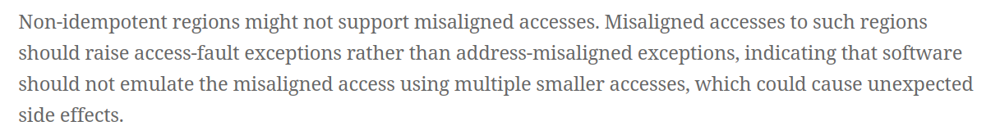

# 香山处理器 & NEMU mcause 异常码不匹配分析报告

**来源**：[GitHub Issue #5807](https://github.com/OpenXiangShan/XiangShan/issues/5807)

**分支**：kunminghu-v3

## 一、Bug 概述

### 1.1 问题描述

在 Difftest（差分测试）执行过程中，当 **XiangShan RTL** 和 **NEMU 参考模型** 同时触发异常时，两侧的 CSR 寄存器值不一致。

具体表现为：

* **问题指令**：`lw t1, 1(t5)`
* **寄存器状态**：`t5 = 0x0`，因此访问地址为 `0x1`
* **核心差异**：两边的 `mcause` CSR 异常码不同

### 1.2 异常码差异

| 组件 | mcause 值 | 含义 |
| --- | --- | --- |
| **XiangShan RTL** | `0x5` | Load Access Fault（加载访问错误） |
| **NEMU** | `0x4` | Load Misaligned（加载地址对齐错误） |

### 1.3 Difftest 错误日志

```plain
mcause different at pc = 0x0080000030
  right (NEMU)  = 0x0000000000000004  (misaligned)
  wrong (RTL)   = 0x0000000000000005  (access fault)

DIFFTEST FAILED at cycle 9214
```

## 二、问题复现

### 2.1 复现环境

| 项目 | 信息 |
| --- | --- |
| 分支 | kunminghu-v3 |
| XiangShan Commit | `5623d8c519` |
| 测试用例 | `lw_45.c`（arch-fuzz 的测试用例） |

### 2.2 复现步骤

```bash
# 运行 Difftest
./build/simv +workload=/path/to/lw_45.bin \
             +diff=./ready-to-run/riscv64-nemu-interpreter-so \
             +dump-wave=fsdb

# 查看波形（对应load指令执行过程中就是分析的这条指令）
# 在 Verdi 中定位到 pc = 0x80000025c 的指令
# 观察 mcause 信号值
```

### 2.3 关键波形分析

[香山架构下 Load 指令执行过程与信号追踪](https://bosc.yuque.com/staff-xmw8rg/fb7qy3/eb97ki1ka9cd61gg)

## 三、原因分析

### 3.1 初步分析

根据 RISC-V Privilege Specification，Load/Store/AMO 指令的异常优先级如下：

| 优先级（高→低） | 异常类型 | mcause 值 |
| --- | --- | --- |
| **高** | Load/Store/AMO **Access Fault** | `0x5`<br/> / `0x7` |
| 低 | Load/Store/AMO **Misaligned** | `0x4`<br/> / `0x6` |

**结论**：当地址同时满足"对齐错误"和"访问错误"时，应优先报告 Access Fault。

因此 XiangShan RTL 的 `mcause=0x5` 是**正确的**，NEMU 的 `mcause=0x4` 是**错误的**。

### 3.2 根本原因定位

问题出在 **NEMU** 的异常检查顺序：

#### NEMU 代码路径

```c
// 文件：src/memory/paddr.c，第 295-301 行

isa_mmio_misalign_data_addr_check(addr, vaddr, len, MEM_TYPE_READ, cross_page_load);
#ifdef CONFIG_ENABLE_CONFIG_MMIO_SPACE
if (!mmio_is_real_device(addr)) {
    raise_read_access_fault(trap_type, vaddr);
    return 0;
}
#endif
```

#### 问题所在

```plain
执行顺序：
1. isa_mmio_misalign_data_addr_check()  ← 先检查对齐
2. mmio_is_real_device()               ← 后检查是否为真实 MMIO 设备
```

**当访问地址 0x1 时**：

1. `isa_mmio_misalign_data_addr_check` 检测到对齐错误（地址 1 不是 4 的倍数）
2. 立即抛出 `misaligned` 异常（cause=4）
3. **跳过了**后续的 MMIO 设备检查和 access fault 判断

### 3.3 相关 Issue

此问题与以下已知的 NEMU Issue 相关：

| Issue | 描述 |
| --- | --- |
| [NEMU #990](https://github.com/OpenXiangShan/NEMU/issues/990) | Misaligned MMIO access raises AddrMisaligned instead of AccessFault |
| [NEMU #629](https://github.com/OpenXiangShan/NEMU/issues/629) | mcause mismatch due to checking misalignment before confirming MMIO address |

## 四、解决方案

### 4.1 根本解决方案

**修改 NEMU 代码**，调整异常检查顺序：

```c
// 修改后的代码逻辑：

// 1. 首先检查是否为 MMIO 设备
if (is_mmio_address(addr)) {
    // 2. 然后检查 MMIO 设备是否为真实设备
    if (!mmio_is_real_device(addr)) {
        // 3. 在确认是 MMIO 但非真实设备后，再检查对齐
        if (addr_not_aligned(addr, len)) {
            raise_read_access_fault(trap_type, vaddr);  // ← 应抛出 access fault
        } else {
            raise_read_access_fault(trap_type, vaddr);
        }
        return 0;
    }
}

// 对于非 MMIO 地址，保持原有对齐检查逻辑
```

根据 RISC-V Privilege Spec，正确的异常检查顺序应为：

```plain
1. PMP/PMA 检查失败  → Access Fault (优先级最高)
2. 页错误            → Page Fault
3. 对齐错误          → Misaligned (优先级最低)
```

## 五、仿真波形输出

### 5.1 XiangShan RTL 波形

[香山架构下 Load 指令执行过程与信号追踪](https://bosc.yuque.com/staff-xmw8rg/fb7qy3/eb97ki1ka9cd61gg)

### 5.2 NEMU 日志输出

```plain
// 问题地址访问
[vaddr_read] Reading vaddr 0x1
[isa_misalign_data_addr_check] addr misaligned: vaddr:0x1 len:4
[isa_mmio_misalign_data_addr_check] addr misaligned: paddr:0x1
[raise_intr] raise intr cause NO: 4   ← 错误地抛出 misaligned

// 正确应为：
// [raise_intr] raise intr cause NO: 5  ← 应抛出 access fault
```

## 5.3 spike 输出

## 5.4 boom 运行输出

## 5.5 kunminghu-v2 输出

## 六、总结

| 项目 | 内容 |
| --- | --- |
| **Bug 性质** | NEMU 异常优先级处理错误，非 XiangShan RTL 问题 |
| **根本原因** | NEMU 中对齐检查在 MMIO 设备检查之前执行 |
| **影响范围** | 所有涉及 MMIO 地址对齐错误的测试用例 |
| **解决方案** | 修改 NEMU `paddr.c`<br/> 中的异常检查顺序 |
| **预期修复后** | Difftest 应能通过，mcause 均报告 0x5 (Access Fault) |

## 七、相关手册




> 更新: 2026-05-26 14:07:33  
> 原文: <https://bosc.yuque.com/staff-xmw8rg/fb7qy3/grcc3leilynxk6ky>